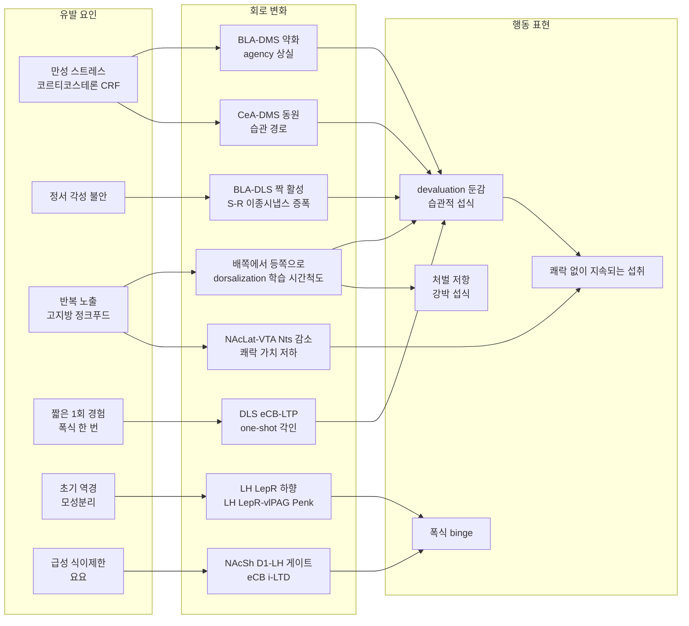

> [!takeaway] 연구 방향 관점의 핵심
> ① **습관의 조작적 정의는 하나다 — 결과의 가치가 떨어져도(outcome devaluation) 행동이 그대로인가.** "자주 먹는다", "자동으로 먹는다", "멈추지 못한다"는 그 자체로는 습관의 증거가 아니다(각각 cue 반응성·[[concept-compulsion|강박]]·[[concept-loss-of-control-eating|통제 상실]]과 겹친다). 특히 *눈앞의 음식을 배고픔과 무관하게 먹는 것*(접시 비우기)은 [[rangel-2008-a-framework-for-studying-the|Rangel 2008]] 틀에서 습관이 아니라 **Pavlovian계의 소비 반응**이다(§1-4). 위키에는 아직 **음식 추구를 devaluation으로 검증한 '습관적 과식' 동물 모델이 없다** — 이것이 lab이 선점할 수 있는 빈자리다.
> ② 위키 근거를 모으면 습관적 과식은 단일 회로가 아니라 **"목표지향 통제가 꺼지는 경로" × "자극-반응(S-R) 결합이 강해지는 경로"의 합**이다: 만성 스트레스가 BLA→DMS(agency)를 끄고 CeA→DMS를 켜고([[giovanniello-2025-a-dual-pathway-architecture-for|Giovanniello 2025]]), 편도 입력이 감각운동 선조체의 S-R 시냅스를 직접 증폭하며([[hobel-2026-a-basolateral-amygdala-to-dorsolateral|Hobel 2026]]), 반복 노출이 배쪽→등쪽 선조체로 통제를 옮기고([[luscher-2021-consolidating-the-circuit-model-for|Lüscher & Janak 2021]]), 단 한 번의 짧은 경험도 DLS에 eCB-LTP로 각인될 수 있다([[piette-2026-striatal-endocannabinoids-drive-one-shot|Piette 2026]]).
> ③ 반론도 위키 안에 있다 — 중독 cue의 통제력은 **결과 표상을 담고 있고**([[hoang-2026-methamphetamine-potentiates-the-use-of|Hoang 2026]]), 과식은 **쾌락 없이도 지속**된다([[concept-hedonic-devaluation]]). 그래서 lab 설계의 핵심은 **습관 / 왜곡된 목표지향 / 쾌락 저하 / 강박을 같은 동물·같은 환자에서 따로 재는 것**이고, [[lee-2025-hijacked-brain-modern-obesity-cue|Hijacked Brain]]의 Habit형을 회로 수준으로 검증하는 길이 여기서 열린다.
> ④ 계산 틀의 출발점은 **"과식 = 통제권 배정(control assignment)의 실패"** 가설이다([[rangel-2008-a-framework-for-studying-the|Rangel 2008]]) — 세 가치계가 충돌할 때 어느 계가 행동을 쥐는가, 그리고 5단계 계산(표상·가치평가·행동선택·결과평가·학습) 중 어디가 고장인가(§1-5)를 묻는다. 개입도 "습관 가치 지우기"와 "통제권 되돌리기"로 나뉜다.

# 습관 (Habit)

## 한 줄 요약
습관은 **결과의 가치와 무관하게 자극이 반응을 직접 일으키는(S-R) 행동 통제 방식**으로, 설치류 배외측 선조체(DLS)·인간 후측 조가비핵이 담당하고 목표지향 통제(DMS·vmPFC)와 경쟁한다. 습관적 과식은 스트레스·정서·반복 노출·발달기 역경이 이 경쟁을 습관 쪽으로 기울이는 여러 경로의 산물이며, 그 각 경로는 위키에 분리된 회로 근거를 갖는다.

> 📌 범위와 근거 표기: 이 페이지는 위키 안의 페이지만 근거로 쓴다. **섭식을 직접 측정한 근거**와 **다른 행동(약물·grooming·회피)에서 온 근거를 섭식으로 옮긴 가설**을 구분해 `[섭식 직접]` / `[타 행동→섭식 가설]`로 표시한다.

---

## 1. 정의 — 무엇을 재야 "습관"인가

### 1-1. 행동을 통제하는 세 시스템 ([[rangel-2008-a-framework-for-studying-the|Rangel 2008]] · [[odoherty-2016-multiple-systems-for-the-motivational|O'Doherty 2016]])

| 시스템 | 학습 내용 | 결과 가치 절하(devaluation)에 | 설치류 회로 | 인간 회로 |
|---|---|---|---|---|
| **목표지향 (goal-directed)** | 행동–결과(A–O) 유관성 + 결과 가치 → 행동 가치 계산 ("world model") | **민감** — 결과가 가치를 잃으면 행동이 줄어든다 | 배내측 선조체(**DMS**), BLA→DMS | **vmPFC**(goal value·chosen value·RPE), caudate |
| **습관 (habitual)** | 자극–반응(**S–R**) 연합, 결과 표상 없음 | **둔감** — 결과가 가치를 잃어도 계속한다 | 배외측 선조체(**DLS**) | **후측 putamen·premotor cortex**(DLS 상동) |
| **파블로프 (Pavlovian)** | 자극–결과(cue–outcome) 연합 | specific PIT는 **둔감** — 이미 가치 절하된 결과도 cue가 추구를 일으킨다 | 편도·선조체 하위구역 | 편도·선조체 (general/specific PIT 분리) |

- **중재(arbitration)**: 두 도구적 시스템의 통제권은 각 시스템의 **예측 신뢰도(precision)** 와 **인지노력 비용**(목표지향 = 고노력)에 따라 배분되며, 인간에서는 **양측 vlPFC·우측 frontopolar cortex**가 중재자다(Lee, Shimojo & O'Doherty 2014; [[odoherty-2016-multiple-systems-for-the-motivational|O'Doherty 2016]]에서 인용).
- **중재 규칙의 원안**: 뇌는 **행동 가치를 덜 불확실하게 추정하는 계**에 통제권을 준다(Daw 2005). 습관계 추정은 경험이 쌓일수록 정확해지므로 **습관계가 목표지향계를 점차 대체**한다. 익숙하고 안정된 환경에서는 이것이 최적이고, 빠르게 변하는 환경에서는 아니다([[rangel-2008-a-framework-for-studying-the|Rangel 2008]]에서 인용).
- **습관계의 네 성질**(Rangel 2008): ① S-R 연합의 가치를 시행착오로 배운다 ② 연습이 충분하고 환경이 안정적이면 기대 보상에 맞는 가치를 준다 ③ **느리게 배워서** 유관성이 바뀐 직후에는 가치를 틀리게 예측한다 ④ 새 상황에서는 **일반화**로 가치를 매긴다. 계산적으로는 예측 오차로 갱신되는 **model-free 강화학습**(Q-learning·SARSA·actor–critic)으로 기술된다.
- 중독은 습관계의 hijack(단, 목표지향·파블로프계도 관여), **OCD는 습관 통제 또는 목표/습관 중재의 조절 이상**으로 정리된다(O'Doherty 2016). Rangel 2008은 한발 앞서 **OCD와 과식을 "적절한 계에 통제권을 주지 못하는" 병리 후보**로 들었다.
- 사용자 lab 프레임: [[concept-need-motivation-pleasure-utility|NMPU]]는 habit-context를 **"Motivation의 자동화(goal-directed → habitual)"** 로, 결과 가치(outcome value)는 **Utility**로 둔다. Devaluation 민감성 = **Utility가 Motivation을 다시 빚는 정도**라는 회로 해석은 [[hoang-2026-methamphetamine-potentiates-the-use-of|Hoang 2026]]이 제공한다.

### 1-2. 측정 도구와 그 함정

| 검사 | 무엇을 바꾸나 | 습관이면 | 위키 사례 |
|---|---|---|---|
| **Outcome devaluation** | 결과의 가치 (LiCl 혐오 짝짓기, 특이 포만) | 행동 불변 | [[giovanniello-2025-a-dual-pathway-architecture-for|Giovanniello 2025]](lever-press), [[hoang-2026-methamphetamine-potentiates-the-use-of|Hoang 2026]](LiCl로 sucrose 절하) |
| **Contingency degradation** | 행동–결과 유관성 (행동 없이도 결과 제공) | 행동 불변 | [[giovanniello-2025-a-dual-pathway-architecture-for|Giovanniello 2025]]; Pavlovian판 CD의 회로는 [[hjort-2026-prefrontal-to-ventral-tegmental-area|Hjort 2026]](mPFC→VTA), 알고리즘은 [[jeong-2022-mesolimbic-dopamine-release-conveys-causal|Jeong 2022]]·[[concept-anccr]] |
| **PIT (general/specific)** | cue가 도구 행동을 밀어 올리는지 | specific PIT가 devaluation에도 유지 | [[odoherty-2016-multiple-systems-for-the-motivational|O'Doherty 2016]], [[hoang-2026-methamphetamine-potentiates-the-use-of|Hoang 2026]] |

⚠️ **지표마다 결론이 갈린다.** [[fallon-2026-striatal-pathways-dissociably-control-action|Fallon 2026]]의 counting 과제에서 devaluation은 **누르는 속도는 낮추고 지속시간은 늘렸지만 누르는 횟수(count)는 바꾸지 않았다** — 같은 행동 안에서도 "얼마나 세게/빨리"와 "어떤 구조로"가 다른 통제를 받는다. 섭식에서도 bout 개시·bout 길이·총 섭취를 따로 봐야 하는 이유다([[concept-consumption-vigor]], [[gordon-2026-lateral-hypothalamic-control-of-the|Gordon 2026]]: 소비 중 도파민은 bout **개시**를 강화하고 bout **길이**는 늘리지 않는다).

⚠️ **"습관"이라는 단어의 느슨한 사용.** 위키의 여러 문헌이 devaluation 검사 없이 "habit"을 쓴다 — 예: [[shin-2023-early-adversity-promotes-binge-like-eating|Shin & Lim 2023]]의 제목 "binge-like eating *habits*"는 반복 폭식 패러다임의 행동 증가를 가리키며, 위키 기록상 devaluation 검사로 확인된 것은 아니다. [[lee-2025-hijacked-brain-modern-obesity-cue|Hijacked Brain]]의 habitual-context eating도 리뷰 수준의 표현형 정의다. 인용할 때 **조작적 습관(devaluation 둔감)인지 기술적 습관(반복·자동)인지**를 밝힐 것.

### 1-3. 습관과 혼동되는 이웃 개념

| 개념 | 핵심 기준 | 습관과의 차이 | 위키 hub |
|---|---|---|---|
| **강박 (compulsion)** | **처벌**(foot-shock·quinine)에도 지속되는 추구; 개체 분포가 양봉 | 습관은 "가치 없어도 계속", 강박은 "해로워도 계속". OFC→등쪽 선조체 시냅스 강화가 기질 | [[concept-compulsion]] |
| **유인-감작 (incentive sensitization)** | cue에 부여된 '갈망'이 '좋아함'과 무관하게 폭주 | 감작된 갈망은 **동기적**(선택 왜곡, 부분 저항 가능 — *motivational compulsion*); 습관은 **무표상** S-R | [[concept-incentive-sensitization]], [[concept-liking-wanting]] |
| **쾌락 가치 저하 (hedonic devaluation)** | 만성 HFD가 고칼로리 음식의 '좋아함' 자체를 낮춤 | 과식이 "좋아서"가 아니라 "좋아짐 없이" 지속 — 그 지속을 설명하는 후보 중 하나가 습관 | [[concept-hedonic-devaluation]] |
| **목표 몰입 (goal commitment)** | 선택한 목표를 잘 버리지 않음(자원 절약·간섭 차단·동기 비계) | 인간은 **목표 선택은 model-free(습관적), 실행은 model-based**(Cushman & Morris 2015) — 습관/목표지향이 시스템이 아니라 **단계**별로 섞일 수 있다 | [[concept-goal-commitment]], [[holton-2026-the-adaptive-value-of-stubborn|Holton 2026]] |
| **cue 반응성** | 학습된 cue가 자동으로 craving·접근 유발 | 파블로프 축; 습관(도구 S-R)과 PIT로 상호작용 | [[concept-cue-reactivity]] |
| **통제 상실 (LOC)** | 먹는 동안 통제를 잃었다는 주관적 경험 | 임상 현상학; 습관·충동·강박 어느 기전으로도 생길 수 있음 | [[concept-loss-of-control-eating]] |

### 1-4. "과식"의 세 가지 가치계 버전 — 판별표 ★ ([[rangel-2008-a-framework-for-studying-the|Rangel 2008]])
같은 "배고프지 않은데 먹는다"도 어느 가치계가 미는지에 따라 측정과 개입이 달라진다. 표의 '논문의 예'는 Rangel 2008의 진술이고, 판별 기준·회로 근거·표현형 대응은 위키 해석이다.

| | **Pavlovian 과식** | **습관적 과식** | **목표지향 과식** |
|---|---|---|---|
| 방아쇠 | **음식·음식 cue의 존재** | **상태·맥락·시간**(책상, TV, 늘 그 시각) — 음식이 눈앞에 없어도 찾아 나선다 | 결과에 대한 **기대·신념**(맛, 위안) |
| 논문의 예 | 접시의 음식을 다 먹는다; 배부른데 한 입 더. 손 닿는 음식의 소비는 **배고픔과 무관하게** 높은 가치 | 음식 예는 없다 — 아침 커피(그날의 필요와 무관), 식후 담배, 술집의 알코올 중독자 | 파티 디저트·아이스크림 앞의 다이어터(맛 목표 ↔ 건강 목표) |
| 조작적 판별 | 음식·cue를 치우면 소실; 조건화 접근; PIT | 도구 행동이 **devaluation·contingency degradation에 둔감** | devaluation에 민감; 가격·신념·대안에 따라 선택이 바뀜 |
| 위키 회로 근거 | [[derman-2018-junk-food-enhances-conditioned-food-cup\|Derman 2018]], [[pascoli-2026-conditioned-accumbal-dopamine-transients\|Pascoli 2026]], [[concept-cue-reactivity]] (§3 경로 F) | §3 경로 A–D | [[hoang-2026-methamphetamine-potentiates-the-use-of\|Hoang 2026]], [[concept-inhibitory-control-demand]] (§4) |
| [[lee-2025-hijacked-brain-modern-obesity-cue\|Hijacked Brain]] 대응 | Cue형 | Habit형 | Restraint형 |

- **Addiction형**은 논문의 "습관 ↔ 목표지향" 충돌(알코올 중독자 예)과 Redish 2004의 "중독 = 습관 가치계의 질병"에 가깝다. **Emotion형은 Rangel 틀에 대응 항목이 없다**(조절변수가 위험·지연·사회 맥락뿐) — 그 빈칸을 §3 경로 A·B가 채운다.
- ⚠️ 경계가 깨끗하지 않다: Pavlovian cue도 **특정 결과의 표상**을 통해 선택을 바꿀 수 있다([[hoang-2026-methamphetamine-potentiates-the-use-of|Hoang 2026]]). "반사적 소비"와 "결과 표상을 통한 선택 왜곡"은 Pavlovian 과식 안에서도 나뉜다.
- **측정 함의**: Habit형을 판정하기 전에 Pavlovian 소비형을 배제한다 — "음식이 있으면 먹는가"와 "음식이 없어도 그 시간·장소에서 찾아 먹는가"는 다른 문항·다른 과제다.

### 1-5. 계산 단계로 본 고장 지점 — 5단계 체크리스트 ([[rangel-2008-a-framework-for-studying-the|Rangel 2008]])
Rangel 2008은 가치 기반 의사결정을 **표상 → 가치평가 → 행동선택 → 결과평가 → 학습**의 5단계로 나눈다. 각 단계는 습관적 과식의 서로 다른 가설이다(질문과 연결은 위키 해석).

| 단계 | 습관적 과식에서 묻는 것 | 위키 근거·관련 절 |
|---|---|---|
| **표상** (내부·외부 상태, 후보 행동) | 포만이 "지금 상태"의 표상에 들어가는가? 배고플 때 배운 습관 가치가 **배부른 상태로 그대로 일반화**되는가(논문의 미해결 질문: 상태 간 일반화) | Need 신호([[concept-need-motivation-pleasure-utility\|NMPU]]); 등쪽 선조체 도파민의 과제 내 시간 정보·다음 섭취 예측(§2-1) |
| **가치평가** | 과식을 미는 가치가 어느 계의 것인가 | §1-4 |
| **행동선택** | 결과 가치가 바뀌었는데도(포만·건강 목표) **통제권이 습관계에 머무는가** — 논문이 과식에 직접 건 가설 | 중재자 vlPFC·frontopolar(§1-1); 스트레스의 통제권 이전(§3 경로 A) |
| **결과평가** | 결과 신호가 약해 목표지향계가 갱신할 재료가 없는가 | §3 경로 G, [[concept-hedonic-devaluation]] |
| **학습** | 습관 가치의 갱신이 느린가; 지연된 장 이후 결과의 credit assignment | §2-4 가소성 규칙; 등쪽 선조체 = 칼로리 가치(§2-1); 유관성 약화(§6) |

- **[[concept-need-motivation-pleasure-utility|NMPU]] 대응**(위키 해석): 표상의 내부 상태 ≈ Need / 가치평가·행동선택 ≈ Motivation / 결과평가 ≈ Pleasure / 학습 ≈ Pleasure·Utility의 교사 기능. Rangel 2008은 결과평가를 즉각과 지연으로 나누지 않는다 — Utility의 분리가 NMPU의 추가분이다.

---

## 2. 회로 — 목표지향과 습관의 해부

### 2-1. 선조체: DMS ↔ DLS 분업
- **입력이 다르다**: DMS는 연합·변연 피질 입력을 받아 **유연한 목표지향 행동**을, DLS는 운동·체성감각 피질 입력을 받아 **습관 형성**을 돕는다(Hobel 2026 서론 정리; 고전 근거 Yin & Knowlton 2006은 [[concept-dopamine-reward-system]]에 인용).
- **DLS가 실제로 부호화하는 것**:
  - 운동 구성단위(syllable)·운동학을 **dmPFC보다 ~10배 빠른 시간척도**로 부호화 — "dmPFC = 행동 상태(과제), DLS = syllable" ([[weinreb-2026-spontaneous-behavior-is-a|Weinreb 2026]]).
  - dSPN(D1)·iSPN(D2)이 **방향 조종(steering)과 행동 횟수 세기(counting)를 push–pull로** 동시에 제어; 두 경로 활동의 차이가 목표 근접도를 부호화 ([[fallon-2026-striatal-pathways-dissociably-control-action|Fallon 2026]]) — DLS를 "단순 자동 반복기"로만 보면 안 되는 이유.
  - **소비 행동에서**: DLS 도파민은 **time-in-trial**(비행동 과제 정보)을 가장 강하게 담고, trial *n* 의 DLS 도파민이 **다음 trial의 licking 여부를 가장 강하게 예측**한다(OR 1.32, p=6.3×10⁻⁴⁷; DMS 1.27, NAcCR 1.13; TS·NAcShM은 예측 못함) ([[gordon-2026-lateral-hypothalamic-control-of-the|Gordon 2026]]) `[섭식 직접]`. 즉 **배측 선조체 도파민이 "다음에도 먹을 것인가"에 가장 가깝다.**
- **배측 = 칼로리, 복측 = 맛**: 당의 영양(칼로리) 가치는 **배측 선조체(DS→SNr)**, 맛 가치는 **복측(VS→VP)** 도파민 회로가 부호화하고, **배측 회로가 우세**해 쓴 용액이라도 에너지가 있으면 섭취를 강제한다 ([[tellez-2016-separate-circuitries-encode-hedonic-nutritional|Tellez 2016]]) `[섭식 직접]`. [[weber-2025-interoceptive-origin-reinforcement-learning|Weber 2025]]의 정리로는 **VS = hedonic/proxy, DS = action/primary(post-oral) 보상**이다. → 습관 회로(DS)가 **입맛이 아니라 장 이후(post-oral) 칼로리 신호로 강화**될 수 있다는 점은 "맛없어도 먹는" 습관적 과식의 후보 기질이다(위키 해석).
- **선조체 세포 수준**: SPN은 과분극 상태에서 **소수의 군집 입력이 원위 수상돌기에 모일 때 upstate**를 만든다 — 드문 입력이 과대한 영향을 갖는 구조적 이유 ([[hobel-2026-a-basolateral-amygdala-to-dorsolateral|Hobel 2026]], [[concept-medium-spiny-neuron]]).

### 2-2. 편도·피질 입력 — 누가 어느 쪽을 미는가

| 입력 | 표적 | 하는 일 | 근거 |
|---|---|---|---|
| **BLA → DMS** | 목표지향 | 획득한 보상에 강하게 반응해 **보상–행동을 연결(agency)**; 억제하면 정상 동물도 agency 상실 | [[giovanniello-2025-a-dual-pathway-architecture-for|Giovanniello 2025]] |
| **CeA → DMS** (억제성) | 습관 | 평소 보상에 무반응; **만성 스트레스가 학습 경과에 따라 점진 동원**; 억제하면 스트레스군 목표지향 회복·자연 습관 형성도 차단, 활성화하면 역치하 스트레스로도 조기 습관 | 같은 논문 |
| **BLA → DLS** (드문 흥분성, BLAl 기원) | S-R | SPN 원위 수상돌기(~100 μm) 표적 → 수렴 입력 증폭; **단독 자극은 무효, 감각유발 행동과 짝지으면 S-R 반응을 가소적으로 증폭** | [[hobel-2026-a-basolateral-amygdala-to-dorsolateral|Hobel 2026]] |
| **vmPFC / OFC** | 목표 가치 | goal value 부호화(인간); OFC→등쪽 선조체 시냅스 강화는 **강박**의 기질(Pascoli 2018) | [[odoherty-2016-multiple-systems-for-the-motivational|O'Doherty 2016]], [[concept-compulsion]], [[concept-orbitofrontal-cortex]] |
| **mPFC → VTA** | 유관성 갱신 | contingency degradation을 meta-RPE로 표상; 자극하면 CD 가속, 억제하면 지연 | [[hjort-2026-prefrontal-to-ventral-tegmental-area|Hjort 2026]] |
| **mPFC → rZI^GABA** | 강박 섭식 | 처벌을 무릅쓴 HFD 추구를 gate(일반 식욕 TN^SST와 해리); binge 경험이 mPFC-rZI를 **지속적 attractor 상태**로 재편 | [[leow-2026-a-cortical-hypothalamic-neural|Leow 2026]] `[섭식 직접]` |

- **고전 지도와의 대조** ([[rangel-2008-a-framework-for-studying-the|Rangel 2008]] 정리): 습관 = DLS + 그곳으로의 도파민 투사 + 피질–시상 루프의 S-R 표상 + **변연하 피질(infralimbic, 랫 병변 시 습관의 확립·발현 실패)** / 목표지향 = DMS(행동–결과) + OFC(결과–가치) + BLA·내측배쪽 시상 / Pavlovian = **CeA(→뇌간·NAc core)의 비특이적 준비 반응**과 **BLA(→시상하부·PAG)의 특이적 반응**. 이 편도 분업은 인간의 general PIT(centromedial 편도·NAc) / specific PIT(BLA) 분리([[odoherty-2016-multiple-systems-for-the-motivational|O'Doherty 2016]])와 같은 축이다. 위 표의 CeA→DMS·BLA→DLS는 2008년 지도에 없던 경로다. (변연하 피질의 섭식 관련 1차 자료는 위키에 없다.)

→ **BLA는 표적별로 양쪽에 관여한다**: DMS로는 agency를, DLS로는 S-R 증폭을. 두 투사는 **서로 다른 BLA 집단**(DMS: BLAm·BLAc / DLS: BLAl, 이중 표지 <2%)에서 나온다 ([[hobel-2026-a-basolateral-amygdala-to-dorsolateral|Hobel 2026]], [[concept-basolateral-amygdala]]).

### 2-3. 도파민 — 배쪽에서 등쪽으로?
- **Dorsalization 서사**: 중독성 약물 노출 후 가소성은 VTA(수 시간) → NAc(수 일) → 등쪽 선조체(DST, 더 많은 피질선조체 루프 동원 후)로 확장되며, D1R-MSN이 중뇌 GABA를 억제해 SNc까지 탈억제 → **NAc→SNc→DST로 RPE가 나선형으로 전파**(Haber 2000) ([[luscher-2021-consolidating-the-circuit-model-for|Lüscher & Janak 2021]]). [[concept-compulsion]]은 이를 mPFC → OFC → 더 배외측 DST(ACC·운동피질 통제)로 진행하는 순서 가설로 정리한다.
- **시간척도 단서** ★: [[gordon-2026-lateral-hypothalamic-control-of-the|Gordon 2026]]은 중뇌 도파민 말단을 한 아구역에서 자극하면 **그 아구역에서만** DA가 오른다는 것을 보여, **초 단위 소비 행동에서는 도파민이 아구역별로 국소 설정**됨을 확인했다. 저자들은 나선 모델을 반증한 것이 아니라 **"도파민 전파로 습관 형성을 설명하려면 그 기전을 소비에 수반되는 빠른 방출과 다른(학습) 시간척도에 두어야 한다"** 고 경계지었다. → 위키에서 dorsalization을 인용할 때는 **"학습 시간척도"** 단서를 붙일 것 ([[concept-striatal-dopamine-gradient]]).
- **비만·폭식에서의 등쪽 도파민**: 음식 cue가 비만·폭식 환자에서 **등외측 선조체 도파민**·중변연계 과반응·시각 주의 포획을 높인다(Volkow, Wang; [[concept-incentive-sensitization]]에 2차 인용). 비만에서 선조체 **D2R↓**(Wang 2001), 랫 D2R 넉다운 → **강박적 추구**(Johnson & Kenny 2010) ([[stuber-2025-the-neurobiology-of-overeating|Stuber 2025]]).

### 2-4. 가소성 규칙 — 습관이 새겨지는 시냅스

| 규칙 | 어디서 | 무엇이 유도하나 | 행동 의미 | 근거 |
|---|---|---|---|---|
| **eCB-LTP** (전시냅스 CB1R + D2R, NMDAR 불필요) | DLS 피질선조체 흥분성 시냅스 | **~15회의 성긴 post-pre 짝**(단 한 번, 수 초의 경험) | one-shot 기억 각인; DLS 국소 AM251이 짧은 경험 학습만 차단, D-AP5는 무효 | [[piette-2026-striatal-endocannabinoids-drive-one-shot|Piette 2026]] |
| **NMDA-LTP** | 선조체 일반 | 긴·반복 경험 | "짧은 경험 = eCB-LTP / 반복 = NMDA-LTP" 분업 가설; BLA→striosome 시냅스는 NMDA/AMPA 비↑ | Piette 2026, [[hobel-2026-a-basolateral-amygdala-to-dorsolateral|Hobel 2026]] |
| **이종시냅스(heterosynaptic) 가소성** | DLS SPN | 드문 BLA 입력 + 감각유발 행동의 반복 짝 | spine 밀도↑, 시상(VGLUT2) 점 수↑·피질(VGLUT1) 점 크기↑ — **편도 입력이 이웃 피질·시상 시냅스를 키운다** | Hobel 2026 |
| **OFC→DST potentiation** | 등쪽 선조체 D1·D2-SPN 양쪽 | 반복 약물 경험 | 강박(처벌 저항); 인공 depotentiation → perseverance↓, 인공 potentiation → 강박 유발 | [[concept-compulsion]], [[concept-drug-evoked-synaptic-plasticity]] |
| **NAcSh D1-MSN→LH 억제 시냅스의 eCB i-LTD** | 섭식 허가 게이트 | **하룻밤 급성 식이제한** 또는 **3일 HFD** | 게이트가 며칠 단위로 눌려 과식 유리; CB1R 길항(SR141716A)이 가소성과 보상성 과식을 함께 차단 | [[thoeni-2020-depression-of-accumbal-to|Thoeni 2020]] `[섭식 직접]` |
| **LHA^glut→VTA^DA AMPAR potentiation** | mPFC 투사 VTA 도파민 뉴런만 | 이틀 사회 스트레스(코르티코스테론·GR) | 기호성 지방 과식; 1 Hz LFS depotentiation으로 소실 | [[linders-2022-stress-driven-potentiation-of-lateral|Linders 2022]] `[섭식 직접]` |
| **STM이 LTM을 gate, 역설적 소거** | 초파리 버섯체 PPL1-DAN | 학습 10분 후 소거 | 소거가 오히려 LTM을 **강화** — "습관이 잘 안 끊기는" 회로 단서 | [[huang-2024-dopamine-mediated-interactions-between-short|Huang 2024]] `[타 종→가설]` |

---

## 3. 습관적 과식의 뇌 기전 — 경로별 심화 ★

*그림: 위키 근거로 정리한 유발 요인 → 회로 변화 → 행동 표현. 화살표 하나하나의 근거 강도는 아래 각 경로의 표기를 따른다(섭식 직접 vs 다른 행동에서 옮긴 가설).*

### 경로 A. 만성 스트레스 — 목표지향을 끄고 습관을 켠다 (편도-DMS "one-two punch")
- **핵심 실험** ([[giovanniello-2025-a-dual-pathway-architecture-for|Giovanniello 2025]], Wassum lab): 14일 만성 예측불가 경도 스트레스 → 24 h 후 코르티코스테론↑(F=17.35, P<0.0001)·체중↓. 일반 학습·동기·이동·변별은 정상인데 lever-press 행동이 **devaluation과 contingency degradation 모두에 둔감**(조기·경직된 습관).
  - BLA→DMS: 대조군에서 획득 보상에 강하게 활성 → **스트레스가 이 반응을 약화**(F=24.13, P<0.0001).
  - CeA→DMS: 대조군은 보상에 무반응 → 스트레스가 **학습 경과에 따라 점진 동원**(~30 s 지속).
  - 인과 양방향: BLA→DMS 억제 → 대조군도 agency 상실 / 활성 → 스트레스군 agency 복원. CeA→DMS 억제 → 스트레스군 목표지향 복원 / 활성 → 역치하 스트레스에서도 조기 습관.
- **보완 근거**:
  - 스트레스 → CRF·글루코코르티코이드·노르에피네프린 → **NAc/등쪽 선조체 민감화 → 기호식 '갈망'↑**; 미국 성인 39%가 스트레스에 과식 ([[tomiyama-2019-stress-and-obesity|Tomiyama 2019]]).
  - 이틀 사회 스트레스 → **LHA^glut→VTA^DA 시냅스 강화** → 지방 과식(chow는 아님); VTA 내 덱사메타손만으로 재현, 1 Hz LFS로 소실 ([[linders-2022-stress-driven-potentiation-of-lateral|Linders 2022]]) `[섭식 직접]`.
  - 만성 HFD → ArcAgRP→PVN^CRH→LHA^Glu 회로가 불안+과식을 나르고 하류 **CRHR2는 과식만** 매개; midazolam으로 불안을 끄면 과식 감소(수컷 마우스) ([[wang-2026-a-hypothalamic-circuit-links|Wang 2026]]) `[섭식 직접]`.
- **근거 강도**: 습관 전환 자체는 `[타 행동→섭식 가설]` — Giovanniello는 도구적 lever-press 과제이고 자유 섭식의 습관성을 잰 것이 아니다. 스트레스→과식은 `[섭식 직접]`이지만 그것이 **습관 경로로** 일어나는지는 미검증.
- **lab 함의**: "스트레스성 과식"을 (i) 갈망 증폭(Tomiyama·Linders), (ii) 습관 전환(Giovanniello), (iii) 시상하부 불안-과식 회로(Wang 2026)로 쪼개 측정하면 [[concept-emotional-eating]]이 하나의 표현형이 아니라 최소 세 기전임을 보일 수 있다.

### 경로 B. 정서 각성이 감각운동 S-R을 직접 증폭 (BLA → DLS)
- **핵심 실험** ([[hobel-2026-a-basolateral-amygdala-to-dorsolateral|Hobel 2026]], Plotkin lab): BLA→DLS 직접 흥분성 투사는 드물고 원위 수상돌기를 표적한다.
  - 단독 광자극: 자발 grooming·불안 무변화.
  - **물방울로 grooming을 유발하면서 짝지어 반복 자극** → 2일째부터 1 h 뒤 유발 grooming 연장, probe 물방울 1회 반응 증가; 같은 프로토콜의 BLA→DMS 짝 자극은 무효(경로 특이).
  - DLS SPN spine↑, 시상·피질 입력의 이종시냅스 가소성 → **편도는 S-R 시냅스 자체가 아니라 이웃 시냅스를 키운다.**
  - 계산 모델: BLA-DLS 입력이 수상돌기 칼슘 transient를 근위 편향 DMS 패턴보다 ~10배 키운다.
  - OCD 모델 Sapap3 null: BLA→DLS 반응 강화, **자극 후 BLA→DLS 활동 억제가 약하고 짧다**; BLA 만성 억제가 강박 grooming 발병 차단.
- **섭식으로의 번역 가설** `[타 행동→섭식 가설]`: [[lee-2025-hijacked-brain-modern-obesity-cue|Hijacked Brain]]의 **Emotion형과 Habit형을 잇는 회로 다리 후보** — 불안·스트레스 상태에서 반복되는 cue→섭식 결합이 DLS에 더 깊이 새겨질 수 있다. 정상 동물에서 **자극 후 BLA→DLS 억제 창이 "일상 행동의 과도한 강화를 막는 브레이크"** 라는 저자 가설은, 섭식에서 "식사 후 편도 입력이 꺼지지 않는 개체"를 찾는 실험으로 바꿀 수 있다.
- **설계 원칙**: modulator 경로는 **단독 조작으로는 효과가 0**이고 **행동 유발 맥락과 짝지을 때만** 드러난다 → 섭식 회로 조작의 음성 결과를 해석할 때 pairing 여부를 확인할 것.
- 주의: [[figge-schlensok-2025-a-lateral-hypothalamic-neuronal|Figge-Schlensok 2025]]는 LH^LepR가 **불안을 상쇄해 불안한 환경에서의 섭식 개시를 가능하게** 한다고 보고 — 정서와 섭식의 방향(불안이 섭식을 밀어 올리는가 / 막는가)은 회로마다 다르다.

### 경로 C. 반복 노출 — 배쪽에서 등쪽으로, 그리고 강박으로
- **약물 중독 모델의 서열** ([[luscher-2021-consolidating-the-circuit-model-for|Lüscher & Janak 2021]]): 양성강화(D1-MSN 축) + 음성강화(D2-MSN 축)가 합산돼 배쪽→등쪽 선조체로 회로가 이동하고, 그 종착점이 **강박**. 진행은 **확률적**이다 — 약물 자가투여 20–30%, oDASS(광유전 도파민 자기자극) ~50%만 강박으로 진행하고, 기저에는 단봉이던 분포가 처벌 도입 후 **양봉**으로 갈라진다 ([[concept-compulsion]]).
- **음식에서의 평행 증거** ([[stuber-2025-the-neurobiology-of-overeating|Stuber 2025]]): 기호식 → **VTA 도파민 뉴런 글루탐산 시냅스 강화**(Liu 2016), NAc **CP-AMPAR↑**(Oginsky 2016); 지방+당 위내 주입은 단독보다 **흑질선조체(nigrostriatal) 도파민과 과식을 초가산적으로** 높인다(McDougle 2024). 흑질선조체 = 등쪽 선조체 축이라는 점에서 초가공식품 조합이 습관 회로에 직접 들어갈 수 있음을 시사(위키 해석).
- **강박 섭식의 비선조체 회로**: [[leow-2026-a-cortical-hypothalamic-neural|Leow 2026]] — mPFC→rZI^GABA가 처벌 저항 HFD 추구를 gate하고 binge 경험이 이 회로를 지속 상태로 재편; 인간 3개 코호트에서 rZI–ACC/mPFC 연결성이 BMI·binge와 상관 `[섭식 직접]`. → 강박 섭식이 반드시 "선조체 dorsalization"을 거치는 것은 아니다.
- **근거 강도와 주의**: dorsalization은 약물 근거가 중심이고 음식은 부분 매핑이다. Stuber 2025는 "회로 모델은 회로 해부에 유용하지만 **food addiction은 신경생물학적으로 미입증**"이라고 경고한다 ([[concept-food-addiction]]). 시간척도 단서는 §2-3.

### 경로 D. 짧은 경험의 빠른 각인 — "폭식 한 번이 습관이 되는가"
- **eCB-LTP** ([[piette-2026-striatal-endocannabinoids-drive-one-shot|Piette 2026]]): 단 한 번, 수 초의 경험이 DLS의 CB1R·D2R 의존 eCB-LTP로 24 h~1개월 지속 기억을 만든다. 습관의 무대로 알려진 DLS가 **초기 획득 단계에도** 관여한다는 주장이며, "짧은 경험 = eCB-LTP / 반복 = NMDA-LTP" 분업은 **습관 고착의 초기 각인 단계에 별도 규칙**이 있음을 시사한다. `[타 행동→섭식 가설]` (과제는 끈끈이 테이프 회피).
- **같은 분자의 반대 부호** ([[thoeni-2020-depression-of-accumbal-to|Thoeni 2020]]): eCB–CB1R은 NAcSh D1-MSN→LH **억제성** 시냅스에서는 **약화(i-LTD)** 를 만들고, 그것도 **하룻밤 식이제한·3일 HFD 뒤에만** 일어난다 → 섭식 허가 게이트([[oconnor-2015-accumbal-d1r-neurons-projecting|O'Connor 2015]])가 열린 채로 며칠 유지되어 과식이 유리해진다 `[섭식 직접]`. 짧은 식이 경험(제한·고지방)이 **며칠 단위의 가소성 기억**을 남긴다는 점에서, 요요·재발의 시냅스 기질 가설로 쓰인다([[stuber-2025-the-neurobiology-of-overeating|Stuber 2025]] "본 wiki 적용").
- **소거의 역설** ([[huang-2024-dopamine-mediated-interactions-between-short|Huang 2024]], 초파리): 학습 10분 뒤의 소거가 장기기억을 오히려 강화 → **cue 노출 치료를 잘못된 시점에 하면 습관 기억을 키울 수 있다**는 DTx 설계 경고 `[타 종→가설]`.

### 경로 E. 발달기 각인 — 초기 역경이 성체 폭식을 준비시킨다
- **회로** ([[shin-2023-early-adversity-promotes-binge-like-eating|Shin & Lim 2023]]): 생후 P3–4 23 h 모성분리 → 성체 LH에서 **Lepr mRNA 선택 감소**(국소 leptin 저항) → LH^Lepr 흥분성↑ → **LH^Lepr→vlPAG^Penk 탈억제** → HFD 재노출 4번째 주기에 폭식·비만(에너지 소비 무차이). LH Lepr 넉다운만으로 ELT 없이 재현, LH leptin 과량으로 완화; VTA·MPA 투사는 무효 `[섭식 직접]`.
- **분자 저장** ([[kim-2026-early-life-stress-alters-h3k4me1|Kim 2026]]): 초기 스트레스가 성체 VTA 크로마틴을 SETD7·H3K4me1로 "허용적" 상태로 바꿔, **기저는 정상이고 두 번째 hit에서만** 스트레스 반응을 증폭 ([[concept-epigenetic-priming]], [[concept-early-life-adversity]]).
- **습관과의 관계**: 이 경로는 "**취약성(어떤 개체가 습관·폭식으로 넘어가는가)**"을 설명한다 — 경로 C의 확률적 진행(20–30%)을 개체차로 채우는 후보다([[overview-sikrakhak-ch24-food-craving-addiction|식락학 Ch 24]]의 취약성 3층: 학습 양식·발달기 각인·유전). 단, Shin & Lim의 "habit"은 devaluation으로 검증된 조작적 습관이 아니다(§1-2).

### 경로 F. 식이 환경이 cue를 키운다 — cue 경로와 습관의 경계
- **정크푸드는 '먹는 양'이 아니라 '접근'을 키운다** ([[derman-2018-junk-food-enhances-conditioned-food-cup|Derman 2018]]): 14/45일 정크푸드 노출이 **이미 양성 예측(contingency +0.5·+1.0)으로 학습된 cue에 대한 조건화 접근만** 강화하고, cue-potentiated feeding은 바꾸지 않고 음식(US) 자체에 대한 동기는 오히려 낮추며(progressive ratio), **체중 차이 없이** 나타난다 `[섭식 직접]` → 비만 이전에 cue 통제가 먼저 바뀐다.
- **PIT = "원하지 않는데 추구"**: specific PIT는 devaluation에 둔감해 cue가 **이미 가치 절하된 결과도 계속 추구**하게 한다 ([[odoherty-2016-multiple-systems-for-the-motivational|O'Doherty 2016]]) — 배부른데 광고·냄새에 먹는 현상의 인간 회로 근거.
- **cue 도파민이 강박을 예고** ([[pascoli-2026-conditioned-accumbal-dopamine-transients|Pascoli 2026]]): 보상 시점이 아니라 **cue 시점 NAc 도파민**이 개체의 선호와 이후 처벌 저항 강박을 예측.
- **배측 도파민 = 다음 섭취 예측자** (§2-1, Gordon 2026).
- 임상 분류에서 cue형과 habit형은 같은 치료(cue exposure VR + tDCS)로 묶인다 ([[lee-2025-hijacked-brain-modern-obesity-cue|Hijacked Brain]] §5) — 그러나 위 근거는 **cue 통제(파블로프·PIT)** 와 **도구적 S-R 습관**이 다른 회로·다른 측정이라는 것을 보여 준다(§4).

### 경로 G. 쾌락 없이 지속되는 섭취 — hedonic devaluation과 습관
- **회로** ([[gazit-shimoni-2025-changes-in-neurotensin-signalling-drive|Gazit Shimoni 2025]]): 만성 HFD → **NAcLat→VTA 뉴런의 Nts 발현·방출 감소** → VTA 도파민 흥분 실패 → hedonic feeding 소실; NTS 과발현으로 hedonic feeding·체중·활동성·불안 동시 정상화. 그런데 **같은 경로 자극의 place preference는 유지**된다 → cue 유발 접근(유인-감작 축)과 자유 소비(쾌락 축)가 분리된다 `[섭식 직접]`.
- **"좋아지지 않는데 왜 계속 먹나"의 첫 번째 설명이 습관**이다 — 쾌락 가치가 떨어져도 행동 통제가 습관 쪽으로 넘어가 있으면 섭취가 유지된다([[concept-hedonic-devaluation]]의 4가지 설명 중 1번). 다만 이 연결은 **위키 해석 수준**이며, 같은 동물에서 hedonic devaluation과 devaluation 둔감(습관)을 함께 잰 연구는 위키에 없다.
- 보조 해석: [[weber-2025-interoceptive-origin-reinforcement-learning|Weber 2025]]의 강화학습 진단은 Habit형을 **"proxy(구강 맛) 보상 과대"** 로 매핑한다. 반면 [[tellez-2016-separate-circuitries-encode-hedonic-nutritional|Tellez 2016]]은 배측(습관) 회로가 **칼로리** 가치를 담는다고 본다 — Habit형이 맛 주도인지 칼로리 주도인지는 위키 안에서도 **열린 긴장**이다.

---

## 4. 반론과 긴장 — 과식을 "습관"으로 설명할 때의 함정

1. **cue 통제는 결과 표상을 담는다** ([[hoang-2026-methamphetamine-potentiates-the-use-of|Hoang 2026]]): VTA 도파민→LH 회로가 cue–**특정 결과** 연합을 만들고, 메스암페타민이 **outcome-specific PIT를 강화**한다. 중독 cue의 힘이 "결과 표상 없는 자동 습관"이 아니라 **결과 표상을 통한 의사결정 왜곡**이라면, 과식·중독 행동은 **의지 제어 가능한 영역**일 수 있다. ⚠️ 약물(메스) 모델이며 음식으로의 일반화는 가설. LH GABA 억제는 devaluation 후에도 conditioned reinforcement를 남겨 **"결과 표상 사용"을 차단** — [[person-sharpe-melissa|Sharpe의 "cognitive LH"]]와 정합.
2. **food addiction은 미입증** ([[stuber-2025-the-neurobiology-of-overeating|Stuber 2025]]): 특정 음식의 약물성·특정 개인의 통제 상실 취약성이라는 두 가정이 모두 미입증; "일상 섭식의 의료화" 비판. 회로 모델은 해부에 쓰되 진단 틀로 쓰지 말 것.
3. **한 행동 안에 두 통제가 공존** ([[fallon-2026-striatal-pathways-dissociably-control-action|Fallon 2026]]: 속도는 devaluation 민감, 횟수 구조는 둔감) · ([[holton-2026-the-adaptive-value-of-stubborn|Holton 2026]]: 목표 선택은 습관적, 실행은 목표지향적) → "이 환자는 습관형"이라는 이분법보다 **행동 성분별 측정**이 맞다.
4. **dorsalization의 시간척도** ([[gordon-2026-lateral-hypothalamic-control-of-the|Gordon 2026]]): 초 단위 소비에서 도파민은 국소 설정 — 나선 전파는 학습 시간척도에서만 주장할 것.
5. **강박 ≠ 습관**: 처벌 저항은 OFC→DST·mPFC→rZI 같은 별도 회로를 가진다([[concept-compulsion]], [[leow-2026-a-cortical-hypothalamic-neural|Leow 2026]]). 강박의 계산적 분해(대안 둔감 vs 현재 목표 평가절하 둔감)는 [[concept-goal-commitment]] 참조.
6. **억제형(restraint) 과식은 습관이 아니다**: 의도적 제한 → 역설적 폭식(disinhibition/counterregulation)은 ACC·dlPFC 제어 노력↑과 보상 민감↑의 **이중 활성**으로 기술되며 동물 모델이 없다 ([[lee-2025-hijacked-brain-modern-obesity-cue|Hijacked Brain]] 2-5, [[concept-inhibitory-control-demand]]). [[rangel-2008-a-framework-for-studying-the|Rangel 2008]]의 다이어터 예도 이를 **목표지향계끼리의 충돌**(즉각적 맛 평가 ↔ 장기 결과 평가)로 분류한다.
7. **눈앞 음식의 과식은 습관이 아니라 Pavlovian일 수 있다** ([[rangel-2008-a-framework-for-studying-the|Rangel 2008]]): 이 틀에서 "음식이 있을 때의 과식"과 "접시 비우기"는 Pavlovian계의 예이고, "배부른데 한 입 더"는 Pavlovian ↔ 목표지향 충돌이다. 습관계의 예에는 음식이 없다. 즉 **가장 흔한 과식 장면이 조작적 습관의 정의에 해당하지 않을 수 있다**(§1-4). 단 이는 2008년 리뷰의 예시 분류이며 실험 근거가 아니다.
8. **"습관계 = 느린 학습" 가정의 흔들림**: Rangel 2008은 습관계를 시행착오로 느리게 배우는 model-free 학습기로 둔다. 그러나 DLS는 단 한 번의 짧은 경험도 eCB-LTP로 각인한다([[piette-2026-striatal-endocannabinoids-drive-one-shot|Piette 2026]]). "습관 회로(DLS)"와 "습관 계산(느린 S-R 가치 학습)"을 같은 것으로 놓으면 안 된다(위키 해석).

---

## 5. 인간 근거
- **시스템 해부**: 습관 = 후측 putamen·premotor, 목표지향 = vmPFC, 중재 = vlPFC·frontopolar ([[odoherty-2016-multiple-systems-for-the-motivational|O'Doherty 2016]]).
- **Habitual-context eating** ([[lee-2025-hijacked-brain-modern-obesity-cue|Hijacked Brain]] 2-2, 사용자 lab): 책상·TV·집 같은 맥락과 음식이 자동 연결; outcome devaluation 둔감; **DLS 우세, vmPFC·caudate 약화**.
- **충동 조절 회로**: 비만에서 vmPFC→NAc shell 연결성↓·vmPFC 피질 얇아짐이 BMI와 비례, 개인맞춤 폐루프 NAc-shell DBS로 LOC↓ ([[barbosa-2022-aberrant-impulse-control-circuitry|Barbosa 2022]]). 같은 그룹의 "human habit neural circuitry … in eating disorders"(Wang 2023, Sci Transl Med)는 [[concept-loss-of-control-eating]]에 **2차 언급만** 있고 위키 원문 페이지는 없다.
- **등쪽 선조체 도파민**: 비만·폭식 환자에서 음식 cue → 등외측 선조체 도파민↑(Volkow, Wang; 2차 인용).
- **강박 섭식 biomarker**: rZI–ACC/mPFC 기능연결 ↔ BMI·binge, 소아·청소년·성인 3코호트 ([[leow-2026-a-cortical-hypothalamic-neural|Leow 2026]]).
- **강박 일반의 인간 침습 신호**: OCD amOFC low-gamma, NAc–VeP 자극으로 동반 감소 ([[nho-2026-human-orbitofrontal-neural-activity-is|Nho 2026]]); binge 직전 NAc delta ([[wu-2018-closing-the-loop-on|Wu 2018]]).

---

## 6. 개입·치료 함의
| 접근 | 근거 | 습관적 과식에 대한 함의 |
|---|---|---|
| **DTx: cue exposure VR + tDCS (Cue-Habit형)** | [[lee-2025-hijacked-brain-modern-obesity-cue|Hijacked Brain]] §5, [[concept-digital-therapeutics]] | lab의 현행 매핑. CBT가 습관·정서적 섭식을 표적 |
| **소거 대신 유관성 약화(contingency degradation)** | [[jeong-2022-mesolimbic-dopamine-release-conveys-causal|Jeong 2022]]·[[concept-anccr]]: 소거는 행동만 끄고 **cue 도파민 '인과 꼬리표'를 남긴다**; cue 없이 보상을 주는 CD가 cue 도파민을 소거보다 빨리 낮춤(t(6)=−3.51, P=0.0126) | cue exposure 모듈을 "cue 없이도 보상이 오는" CD형으로 설계하는 대안(연결 가설). [[hjort-2026-prefrontal-to-ventral-tegmental-area|Hjort 2026]]의 mPFC→VTA가 CD를 가속 → 피질 자극 표적 후보 |
| **노출 타이밍** | [[huang-2024-dopamine-mediated-interactions-between-short|Huang 2024]] 역설적 소거 | 학습 직후 짧은 소거는 역효과 가능 — 세션 간격이 설계 변수 `[타 종→가설]` |
| **Depotentiation 원리** | [[concept-drug-evoked-synaptic-plasticity]]: 간헐·저주파 + D1R 길항 병용 + 지속 효과; [[linders-2022-stress-driven-potentiation-of-lateral|Linders 2022]] LFS가 스트레스 지방 과식 소실; [[thoeni-2020-depression-of-accumbal-to|Thoeni 2020]] D1-MSN→LH HFS가 금식 마우스 섭취↓ | 강화된 시냅스를 되돌리는 [[concept-deep-brain-stimulation|DBS]]·[[concept-responsive-neurostimulation|폐루프 자극]] 프로토콜의 논리 |
| **CB1R** | Thoeni 2020: SR141716A가 식이제한 가소성·보상성 과식·HFD 체중 증가를 감소; Piette 2026: DLS one-shot 각인이 CB1R 의존 | 짧은 식이 경험의 각인 단계를 표적할 분자 후보(위키 내 임상 근거 없음) |
| **목표 선점** | [[holton-2026-the-adaptive-value-of-stubborn|Holton 2026]]·[[concept-goal-commitment]] | 목표를 미리 정하면 유혹 정보가 덜 처리 → 억제 통제 부하 자체를 줄이는 상류 개입 |
| **통제권 재배정** | [[rangel-2008-a-framework-for-studying-the\|Rangel 2008]]: 과식 = 적절한 계에 통제권을 주지 못하는 병리 후보, 통제권은 추정 불확실성이 낮은 계로 간다(Daw 2005); [[odoherty-2016-multiple-systems-for-the-motivational\|O'Doherty 2016]]: 중재자 vlPFC·frontopolar, 인지노력 비용 | 습관 가치를 지우는 것(소거·유관성 약화)과 **통제권을 목표지향계로 되돌리는 것**은 다른 표적. 후자의 후보는 중재 회로 자극, 목표지향계 예측의 신뢰도를 높이는 훈련(결과를 구체·즉시화: [[redish-2016-the-computational-complexity-of-valuation\|Redish 2016]]), 스트레스 완화(§3 경로 A) — 위키 해석, 섭식 임상 근거 없음 |
| **GLP-1RA** | 만성 투여 시 OFC가 기호식 cue에 활성↑(Farr 2019, [[stuber-2025-the-neurobiology-of-overeating|Stuber 2025]] 인용); binge·물질사용 적용 회로 근거 [[godschall-2026-a-brain-reward-circuit-inhibited|Godschall 2026]] | **습관 성분(devaluation 둔감)에 대한 효과는 위키에 근거 없음** — 미해결 질문 |
| **비침습 자극** | Hijacked Brain §4: tDCS·rTMS는 dlPFC(피질), LH·NAc·선조체 심부는 TIS·tFUS가 차세대 | DLS·DMS 같은 심부 습관 회로 직접 표적은 아직 불가 ([[concept-transcranial-electrical-stimulation]]) |

---

## 7. 사용자 lab 연결
- **NMPU**: habit-context = Motivation의 자동화; devaluation 민감성 = Utility→Motivation 재형성의 회로 지표([[hoang-2026-methamphetamine-potentiates-the-use-of|Hoang 2026]]); Giovanniello의 스트레스는 **Utility(outcome value) 연산을 끄고 습관을 고착** ([[concept-need-motivation-pleasure-utility]], [[kim-2024-unified-theoretical-framework-underlying-regulation|Kim 2024]]).
- **LH^LepR**: 건강한 seeking/consummatory 분리([[lee-2023-lateral-hypothalamic-leptin-receptor|Lee 2023]]) ↔ 초기 역경에서 폭식 회로로 전환([[shin-2023-early-adversity-promotes-binge-like-eating|Shin & Lim 2023]]) ↔ 불안 상쇄([[figge-schlensok-2025-a-lateral-hypothalamic-neuronal|Figge-Schlensok 2025]]). LH는 선조체 밖에서 **결과 표상 사용**을 담당하는 노드이기도 하다([[hoang-2026-methamphetamine-potentiates-the-use-of|Hoang 2026]], [[concept-lateral-hypothalamus]]).
- **Hijacked Brain 5-type**: Habit형(DLS·devaluation 둔감)을 이 페이지의 경로 A–G로 분해하면 Emotion형(경로 A·B)·Addiction형(경로 C)·Cue형(경로 F)과의 경계가 회로 수준에서 정의된다. 계산 수준의 경계는 §1-4가 준다([[rangel-2008-a-framework-for-studying-the|Rangel 2008]]의 가치계 충돌 유형: Cue형 = Pavlovian, Habit형 = 습관, Addiction형 = 습관 ↔ 목표지향, Restraint형 = 목표지향 ↔ 목표지향).

---

## 8. 미해결 질문과 연구 제안 (위키 근거 기반)
> 아래는 위키 근거의 빈자리에서 도출한 **제안**이며 검증된 사실이 아니다.

1. **습관적 과식의 조작적 모델이 없다.** HFD·정크푸드 반복 노출 후 음식 추구(lever·nose-poke)를 **outcome devaluation(특이 포만·LiCl)과 contingency degradation**으로 검사하는 설계 — Derman 2018의 노출 프로토콜 × Giovanniello 2025의 검사 세트.
2. **BLA→DLS 짝 활성의 섭식판**: Hobel 2026 패러다임에서 grooming 유발 자극 대신 **음식 cue–섭취**를 짝지어, probe 반응과 devaluation 민감성이 바뀌는지.
3. **"폭식 한 번"의 각인**: 단회 HFD binge 직후 DLS 국소 CB1R 길항(AM251)이 이후 binge 진행을 막는지 — Piette 2026 × 반복 폭식 패러다임(Shin & Lim 2023).
4. **스트레스 습관 전환이 음식 추구에도 일어나는가**: 만성 스트레스 × 음식 lever 과제에서 CeA→DMS 동원과 BLA→DMS 약화를 photometry로 재현.
5. **LH^LepR 의존 seeking은 목표지향인가 습관인가**: Lee 2023의 seeking subset 행동을 Hoang 2026의 devaluation 방법론으로 판정 — LH가 결과 표상을 쓰는 노드라면 LH^LepR 억제가 devaluation 민감성을 없애는지.
6. **쾌락 저하 × 습관 동시 측정**: 같은 HFD 코호트에서 hedonic feeding(Gazit Shimoni 지표)과 devaluation 민감성을 함께 재서, "쾌락 없이 지속되는 섭취"가 습관으로 설명되는 비율을 정량.
7. **인간 Habit형 표현형 검증**: DTx 코호트에서 O'Doherty식 outcome devaluation 과제로 Habit형 분류의 타당도 확인, 그리고 소거형 vs 유관성 약화형 cue 모듈의 효과 비교.
8. **Pavlovian 소비형 vs 도구적 습관형의 분리**(§1-4): 같은 코호트에 조건화 접근·PIT(Pavlovian)와 devaluation(습관)을 함께 걸어, HFD·정크푸드 노출이 어느 쪽을 먼저 바꾸는지 본다(Derman 2018은 접근만 강화됨을 보였다 — 위키 기록상 devaluation 검사는 없다). 인간에서는 "음식이 있을 때만 먹는가 / 없어도 그 맥락에서 찾는가"를 EMA 문항으로 나눈다.
9. **습관 가치의 상태 간 일반화**(§1-5 표상): 배고픈 상태에서 과훈련한 음식 추구가 포만·갈증·GLP-1RA 투여 상태로 얼마나 넘어가는지 — Rangel 2008이 미해결로 남긴 질문의 섭식판이자, "GLP-1RA가 습관 성분에 듣는가"(§6)의 직접 검사.

---

## 관련 페이지
- [[proposal-habitual-overeating-dls-miniscope]] — 음식 추구의 습관화와 포만 후 실제 섭취를 연결하는 DLS Miniscope 종단 기록·인과 검증 제안(2026-10-04).
- [[giovanniello-2025-a-dual-pathway-architecture-for]] — 만성 스트레스의 BLA→DMS↓ / CeA→DMS↑ 습관 전환(경로 A의 핵심).
- [[hobel-2026-a-basolateral-amygdala-to-dorsolateral]] — BLA→DLS 직접 투사, S-R 이종시냅스 증폭, OCD 모델(경로 B).
- [[odoherty-2016-multiple-systems-for-the-motivational]] — 목표지향·습관·파블로프 3계와 중재(정의의 원전).
- [[rangel-2008-a-framework-for-studying-the]] — 세 가치계·5단계 계산·통제권 배정의 원형 틀(Nat Rev Neurosci 2008). "Pavlovian 과식 vs 습관적 과식" 판별(§1-4)과 5단계 고장 지점(§1-5)의 근거.
- [[lee-2025-hijacked-brain-modern-obesity-cue]] — Habit형 포함 5 표현형과 DTx·전자약 매핑(사용자 lab).
- [[luscher-2021-consolidating-the-circuit-model-for]] · [[concept-compulsion]] · [[concept-drug-evoked-synaptic-plasticity]] — dorsalization→강박, depotentiation 치료 원리(경로 C).
- [[piette-2026-striatal-endocannabinoids-drive-one-shot]] · [[concept-one-shot-learning]] — DLS eCB-LTP, 짧은 경험의 각인(경로 D).
- [[thoeni-2020-depression-of-accumbal-to]] · [[oconnor-2015-accumbal-d1r-neurons-projecting]] — 섭식 허가 게이트와 그 eCB 가소성(경로 D).
- [[shin-2023-early-adversity-promotes-binge-like-eating]] · [[kim-2026-early-life-stress-alters-h3k4me1]] · [[concept-early-life-adversity]] · [[concept-epigenetic-priming]] — 발달기 취약성(경로 E).
- [[derman-2018-junk-food-enhances-conditioned-food-cup]] · [[pascoli-2026-conditioned-accumbal-dopamine-transients]] · [[concept-cue-reactivity]] — 식이 환경과 cue 통제(경로 F).
- [[gazit-shimoni-2025-changes-in-neurotensin-signalling-drive]] · [[concept-hedonic-devaluation]] — 쾌락 없이 지속되는 섭취(경로 G).
- [[hoang-2026-methamphetamine-potentiates-the-use-of]] — 습관 이론에 대한 반론(결과 표상을 담은 cue 통제).
- [[stuber-2025-the-neurobiology-of-overeating]] · [[concept-food-addiction]] — 과식의 중독 회로 모델과 신중론.
- [[fallon-2026-striatal-pathways-dissociably-control-action]] · [[weinreb-2026-spontaneous-behavior-is-a]] · [[concept-medium-spiny-neuron]] — DLS가 실제로 하는 일.
- [[gordon-2026-lateral-hypothalamic-control-of-the]] · [[concept-striatal-dopamine-gradient]] · [[concept-dopamine-reward-system]] — 선조체 도파민 지형과 시간척도.
- [[tellez-2016-separate-circuitries-encode-hedonic-nutritional]] · [[weber-2025-interoceptive-origin-reinforcement-learning]] — 배측 = 칼로리/primary, 복측 = 맛/proxy.
- [[tomiyama-2019-stress-and-obesity]] · [[linders-2022-stress-driven-potentiation-of-lateral]] · [[wang-2026-a-hypothalamic-circuit-links]] · [[concept-emotional-eating]] — 스트레스·정서→과식의 다른 경로들.
- [[leow-2026-a-cortical-hypothalamic-neural]] · [[concept-zona-incerta]] — 강박 섭식의 피질-시상하부 회로.
- [[hjort-2026-prefrontal-to-ventral-tegmental-area]] · [[jeong-2022-mesolimbic-dopamine-release-conveys-causal]] · [[concept-anccr]] · [[huang-2024-dopamine-mediated-interactions-between-short]] — 유관성 약화·소거와 "습관이 안 끊기는" 이유.
- [[holton-2026-the-adaptive-value-of-stubborn]] · [[concept-goal-commitment]] — 목표 몰입과 습관의 단계별 배분.
- [[concept-loss-of-control-eating]] · [[barbosa-2022-aberrant-impulse-control-circuitry]] · [[concept-inhibitory-control-demand]] — 인간 LOC·충동 조절·억제 통제.
- [[concept-basolateral-amygdala]] · [[concept-orbitofrontal-cortex]] · [[concept-lateral-hypothalamus]] — 관련 노드 hub.
- [[concept-need-motivation-pleasure-utility]] · [[concept-digital-therapeutics]] — lab 프레임과 개입.
- [[overview-sikrakhak-ch24-food-craving-addiction]] — 갈망→병리의 6축 서사(목표→습관→강박 포함).
- [[overview-habitual-overeating-dls]] — 습관적 과식과 DLS의 원문 대조 분석: 위키 1차 자료가 지지하는 DLS의 역할, bout 구조 가설, miniscope 중심 연구 제안 8개.
