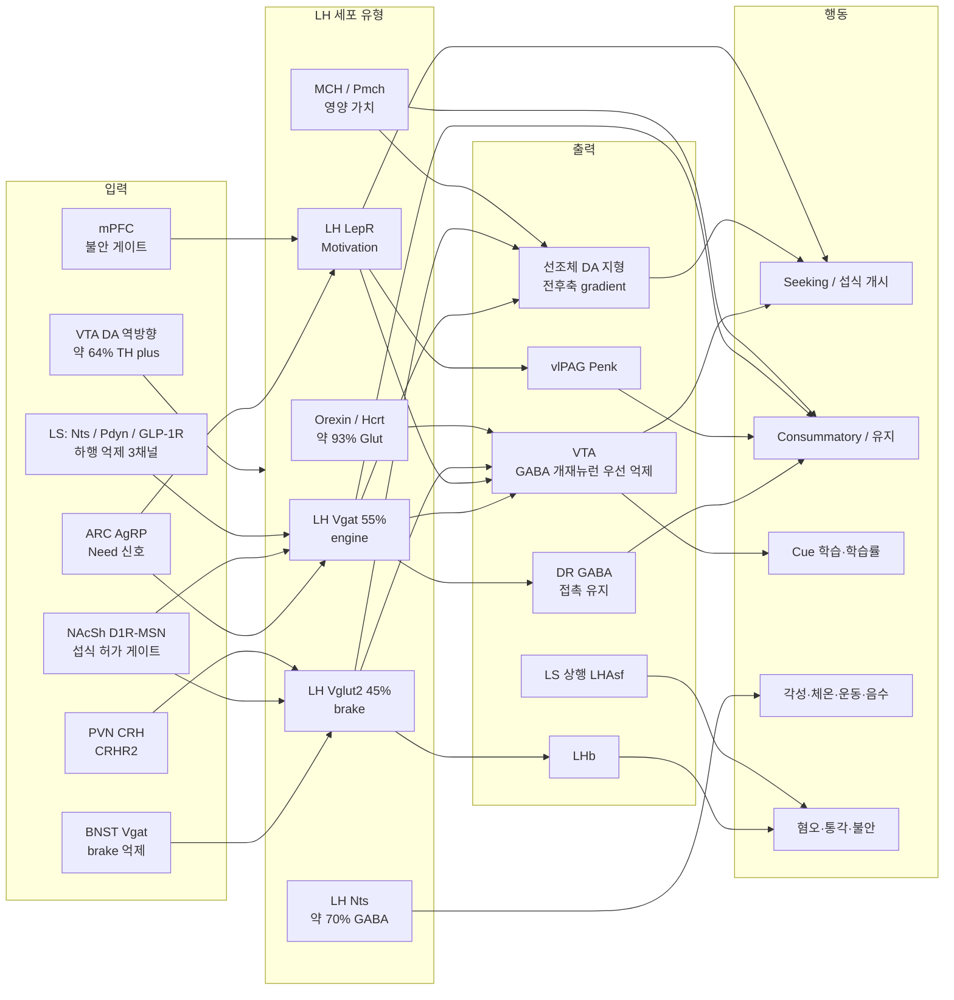

> [!takeaway] 연구 방향 관점의 핵심
> 우리 연구실의 LH 노선은 **marker 기반 기능 분해**다 — [[lee-2023-lateral-hypothalamic-leptin-receptor|Lee 2023 Nat Commun]]이 "LH GABA의 4%인 LepR 뉴런이 food-specific LH GABA의 79%를 설명한다"는 기능적 농축 논증으로 [[jennings-2015-visualizing-hypothalamic-network-dynamics|Jennings 2015]]가 열어 둔 "Vgat subset의 분자 정체"를 메웠고, [[kim-2024-normative-framework-dissociates-need|Kim 2024 Sci Adv]]가 이를 **AgRP=Need / LH^LepR=Motivation**으로 정량화했으며, [[cheon-2025-lateral-hypothalamus-and-eating-cell|Cheon 2025 EMM]]이 cell type × 4 subdivision × phase 3차원 격자로 정리했다. 이 종합 페이지의 결론은 세 가지다.
>
> 1. **우리가 가장 잘 메울 수 있는 공백은 "기능 ensemble의 분자 정체"다.** [[lee-2026-distinct-lateral-hypothalamic-gabaergic|Lee 2026]]·[[figge-schlensok-2025-a-lateral-hypothalamic-neuronal|Figge-Schlensok 2025]]·[[gordon-2026-lateral-hypothalamic-control-of|Gordon 2026]]이 모두 "이 ensemble의 분자 정체는?"을 미해결로 남겼고, EASI-FISH가 300 µm 두께에서 RNA를 40일 이상 보존하므로 사후 활성–분자 정합이 기술적으로 열려 있다([[wang-2021-expansion-assisted-iterative-fish-defines-lateral|Wang 2021]], [[concept-activity-molecular-registration]]).
> 2. **우리 노선의 약점 세 가지는 선제적으로 수선해야 한다** — (i) LH^LepR의 분자 주소 미확정(두 공간·단일세포 아틀라스 모두 *Lepr* 저검출·패널 부재), (ii) Lepr-Cre의 순도(glutamatergic *Lepr*⁺ subset; [[rossi-2021-transcriptional-and-functional-divergence|Rossi 2021]]), (iii) 비율 인용의 비일관성(리뷰 ~20% vs 원저 4%).
> 3. **비만의 분자·인간 유전 신호는 우리가 보는 GABA 쪽이 아니라 반대편 Vglut2 brake에 몰려 있다**([[rossi-2019-obesity-remodels-activity-and|Rossi 2019]]). [[concept-need-motivation-pleasure-utility|NMPU]]로 번역하면 비만은 "Motivation 과잉"이 아니라 **Motivation을 상쇄할 satiation counter-term의 소실**로 정식화되며, 치료 극성이 "LH^Vgat 끄기"보다 **"LH^Vglut2 brake 복원"**일 수 있다는 작업 가설이 나온다(연결 가설 — §9).

# Lateral hypothalamus 종합 — 세포 유형·시간 동역학·Need/Motivation·학습·가소성·회로

이 페이지는 위키에 수집된 LH 1차 문헌·리뷰·개념 페이지를 **다섯 렌즈**(세포 유형·시간 동역학·Need/Motivation·학습·입출력/가소성)로 교차 분석한 종합이다. 개별 논문 요약은 각 페이지에 있고, 여기서는 **논문 사이의 관계**(수렴·충돌·공백)만 다룬다. LH 단일 개념 정리는 [[concept-lateral-hypothalamus]], 섭식 전체 지형은 [[overview-appetite-energy-homeostasis]]를 참조.

표기 규칙:
- **(배경지식)** = 위키 1차 출처 없이 분야 상식으로 적은 문장.
- `> [!warning] 연결 가설` = 위키 내 어떤 논문도 단독으로 주장하지 않은 **본 페이지의 추론**. 절대 findings로 읽지 말 것.
- ⚠️ = 같은 사실에 대해 문헌이 갈리거나 원문보다 강하게 전파된 수치.

---

## 0. 한눈에 보기 — 핵심 명제

**명제 1. LH의 전달물질 이분법은 유지되지만, 그 경계는 "어떤 marker를 쓰는가"에 달려 있다.** Tuberal LHA 뉴런 36,423개의 EASI-FISH에서 *Slc17a6*⁺ 45% vs *Slc32a1*⁺ 55%로 이분법은 대체로 성립한다([[wang-2021-expansion-assisted-iterative-fish-defines-lateral]]). 그러나 GABA marker를 *Gad1*(합성효소)로 잡으면 공발현이 흔하고 *Slc32a1*(소포수송체)로 잡으면 드물다 — MCH 분류 논쟁 전체가 이 한 문장에서 나온다([[mickelsen-2019-single-cell-transcriptomic-analysis-of]]).

**명제 2. "engine(Vgat) / brake(Vglut2)"는 고정 속성이 아니라 상태·식이·시냅스 무게에 따라 변하는 설정값이다.** LHA^Vglut2의 sucrose 반응은 포만(prefed)에서 더 크고 만성 HFD 12주에 반응·휴지기 활동·내재 흥분성이 모두 둔화된다([[rossi-2019-obesity-remodels-activity-and]]). 거꾸로 LH^Vgat의 "섭취 증가" 일부는 갉기 spillage였다([[de-vrind-2019-effects-of-gaba-and]]).

**명제 3. 단일 marker 집단은 거의 언제나 투사별로 둘 이상으로 쪼개진다.** LHA^Vglut2는 전측·*Pax6*⁺→LHb와 후측·*Pdyn*⁺/*Hcrt*⁺→VTA로 갈리고, **leptin이 두 경로를 반대 부호로 민다**(interaction F(1,370)=63.99, p=1.6e-14)([[rossi-2021-transcriptional-and-functional-divergence]]). LH^Lepr도 vlPAG 분지만 폭식을 매개한다([[shin-2023-early-adversity-promotes-binge-like-eating]]).

**명제 4. appetitive와 consummatory는 LH 안에서 거의 비중첩 subset으로 분업한다.** LH^Vgat 743 뉴런에서 nose-poke 반응 168 / 첫 lick 반응 75가 "rarely both"였고([[jennings-2015-visualizing-hypothalamic-network-dynamics]]), LH^LepR에서는 seeking 전용 25% / consummatory 전용 39%로 순차·배타적이며 seeking 활성은 자발적 seeking 개시 **약 6초 전**에 이미 올라간다([[lee-2023-lateral-hypothalamic-leptin-receptor]]).

**명제 5. cue 반응의 "음식 특이성"은 소수 집단만의 속성이다.** 단일세포에서 **LH^LepR만 CS+/CS−를 변별**하고(centroid 2.00 vs LH^Vgat 1.26, 선택성 p=0.0034)([[siemian-2021-lateral-hypothalamic-lepr-neurons]]), LH^Vgat cue ensemble 다수는 혐오 열자극에도 흥분하는 **valence 무관 salience 코더**다(heat vs caged PB r=0.59)([[lee-2026-distinct-lateral-hypothalamic-gabaergic]]).

**명제 6. 같은 LH^LepR 광·화학유전 활성의 섭취 부호가 네 갈래로 갈린다** — phase-isolated ↑ / 급성 제한 직후 ↓ / 전부 무변(학습만 변화) / 바닥 chow ↓·운동 ↑. 과제 구조·배고픔 상태·좌표·시간척도·맥락 불안도 다섯 축이 모두 다르지만 **어느 축도 실험적으로 검정되지 않았다**(§8 쟁점 2).

**명제 7. LH는 "먹을지 스위치"가 아니라 도파민을 어디에 뿌릴지 정하는 조절기다.** LH^GABA/LH^Glut의 **비율(LHA^Ratio)**이 섭취물 가치·valence를 연속축으로 추적하고 선조체 DA를 전후축 gradient로 인과 설정한다(GABA 자극 → 전측 DA↑, Glut 자극 → 전측 DA↓·tail of striatum DA↑)([[gordon-2026-lateral-hypothalamic-control-of]]).

**명제 8. 선조체 DA는 섭취의 개시(bout 수)만 강화하고 지속(bout 길이)은 강화하지 않는다.** lick 연동 자극에서 VTA·NAcCC·DMS·DLS 모두 bout 수를 늘리지만 DMS·DLS는 licks/bout을 오히려 줄인다([[gordon-2026-lateral-hypothalamic-control-of]]). [[concept-liking-wanting|wanting/liking]] 지표 분리와 그대로 겹친다.

**명제 9. LH는 섭식 출력뿐 아니라 "무엇을 배울지"를 배분한다.** cue 구간만 광억제하면 cue–음식 연합의 획득·발현이 무너지는데 직후 pellet 섭취는 정상이고 결손이 레이저 없는 소거까지 지속되며([[sharpe-2017-lateral-hypothalamic-gabaergic-neurons]]), 같은 조작이 중립·원위 cue 학습은 **촉진**하고 latent inhibition은 소실시킨다([[sharpe-2021-past-experience-shapes-the]]).

**명제 10. 비만의 1차 병변 후보는 brake의 기능 상실이고, 그 기전은 최소 둘(세포 내재 흥분성 / 상류 시냅스 억제)이다.** HFD 전사체 변화와 **인간 BMI gene-level 연관이 모두 LHA^Vglut2 클러스터에서 최대**이며([[rossi-2019-obesity-remodels-activity-and]]), 불안-취약 아형에서는 PVN^CRH가 **CRHR2**(CRHR1 아님) 경유로 brake를 눌러 과식만 만든다([[wang-2026-a-hypothalamic-circuit-links]]).

### LH 회로 지도 — 입력 → 세포 유형 → 출력 → 행동

---

## 1. 개념의 역사적 궤적 — 네 시대

LH 연구는 네 번 질문을 바꿨다. "LH가 필요한가"(병변/자극) → "어느 세포가 하는가"(세포 유형/광유전) → "세포 유형이 몇 개인가"(아틀라스) → "LH가 계산하는 양은 무엇인가"(인지·계산).

| 시대 | 대표 연구 | 질문 | 핵심 결과 | 남긴 한계 |
|---|---|---|---|---|
| **I. 병변·ICSS 시대** (1960s–70s) | Valenstein 1968(substitutability) · Wise 1968/1971 · Coons 1965 · Wise & Albin 1973 — [[stuber-2016-lateral-hypothalamic-circuits-for]] 경유 | LH가 섭식에 필요한가 | 전기자극 섭식은 **반복 시행 중 형성되는 반응 패턴**이고 먹이·물·갉기로 **substitutable**하며, 조건 맛 혐오를 만들 수도 있다 | 세포 유형 미분해. drive–reward paradox 미해결 |
| **II. 세포 유형·광유전 시대** (2013–2016) | [[jennings-2013-the-inhibitory-circuit-architecture]] · [[jennings-2015-visualizing-hypothalamic-network-dynamics]] · [[nieh-2016-inhibitory-input-from-the]] · [[oconnor-2015-accumbal-d1r-neurons-projecting]] | 어느 세포·어느 입력이 하는가 | LH^Vglut2 = brake(활성 → 섭취·food zone↓, F1,36=13.31/13.12), LH^Vgat = engine(ChR2 → 섭식·장소선호·자기자극), BNST^Vgat은 **LH^Vglut2를 선택 표적**(rabies F1,20=38.50), NAcSh D1R-MSN은 LH^Vgat 78%를 억제해 섭식을 허가/종료 | 집단 내부 이질성 미분해. bulk 조작이 phase를 덮어씀 |
| **III. 아틀라스 시대** (2019–2021) | [[mickelsen-2019-single-cell-transcriptomic-analysis-of]] · [[rossi-2019-obesity-remodels-activity-and]] · [[wang-2021-expansion-assisted-iterative-fish-defines-lateral]] · [[rossi-2021-transcriptional-and-functional-divergence]] · [[heyward-2025-single-nucleus-transcriptional-and-chromatin]] | 세포 유형이 몇 개이고 어디 있는가 | 흥분성 15+억제성 15(Mickelsen) / 뉴런 4(Rossi 2019) / consensus 17+17·FISH 24+22(Wang) / 투사 정의 scRNA-seq(Rossi 2021) / LepR⁺ 39 클러스터(Heyward) | ⚠️ **클러스터 수의 정답은 없다**(해상도·알고리즘·샘플 영역 차이). *Lepr*는 두 공간 아틀라스에서 저검출·패널 부재 |
| **IV. 인지·계산 시대** (2017–2026) | [[sharpe-2017-lateral-hypothalamic-gabaergic-neurons]] · [[sharpe-2021-past-experience-shapes-the]] · [[sharpe-2024-the-cognitive-lateral-hypothalamus]] · [[kim-2024-normative-framework-dissociates-need]] · [[liu-2023-an-iterative-neural-processing]] · [[lee-2026-distinct-lateral-hypothalamic-gabaergic]] · [[gordon-2026-lateral-hypothalamic-control-of]] · [[hoang-2026-methamphetamine-potentiates-the-use-of]] | LH가 계산하는 양은 무엇인가 | LH^GABA = 학습 자원 배분기(cue 억제가 보상 근접 학습↓·중립 원위 학습↑·latent inhibition 소실), LH^LepR = Motivation(M(t)=∫[a·N−Leak]dt), 섭식은 C-W-n(E-W)-C로 조각나 있고 LH^GABA는 조각 개시 노드, LHA^Ratio가 선조체 DA 지형을 설정 | 기능 ensemble ↔ 분자 ↔ 공간 ↔ 투사의 **대응표가 하나도 없다** |

### 시대 전환의 의미 — 세 가지 교훈

**교훈 1. 숫자는 방법의 함수다.** 같은 "LHA 세포타입 수"가 4개에서 46개까지 가고, 그 차이는 해상도·군집 알고리즘·샘플 영역(caudal LHA+tuberal vs tuberal only)에서 나온다. Wang 2021의 consensus 17+17이 Mickelsen 4,418 + Rossi 2019 대조군 2,087을 **통합해 만들어진 것**이라는 사실 자체가 그 증거다([[wang-2021-expansion-assisted-iterative-fish-defines-lateral]], [[rossi-2023-control-of-energy-homeostasis]], [[chen-2025-the-integrated-function-of-the]]). 특정 숫자를 "LHA 세포타입 수"로 인용하지 말 것.

**교훈 2. 1차 census가 리뷰 수치를 깎는다.** [[bonnavion-2016-hubs-and-spokes-of|Bonnavion 2016]]이 정리한 공발현 수치(LepRb 약 60% *Nts*, Nts–LepRb 95% *Gal*, MC4R⁺의 약 75%가 *Nts*, LepRb→Hcrt 30% 접촉·27.5% GABA_A IPSC)는 **리포터·IHC 근거**이며 전사체 해상도에서 재정량됐다. 인용 시 근거 종류를 밝혀야 한다(§2 표 4).

**교훈 3. 설명 수준의 경쟁은 데이터 모순이 아니다.** [[sharpe-2024-the-cognitive-lateral-hypothalamus|Sharpe 2024]]는 [[stuber-2016-lateral-hypothalamic-circuits-for|Stuber & Wise 2016]]과 [[rossi-2023-control-of-energy-homeostasis|Rossi 2023]]을 "학습 증거를 인정해도 결론은 항상성으로 돌아가는" 이론의 대표로 **직접 비판**한다. 그런데 Stuber & Wise가 인용한 고전(Valenstein의 substitutability, Wise의 반복 시행 중 반응 형성, Wise & Albin의 조건 맛 혐오)이 오히려 학습 해석과 같은 방향이다 — 즉 쟁점은 종결점 선택이다(§8 쟁점 10).

---

## 2. 해부와 세포 유형 — hubs & spokes에서 분자 층판으로

### 2.1 계보 — 왜 "hubs and spokes"였는가

전사체 이전 시대의 정리인 [[bonnavion-2016-hubs-and-spokes-of]]는 LHA를 **세 펩타이드 집단**(Hcrt/Orexin, MCH, 그리고 LepRb·Nts·Gal·MC4R의 "세 번째 집단") **+ 넓은 GABA/Glut 배경**으로 그렸다. 중요한 것은 그 리뷰가 세포 유형을 "분자 marker · 발생 이력 · 전기생리 · 형태 · 입출력의 합류점"으로 정의하고, **전달물질 전환(respecification)에 따른 동적 정체성**까지 경고했다는 점이다 — 10년 뒤 EASI-FISH가 보여준 "좌표가 아니라 발생 전사인자가 구획을 정한다"는 결과의 예고였다.

지난 10년의 이동을 한 줄로 요약하면: **"펩타이드 하나 = 집단 하나"에서 "전달물질 × 펩타이드 × 전사인자 × 공간 층판 × 투사 표적의 교집합"으로**([[bonnavion-2016-hubs-and-spokes-of]] → [[mickelsen-2019-single-cell-transcriptomic-analysis-of]] → [[wang-2021-expansion-assisted-iterative-fish-defines-lateral]] → [[rossi-2021-transcriptional-and-functional-divergence]]). 우리 연구실의 [[cheon-2025-lateral-hypothalamus-and-eating-cell]]가 세운 **cell type × 4 subdivision × phase 3차원 격자**는 이 이동의 중간 정리이며, 지금은 세 지점에서 업데이트가 필요하다 — ① 좌표 격자가 분자 층판과 어긋나고, ② 리뷰가 인용한 공발현 비율 몇 개가 1차 census 수치보다 높고, ③ **투사 축이 빠져 있다**.

### 2.2 마스터 세포 유형 표

| 세포 유형 (marker) | 전달물질 (수치·근거) | 아영역·공간 | 주요 투사 | 행동 역할 (인과 vs 상관) | 핵심 근거 |
|---|---|---|---|---|---|
| **LH^Vgat** (*Slc32a1*) | GABA. tuberal 뉴런의 **55%**(20,029/36,423) | 전역. LHAs-db(억제성 우세)·LHAfm 농축; ZI와 Inh-9/13/17/19 공유 | VTA^GABA, DLS^Pdyn, PAG, LC, PVN | **인과**: ChR2→섭식·장소선호·자기자극↑, eArch→섭식↓·장소혐오, taCasp3→체중·섭취·PR breakpoint↓. ⚠️ bulk hM3Dq는 lick만↑, 수 시간 활성은 **실제 섭취 불변·갉기만↑**. **상관**: salience ensemble vs value-scaled consumption ensemble 비중첩 | [[jennings-2015-visualizing-hypothalamic-network-dynamics]] · [[de-vrind-2019-effects-of-gaba-and]] · [[lee-2026-distinct-lateral-hypothalamic-gabaergic]] · [[wang-2021-expansion-assisted-iterative-fish-defines-lateral]] |
| **LH^Vglut2** (*Slc17a6*) | Glutamate. tuberal 뉴런의 **45%**(16,394) | **전측→LHb / 후측→VTA** AP 분리(F(2,18)=65.83) | LHb(*Pax6*⁺·*Sostdc1*⁺), VTA(*Pdyn*⁺/*Hcrt*⁺), PBN, PAG | **인과**: 5 Hz 광활성→굶긴 마우스 섭취·food zone↓(F1,36=13.31/13.12)·혐오; 광억제→포만 중 섭식·기호식 선호 = **brake**. 상태 의존: sucrose 반응 prefed>24h fast, HFD 12주에 둔화(내재 흥분성↓). 인간 BMI 유전 연관 최대 | [[jennings-2013-the-inhibitory-circuit-architecture]] · [[rossi-2019-obesity-remodels-activity-and]] · [[rossi-2021-transcriptional-and-functional-divergence]] |
| **LH^LepR** | GABA 우세(*Gad1*^EGFP에서 전부 GAD67⁺). ⚠️ *Vglut2* 투사뉴런 일부에도 *Lepr*(X²=121.67) | **4%**(본 lab 실측) ~ **20%**(선행)의 LH GABA. pmLH(Lee) / amLH(Petzold·Figge) / alLH 경계(Siemian) | VTA(조밀), vlPAG^Penk, 국소 orexin(WGA), **선조체·NAc 투사 없음** | **인과 부호 4갈래**: phase-isolated↑ / 급성제한 후↓ / 전부 무변(학습만 변화) / 바닥 chow↓·운동↑·체온↑. anxiogenic 맥락에서만 섭식 개시↑. **상관**: food-specific LH GABA의 79%, seeking 25%/consummatory 39% | [[lee-2023-lateral-hypothalamic-leptin-receptor]] · [[leinninger-2009-leptin-acts-via-leptin]] · [[siemian-2021-lateral-hypothalamic-lepr-neurons]] · [[petzold-2023-complementary-lateral-hypothalamic-populations]] · [[de-vrind-2019-effects-of-gaba-and]] · [[figge-schlensok-2025-a-lateral-hypothalamic-neuronal]] |
| └ **LepR *Gal*⁺/*Ebf1*⁺** (cluster 3) | GABA (*Gal*은 LH 뉴런의 12–15%) | — | — | *Ebf1* = anorexia nervosa·불안 위험 유전자. LepR⁺*Ebf1*⁺ 공발현↑ ↔ 불안↓(ISH P=0.029) | [[figge-schlensok-2025-a-lateral-hypothalamic-neuronal]] |
| └ **LepR *Tac1*⁺/*Htr2c*⁺/*Opcml*⁺** (cluster 4) | — (*Tac1*은 LH의 약 30%, 금식 민감) | — | — | *Opcml* = AN 위험 유전자. 불안 방향은 Gal/Ebf1형과 반대일 가능성 | [[figge-schlensok-2025-a-lateral-hypothalamic-neuronal]] · [[korotkova-2026-balancing-acts-lateral-hypothalamic]] |
| **LH^Nts** | **70.8% GABA / 29.2% Glut**(sc-qPCR 78.1/26.0). ⚠️ 리뷰 표기 80/20 | **흥분성 1 + 억제성 3**: Ex-16(등내측·전측), Inh-9(ZI·LHAs-db), Inh-14(Hcrt 띠 33% 중첩), Inh-18 | VTA, OVLT·MEPO·SO·PVH·PBN, LC·LDTg·VLPO, MEV·SUT(턱운동), ARH·DMH·VMH | **인과**: TeTox 침묵 → 물 섭취·체온·체중·지방량·자발운동·novelty engagement↓, **24 h 총 섭취·meal 구조 불변**. 화학유전 활성 → 음수 급증·social↓ | [[mickelsen-2019-single-cell-transcriptomic-analysis-of]] · [[wang-2021-expansion-assisted-iterative-fish-defines-lateral]] · [[sumarli-2026-multidimensional-control-of-ingestive-behavior]] · [[petzold-2023-complementary-lateral-hypothalamic-populations]] |
| └ *Nts*/*Cartpt* cluster 3 | GABA (*Gal* 59%·*Calcr*·*Gpr101*) | mid-LHA에서 *Cartpt* 공발현 최대 | — | 내부가 ***Crh*형(39.7%) vs *Tac1*형(50.4%)로 거의 상호배타**(둘 다 9.9%, 1,016세포) — 기능 미측정 | [[mickelsen-2019-single-cell-transcriptomic-analysis-of]] |
| **Orexin / Hcrt** | ***Slc17a6* 93.0% / *Slc32a1* 4.0%**. *Pdyn* 거의 전부. ⚠️ 약 20%가 GABA-IR이나 VGAT⁻ | **LHAhcrt-db 단일 하위구역**(꼬리쪽 dorsal band). *Calb2*⁺ 93%(593/640)·*Nts*⁺ 5%. soma 3,690 µm³(평균 약 2.4배) | VTA(DA·GABA 모두 흥분), LC, NAc, TMN, 전역 | **상관+약리**: CPP 표현 중 LH orexin Fos 48–52%, 선호와 R=0.72–0.90(PFA·DMH 무상관). LH 국소 rPP→소거 선호 복원(OX1R 길항제로 차단), VTA orexin A 주입→복원. **novelty CPP에서는 무반응(18±2%)**. 포도당·leptin 억제, ghrelin 흥분 | [[mickelsen-2019-single-cell-transcriptomic-analysis-of]] · [[wang-2021-expansion-assisted-iterative-fish-defines-lateral]] · [[harris-2005-a-role-for-lateral]] · [[yamanaka-2003-hypothalamic-orexin-neurons-regulate]] · [[rossi-2021-transcriptional-and-functional-divergence]] |
| **MCH / Pmch** | ⚠️ **분류 충돌**: sc-qPCR *Slc17a6* 100%·*Slc32a1* 미검출 vs EASI-FISH **92% 이상이 *Gad1*+*Slc17a6* 공발현** | 83% LHA / 17% ZI(ZI는 99% *Cartpt*⁺). ***Cartpt*⁺ 77% vs ⁻ 22%**(⁻는 LHAdl). *Gpr83* 77% | NAc shell·선조체, LS(glutamate 방출), MS, TMN, MRN | **인과**: sucralose와 짝지은 20 Hz 자극 → lick·선조체 DA +69%, sucrose 선호 82%→20% 역전; MCH 제거 → sucrose DA(+118%)·영양 조건화 소실, **단맛 선호는 보존** = 영양(post-ingestive) 가치 채널. rat에서는 cue+섭취 통합형. ⚠️ **LepR 미발현**(4편 음성) | [[mickelsen-2019-single-cell-transcriptomic-analysis-of]] · [[wang-2021-expansion-assisted-iterative-fish-defines-lateral]] · [[domingos-2013-hypothalamic-melanin-concentrating-hormone]] · [[subramanian-2023-hypothalamic-melanin-concentrating-hormone-neurons]] |
| **Sst** | **아영역 의존**: perifornical 56.1% GABA/43.6% Glut(후측 Glut 71.1%), tuberal **97.3% GABA** | perifornical vs tuberal. Glut Ex-5(LHAs-db·LHAfl), Inh-1(LHAfm), Inh-2(LHAs-db), Inh-5 | **perifornical LHA^Glut Sst → dLS**(CTb⁺Sst⁺의 75.3%가 *Slc17a6*⁺) | **인과**: hM3Dq(n=4 vs 6) → **비식용 물체 갉기 P=0.011**, rearing·digging·이동거리↑(P=0.009). ⚠️ 4개 하위집단 동시 활성 | [[mickelsen-2019-single-cell-transcriptomic-analysis-of]] · [[wang-2021-expansion-assisted-iterative-fish-defines-lateral]] · [[concept-lateral-septum]] |
| **Trh** | Glutamate(FISH *Slc17a6* 93.6%). **97.6%가 *Otp*⁺** | ***Syt2*형 전측 / *Cbln2*형 후측 구배**(am/al vs pm/pl 축과 정렬). 4타입: Ex-3(LHAfm), Ex-4(LHAfl-mv), Ex-8·11(LHAfl-dl) | — | ARC AgRP·POMC 입력을 받는 섭식 후보 집단 — **직접 조작 없음** | [[mickelsen-2019-single-cell-transcriptomic-analysis-of]] · [[wang-2021-expansion-assisted-iterative-fish-defines-lateral]] |
| **Gal** | 약 50% Vgat(리뷰). GABA cluster 1(*Gal*+*Dlk1*)과 흥분성 Ex-10 양쪽 | Ex-10은 LHAd-db·LHAfl-vl 두 곳 | **VTA로 투사하지 않음**. LC_NA로 조밀 | 섭식↑(리뷰). LepR⁺의 20–44%가 *Gal*⁺ | [[cheon-2025-lateral-hypothalamus-and-eating-cell]] · [[wang-2021-expansion-assisted-iterative-fish-defines-lateral]] · [[bonnavion-2016-hubs-and-spokes-of]] |
| **Crh** | GABA 계열로 분류(리뷰 표는 Vgat 항에 배치하되 **비율을 제시하지 않는다** — ⚠️ "82% Vgat"처럼 인용되는 수치는 위키에서 1차 근거를 확인하지 못했다). *Lepr*와 약 50/52% 상호 공발현 | amLH 우세. *Nts*/*Cartpt* cluster 3 내 ***Crh*형 39.7%** | VTA, LC | amLH Vgat 활성 → 섭식↑(리뷰; *Crh* 한정 조작 아님) | [[cheon-2025-lateral-hypothalamus-and-eating-cell]] · [[mickelsen-2019-single-cell-transcriptomic-analysis-of]] · [[figge-schlensok-2025-a-lateral-hypothalamic-neuronal]] |
| **Penk** | 52% Vglut2 / 42% Vgat(리뷰) | plLH | PAG | predator odor → high-fat 과식(stress eating) | [[cheon-2025-lateral-hypothalamus-and-eating-cell]] |
| **Pdyn** | orexin과 거의 전부 공발현; Glut1(*Grp*+*Cck*)에도 | 후측 LHA(VTA 투사 Vglut2 클러스터의 정체) | VTA | Hcrt와 공동방출되나 VTA_DA 흥분성·보상에 **반대 방향** | [[mickelsen-2019-single-cell-transcriptomic-analysis-of]] · [[rossi-2021-transcriptional-and-functional-divergence]] · [[bonnavion-2016-hubs-and-spokes-of]] |
| **Tac1** | 억제성 cluster 3 내 *Tac1*형(50.4%); *Lepr*⁺ cluster 4; Glut cluster 4(*Tac1*+*Pitx2*) | LH의 약 30%(금식 민감) | — | 직접 조작 없음 | [[mickelsen-2019-single-cell-transcriptomic-analysis-of]] · [[figge-schlensok-2025-a-lateral-hypothalamic-neuronal]] |
| **MC4R** | GAD67 공존. **MC4R⁺의 약 75%가 *Nts* 공발현**(방향 주의). LHA LepRb의 약 1/3만 MC4R | LHA 고유 Nts–MC4R 집단 | **DR·VTA로 투사하지 않음**(Nts–LepRb와 구분되는 별개 하위집단) | leptin 주사 후 MC4R 세포의 약 80%가 pSTAT3⁺. ⚠️ scRNA-seq에서 *Mc4r* 저검출 | [[bonnavion-2016-hubs-and-spokes-of]] · [[cheon-2025-lateral-hypothalamus-and-eating-cell]] · [[mickelsen-2019-single-cell-transcriptomic-analysis-of]] · [[concept-mc4r]] |
| **Camk2a** | 대부분 Vglut2(64–79%), Vgat 일부 | — | — | hunting 중 활성↑, 섭취 후 rapid baseline 회복 | [[cheon-2025-lateral-hypothalamus-and-eating-cell]] |
| **Th / 도파민성** | ⚠️ **양쪽**: 흥분성 Ex-4(*Trh*/*Th*)·Ex-15 / 억제성 Inh-2(*Sst*/*Th*), GABA cluster 12(*Th*·*Ddc*·*Slc18a2*) | Inh-2는 LHAs-db | — | ⚠️ 리뷰의 "Th = Vgat subgroup" 분류와 EASI-FISH가 불일치 | [[wang-2021-expansion-assisted-iterative-fish-defines-lateral]] · [[mickelsen-2019-single-cell-transcriptomic-analysis-of]] · [[chen-2025-the-integrated-function-of-the]] |
| ***Prlr*/*Prokr1*⁺ Sst^Glut** | Glutamate (Glut cluster 15) | perifornical | dLS | 모체 섭식·수유기 과식 후보 노드 — 발현만 보고, 기능 미검증 | [[mickelsen-2019-single-cell-transcriptomic-analysis-of]] |
| ***Oxt*⁺ 대형 뉴런** | *Slc17a6*·*Gal* 공발현(13/13) | **복외측 LHA**(LHAfl-vl), 3,089 µm³ | — | 공간·형태 이상치 추적(iterative refinement)으로 새로 발굴. 기능 미검증 | [[wang-2021-expansion-assisted-iterative-fish-defines-lateral]] |
| **비뉴런** | Astro, MG, Olig, OPC, Endo, Peri, VSM, EOC (뉴런은 전체 세포의 약 55%) | — | — | astrocyte ANLS lactate shuttle이 orexin 활성 유지; HFD 전사체 변화는 Vglut2 뉴런 > oligodendrocyte | [[rossi-2019-obesity-remodels-activity-and]] · [[chen-2025-the-integrated-function-of-the]] · [[mickelsen-2019-single-cell-transcriptomic-analysis-of]] |

> [!warning] 프로모터 표지의 함정 — [[concept-lh-camkii-neurons]] (2026-10 추가)
> `AAV-CaMKIIα` 프로모터로 정의한 "LH^CaMKIIα"는 세포 유형이 아니다. 같은 프로모터·거의 같은 좌표에서 [[heiss-2024-distinct-lateral-hypothalamic-camkiia]]는 Vgat 20–33%를 세고 [[tan-2022-lateral-hypothalamus-calcium-calmodulin-dependent-protein]]은 "거의 비중첩"이라 적으며(수치 없음), 후자의 기능 주역은 **미확인 vGluT2⁻ 36.13%**다. *Camk2a*는 [[mickelsen-2019-single-cell-transcriptomic-analysis-of]] census의 단일 클러스터에 대응되지 않는다. 본 절의 marker 의존성 논지가 가장 선명하게 드러나는 사례이며, §8-2의 LepR 부호 논쟁과 같은 뿌리(드라이버 라인을 세포 유형으로 취급)로 읽을 수 있다 (연결 가설).

### 2.3 전달물질 이분법 — 유지되지만 marker에 달려 있다

Tuberal LHA 36,423 뉴런에서 *Slc17a6*⁺ 45% vs *Slc32a1*⁺ 55%로 이분법은 대체로 유지된다([[wang-2021-expansion-assisted-iterative-fish-defines-lateral]]). 따라서 [[concept-lateral-hypothalamus]]의 "단일 세포가 Vgat·Vglut2 동시 발현 → 이분법 약화" 서술은 **원문보다 강하다** — 공발현 클러스터 Ex-12는 대부분 entopeduncular nucleus에 있고 LHA에는 작은 무리뿐이며, *Pmch*의 이중 marker는 ***Gad1***+*Slc17a6*이지 *Slc32a1*이 아니다.

대신 [[mickelsen-2019-single-cell-transcriptomic-analysis-of]]가 셋째 패턴을 더한다: ***Slc17a6*⁺·*Slc32a1*⁻이면서 *Gad1*을 강발현하는 LHA^Glut 클러스터 4개**(*Pmch* 포함), 그리고 *Gad2*가 *Gad1*보다 *Slc32a1*과 더 잘 맞는다는 관찰. 결론은 방법론적이다 — **"무엇을 GABA marker로 잡는가"가 분류를 정한다**(합성능 vs 소포 적재).

#### 표 5. 같은 세포, 다른 라벨 — 전달물질 귀속이 뒤집히는 사례

| 집단 | "GABA" 근거 | "Glutamate" 근거 | 무엇이 결정하는가 | 출처 |
|---|---|---|---|---|
| **MCH / Pmch** | GAD65·GAD67 공존, rat MCH-IR 대다수 GAD67⁺, **EASI-FISH 92% 이상이 *Gad1* 공발현** | sc-qPCR ***Slc17a6* 100%·*Slc32a1* 미검출**, LS 투사는 glutamate 단시냅스 방출, LC 말단 VGAT 공존 약 6% | ***Gad1*(합성효소) vs *Slc32a1*(소포수송체)** | [[wang-2021-expansion-assisted-iterative-fish-defines-lateral]] · [[mickelsen-2019-single-cell-transcriptomic-analysis-of]] · [[bonnavion-2016-hubs-and-spokes-of]] |
| **Orexin / Hcrt** | 약 20%가 GABA 면역반응 양성, Hcrt→MCH 억제가 gabazine 민감 | ***Slc17a6* 93.0%**, 말단 VGLUT2 공존, LC에서 비대칭(흥분성) 시냅스 | **VGAT 음성 + GABA-IR 양성** → 국소 GABA 중계 vs 자체 방출 미해결 | [[bonnavion-2016-hubs-and-spokes-of]] · [[mickelsen-2019-single-cell-transcriptomic-analysis-of]] |
| **Nts** | *Slc32a1* 78.1%(sc-qPCR), binarize 70.8% | *Slc17a6* 26.0%, binarize 29.2%. 단일 Glut 클러스터로 안 뜨고 여러 Glut 클러스터에 **얇게 퍼져** 있다 | 기준 집합(*Nts*⁺ 전체 vs *Nts*⁺GABA)이 *Gal* 공발현율도 59% vs 95%로 가른다 | [[mickelsen-2019-single-cell-transcriptomic-analysis-of]] · [[cheon-2025-lateral-hypothalamus-and-eating-cell]] |
| **Sst** | tuberal **97.3%** *Slc32a1*⁺ | perifornical **43.6%** *Slc17a6*⁺(후측 최대 71.1%), dLS 투사의 75.3%가 *Slc17a6*⁺ | **아영역**이 비율을 결정 → 섞어 샘플링하면 비율이 임의로 바뀜 | [[mickelsen-2019-single-cell-transcriptomic-analysis-of]] |
| **LepR** | *Gad1*^EGFP 전부 GAD67⁺(단백), Lepr-Cre sc-qPCR "대다수 *Slc32a1*⁺" | ***Lepr* mRNA가 Vglut2 투사뉴런 일부에**, LHb 투사에서 유의하게 높음(X²=121.67) | **단백 pSTAT3 공존 vs mRNA 검출**, Cre 계통 포착 범위 | [[leinninger-2009-leptin-acts-via-leptin]] · [[rossi-2021-transcriptional-and-functional-divergence]] |
| **Th** | GABA cluster 12, Inh-2(*Sst*/*Th*) | Ex-4(*Trh*/*Th*), Ex-15 | **양쪽에 실재** → 단일 marker로 subgroup을 지정하는 리뷰 관행의 한계 | [[wang-2021-expansion-assisted-iterative-fish-defines-lateral]] · [[chen-2025-the-integrated-function-of-the]] |

### 2.4 투사 축 — "Vglut2 = brake"는 최소 두 집단의 합

[[rossi-2021-transcriptional-and-functional-divergence]]가 같은 LHA^Vglut2를 네 층위(전사체·공간·전기생리·호르몬 반응)에서 쪼갰다.

- **전측 LHA·*Pax6*⁺(+*Sostdc1*) → LHb**: 고흥분성(rheobase↓ t(91)=5.62, p=2e-7), 자발발화↑, leptin에 반응↓/ghrelin에 반응↑, 포만 시 음식 보상 반응 세포 비율↑.
- **후측 LHA·*Pdyn*⁺/*Hcrt*⁺(= glutamatergic orexin) → VTA**: 저흥분성(약 2 Hz), quinine 우세, leptin에 반응↑.
- AP 상호작용 F(12,108)=12.05, p=4.0e-15. leptin 1.5 mg/kg이 같은 marker 안에서 **투사별로 부호를 반대로** 민다(interaction F(1,370)=63.99, p=1.6e-14).

그리고 결정적으로 ***Lepr* mRNA가 Vglut2 투사뉴런 일부에 있고 LHb 투사에서 비율이 유의하게 높다**(X²=121.67, p<0.0001; *Ghsr*은 경로 차 없음 X²=1.80, p=0.18) — 이는 [[lee-2023-lateral-hypothalamic-leptin-receptor]]·[[siemian-2021-lateral-hypothalamic-lepr-neurons]]·[[de-vrind-2019-effects-of-gaba-and]]의 LepR-Cre 조작 전체에 **순도 confound**를 만든다.

[[gordon-2026-lateral-hypothalamic-control-of]]는 두 집단을 하나의 연속 스칼라 **LHA^Ratio(GABA/Glut)**로 묶어 선조체 DA 지형을 인과 설정했는데, Rossi 2021 기준으로 그 분모(Glut)는 **leptin에 반대 부호로 반응하는 두 집단의 합**이므로 대사·호르몬 조건에서 Ratio 해석은 투사 조성에 의존한다.

### 2.5 LH^LepR — 위키에서 수치가 가장 갈리는 집단

[[leinninger-2009-leptin-acts-via-leptin]]가 원형을 세웠다: LHA LepRb는 **MCH·orexin과 완전 비중첩**(colchicine + i.c.v. leptin 3 µg 이중 검증)이고 *Gad1*^EGFP에서 **전부 GAD67⁺**이며 **VTA로 조밀 투사·선조체/NAc 투사 없음**(dorsal perifornical 주입, n=11), leptin 100 nM은 그중 **34%만 탈분극**시킨다. [[leinninger-2011-leptin-action-via-neurotensin]]이 분자 손잡이를 달았다 — **LHA LepRb의 약 60%가 *Nts*⁺**, 역으로 LHA *Nts*의 약 30%가 LepRb⁺이고, *Nts* 아집단으로 좁히면 leptin 탈분극 비율이 62%(8/13)로 올라간다. 즉 위키가 [[petzold-2023-complementary-lateral-hypothalamic-populations]]를 따라 **LepR ↔ Nts 상보·길항 쌍**으로 적는 두 집단은 **교집합이 큰 두 표지**다.

분자 주소는 아직 비어 있다. [[mickelsen-2019-single-cell-transcriptomic-analysis-of]]의 scRNA-seq은 **LHA^GABA 전반에서 *Lepr*·*Mc4r*을 거의 못 잡았고**, "LH^LepR 92% GABA"의 실제 근거는 본문 수치가 아니라 **Lepr-Cre;EYFP 정렬세포 qPCR(마우스 2마리)**이다. [[wang-2021-expansion-assisted-iterative-fish-defines-lateral]]의 24-유전자 패널에는 ***Lepr*가 없다**(후보는 *Nts*/*Gal*/*Gpr101*의 Inh-14, *Gal*의 Inh-11). [[figge-schlensok-2025-a-lateral-hypothalamic-neuronal]]가 가장 구체적인 단서를 준다 — 공개 데이터(GSE188646) 재분석에서 *Lepr*⁺가 **cluster 3 = *Gal*⁺/*Ebf1*⁺**와 **cluster 4 = *Tac1*⁺/*Htr2c*⁺/*Opcml*⁺** 두 갈래로 갈리고, ***Ebf1*·*Opcml*은 anorexia nervosa 위험 유전자**이며 LepR⁺*Ebf1*⁺ 공발현이 클수록 불안이 낮다(RNAscope P=0.029, IHC P=0.082). [[korotkova-2026-balancing-acts-lateral-hypothalamic]]이 이를 "*Tac1*·*Galanin*·*Opcml*·*Ebf1* 공발현 subset" 한 묶음으로 요약한 것은 **분화해 읽어야 한다**. [[heyward-2025-single-nucleus-transcriptional-and-chromatin]]은 LepR 뉴런 39아형 중 LH 쪽을 ***Nts*(cluster 3)·*Tcf7l2*(9)·*Meis2*/*Sst*(21)**로 적어 또 다른 좌표계를 준다.

#### 표 4. LH^LepR 분자 정체 — 수치가 갈리는 지점(인용 시 근거 종류 필수)

| 주장 | 수치 | 근거 종류 | 출처 | 병기할 반대/보완 수치 |
|---|---|---|---|---|
| LH GABA 중 LepR 비율 | **4%** | 본 lab 자체 매핑(논문은 "4–20%" 병기) | [[lee-2023-lateral-hypothalamic-leptin-receptor]] | 리뷰·외부 lab은 **약 20%**([[cheon-2025-lateral-hypothalamus-and-eating-cell]], [[siemian-2021-lateral-hypothalamic-lepr-neurons]]) |
| LH^LepR 중 GABA 비율 | **92%** | ⚠️ 원문 본문에 그 수치 없음. 근거는 FACS 단일세포 qPCR(마우스 2마리)의 "대다수" 서술 | [[mickelsen-2019-single-cell-transcriptomic-analysis-of]] 경유 [[lee-2023-lateral-hypothalamic-leptin-receptor]] | 같은 논문 scRNA-seq에서는 LHA^GABA의 *Lepr* 저검출; Vglut2 투사뉴런 일부에 *Lepr* → [[rossi-2021-transcriptional-and-functional-divergence]] |
| LepRb 전부 GABA | **100%**(정성 공존) | *Gad1*^EGFP × pSTAT3 **단백 수준**(2009년 감도) | [[leinninger-2009-leptin-acts-via-leptin]] | "약 40%는 Vgat 음성" 보고도 리뷰에 병기됨 |
| LepRb–Nts 중첩 | **약 60%**(역방향 약 30%) | leptin 유발 pSTAT3 × Nts-EGFP(n=4/군) | [[leinninger-2011-leptin-action-via-neurotensin]] | 이 수치 때문에 "LepR vs Nts 길항"은 "교집합 큰 두 표지"로 재해석 필요 → [[petzold-2023-complementary-lateral-hypothalamic-populations]] |
| LepR–Crh 상호 공발현 | ***Crh*의 약 50% / *Lepr*의 약 52%** | 리뷰 인용 | [[cheon-2025-lateral-hypothalamus-and-eating-cell]] | Mickelsen cluster 3의 *Crh*형(39.7%)·*Tac1*형(50.4%) 상호배타 분할과 대조 |
| LepRb–Gal 공발현 | **20–44%** | 리뷰 경유 Laque 2013 | [[bonnavion-2016-hubs-and-spokes-of]] | Figge-Schlensok의 *Lepr*⁺ cluster 3 = *Gal*⁺/*Ebf1*⁺ |
| LepRb–MC4R 공발현 | LepRb의 **약 1/3**; 역으로 MC4R⁺의 **약 75%가 *Nts*** | 리뷰 경유 Cui 2012 | [[bonnavion-2016-hubs-and-spokes-of]] · [[concept-mc4r]] | scRNA-seq에서 *Mc4r* 저검출. MC4R–pSTAT3 세포는 DR·VTA 비투사 |
| LepRb→Hcrt 국소 연결 | 접촉 **약 30%**, GABA_A IPSC **27.5%** | trans-synaptic 추적 + ex vivo 광자극 | [[bonnavion-2016-hubs-and-spokes-of]] · [[leinninger-2011-leptin-action-via-neurotensin]] | WGA는 단시냅스 미확정. ⚠️ KO의 자유급식 상태에서도 orexin이 켜져 있지 않다는 **자기 반증** |
| leptin 반응 이질성 | **34% 탈분극**(일부 과분극). *Nts* 아집단은 **62%(8/13)** | whole-cell, leptin 100 nM, 시냅스 차단 무관(직접 작용) | [[leinninger-2009-leptin-acts-via-leptin]] · [[leinninger-2011-leptin-action-via-neurotensin]] | "leptin 약리 ≠ 세포 특이 조작"의 근거이고 LepR 부호 논쟁의 뿌리 |
| 분자 하위집단 | ***Gal*⁺/*Ebf1*⁺** vs ***Tac1*⁺/*Htr2c*⁺/*Opcml*⁺** | 공개 scRNA-seq 재분석 + RNAscope 검증 | [[figge-schlensok-2025-a-lateral-hypothalamic-neuronal]] | 리뷰가 "*Tac1*·*Gal*·*Opcml*·*Ebf1* subset" 한 묶음으로 요약한 것은 분화해 읽어야 함 → [[korotkova-2026-balancing-acts-lateral-hypothalamic]] |

### 2.6 펩타이드 집단 — 1차 census가 리뷰 수치를 깎는 지점

- ***Nts***: [[cheon-2025-lateral-hypothalamus-and-eating-cell]]의 "약 80% Vgat/약 20% Vglut2, 95% *Gal* 공발현"에서 전자는 대략 맞고(70.8/29.2, sc-qPCR 78.1/26.0) **후자는 기준 집합이 다르다** — *Gal*은 ***Nts*⁺*Slc32a1*⁺의 59.0%**(308세포/3마우스)이고 *Nts*⁺*Slc32a1*⁻에서는 0%다. 원 수치 95%는 [[bonnavion-2016-hubs-and-spokes-of]] 원문에서 "***Nts*–LepRb 집단**의 95%"였다(§8 쟁점 4). 또 ***Cartpt*는 *Nts*⁺ 전체의 18.1%(FISH)·19.5%(seq)뿐**이라 "Nts = Nts/Cartpt 집단"으로 읽으면 안 된다. 기능은 섭취보다 **음수·체온·각성·자발운동**이다 — TeTox 침묵 시 24 h 총 섭취·meal 구조 불변([[sumarli-2026-multidimensional-control-of-ingestive-behavior]]), 15년 전 Nts-LepRbKO의 "운동량·VO₂↓, 섭식 거의 불변"과 같은 축([[leinninger-2011-leptin-action-via-neurotensin]]). ⚠️ 두 연구 모두 Nts-Cre 계열이며 *Nts*^cre/+ 대립유전자 자체가 체중·지방량을 낮춘다.
- **Orexin/Hcrt**: 공간적으로 **단일 하위구역(LHAhcrt-db)**에 국한되고 *Calb2*⁺ 93%로 분자 이질성이 작으며 soma가 LHA 평균의 약 2.4배다([[wang-2021-expansion-assisted-iterative-fish-defines-lateral]]). ⚠️ **전사체로는 하위집단이 안 나온다**(162세포 재군집화가 성·*Fos*로만 갈림; 저자들이 표본·샘플링 한계로 한정) — 반면 [[harris-2005-a-role-for-lateral]]의 **fornix 기준 LH vs PFA/DMH 기능 이분법**은 좌표 구획이지 분자 구획이 아니다. leptin의 orexin 억제가 직접인지([[yamanaka-2003-hypothalamic-orexin-neurons-regulate]]) LepRb^Nts GABA 탈억제 경유인지([[leinninger-2011-leptin-action-via-neurotensin]])는 열린 문제다.
- **MCH/Pmch**: 기능은 섭취물의 **영양(post-ingestive) 가치** 채널이고([[domingos-2013-hypothalamic-melanin-concentrating-hormone]]) rat에서는 **cue+섭취 통합형**이다([[subramanian-2023-hypothalamic-melanin-concentrating-hormone-neurons]]). ⚠️ 리뷰 표의 "*Mch* … *Lepr* 공발현"은 **MCH가 LepR를 발현하지 않는다**는 네 편·세 방법의 음성 결과와 충돌한다(§8 쟁점 1).
- **Sst**: 두 아틀라스가 "흥분성 1 + 억제성 3"에서 일치하지만 전달물질 비율이 아영역에 전적으로 의존한다. tuberal nucleus Sst(거의 순수 GABA)와 perifornical LHA Sst(혼합·dLS 투사)를 **직접 비교하지 말 것** — [[leow-2026-a-cortical-hypothalamic-neural]]의 TN^SST는 tuberal 소재다.

### 2.7 해부 — 좌표 격자 vs 분자 층판

#### 표 2. 두 구획 체계 대조

| 항목 | [[cheon-2025-lateral-hypothalamus-and-eating-cell]] 좌표 격자 | [[wang-2021-expansion-assisted-iterative-fish-defines-lateral]] 분자 층판 |
|---|---|---|
| 구획 수 | **4** (amLH·alLH·pmLH·plLH) | **9** (LHAd-db, LHAs-db 내·외측, LHAdl, LHAfm, LHAfl mv/dl/vl, + 꼬리쪽 LHAhcrt-db) |
| 경계 기준 | AP −1.5 / ML 1.0 **직교 격자** | ***Otp*/*Meis2* × *Slc17a6*/*Slc32a1*** 4유전자 이웃 농축 + GMM 3D 분할 + STAPLE consensus |
| 기하 | 좌표축 평행 | LHAd-db와 LHAs-db가 서로 **약 60° 기운 띠**, 그 사이 *Meis2* 쐐기(LHAdl). **ML 1.0 선을 가로지름** |
| AP 범위 | −0.8 ~ −2.2 | tuberal **약 −1.16 ~ −1.36 한 구간만**(저자들: 경계는 AP를 따라 변한다) |
| 세포 유형 농축 | subregion별 composition 차이를 기술 | **48개 중 45개**가 하나 이상 구역에 농축(χ², p<0.05), 개체 간 재현 |
| 입력 분리 | ARC AgRP→am/alLH, BNST→pmLH, LS·mPFC·IC·PBN→다양 | **CEA→LHAd-db, VTA→LHAdl, MEA→LHAfm, MM·NDB→LHAfl**(LHAdl·LHAfl 거의 상호배타) |
| 국소 혼합 | 명시 안 함 | 반경 50 µm 안 평균 **16개 세포 유형**, 최다 타입도 **27%** |
| 위치 예측력 | — | 24유전자 random forest가 위치 분산의 **60±2%** 설명(4유전자 제거 후 54%) |
| *Lepr* 포함 | 핵심 세포 유형 | **패널에 없음**(*Crh*·*Penk*·*Pdyn*도 없음) |
| 쥐 고전 구획 | — | Hahn & Swanson의 "suprafornical LHA"가 **LHAfm·LHAs-db·LHAd-db 세 층판으로 분해** |
| 실무 귀결 | 주입 좌표로 구역 지정 | 같은 "amLH 주입"이 fornix·ZI 기준 위치에 따라 **다른 분자 구역을 섞어 칠 수 있다** |

**대응표는 존재하지 않는다.** 모순이 아니라 다른 해상도·다른 기준이며, 두 체계를 같은 뇌에서 정합하는 실험이 비어 있다. 실무 귀결은 분명하다 — 같은 "amLH 주입"이 LHAs-db(억제성 우세)나 LHAfl(흥분성·*Trh* 우세)을 다르게 칠 수 있고, Lee 2023의 pmLH(AP −1.5~−2.2)는 Wang 표본(tuberal)보다 후측이라 **직접 매핑조차 불가하다**. [[de-vrind-2019-effects-of-gaba-and]]의 ZI 확산 판단("기여 작다")도 **ZI–LHA 분자 연속성**(Inh-9/13/17/19 공유, ZI의 *Pmch* 99%가 *Cartpt*⁺) 앞에서는 보류해야 한다([[concept-zona-incerta]]).

동시에 국소적으로는 심하게 섞여 있다 — 반경 50 µm 안 평균 16개 세포 유형, 최다 타입도 27%. 이는 [[jennings-2015-visualizing-hypothalamic-network-dynamics]]의 "cell map에서 반응 프로파일이 공간 클러스터로 분리되지 않음"(FZe 87·FZi 73·appetitive 168·consummatory 75)의 분자적 대응이지만, 그 진술은 **단일 GRIN 시야 안의 관찰**로 한정해야 한다.

#### 표 3. LHA 아틀라스 비교 — "클러스터 수의 정답은 없다"

| 연구 | 방법 | 표본 | 영역 | 클러스터 | 검증 | 주의 |
|---|---|---|---|---|---|---|
| [[mickelsen-2019-single-cell-transcriptomic-analysis-of]] | 10× scRNA-seq + DBSCAN on t-SNE | 7,129세포(P30, 수컷 3 + 암컷 2) | caudal LHA + tuberal 일부 | **흥분성 15 + 억제성 15**(비뉴런 본문 13 / Discussion 11 — 원문 불일치) | RNAscope FISH + FACS 단일세포 qPCR(30유전자) | *Lepr*·*Mc4r* 저검출. **ambient mRNA로 *Pmch*·*Hcrt*가 전 클러스터에 번짐**. P30 juvenile 단일 시점 |
| [[rossi-2019-obesity-remodels-activity-and]] | scRNA-seq(lean vs HFD 공동 clustering) | 20,194세포(대조 7마리 10,086 / HFD 7마리 10,108) | LHA | **14 클러스터** = 뉴런 4(Vglut2·Vgat·Mch·Orx) + glia·stroma | FISH 비율 검증 | 뉴런 해상도 낮음(Vgat을 하나로 취급). GEO **GSE130597** |
| [[wang-2021-expansion-assisted-iterative-fish-defines-lateral]] | EASI-FISH(ExM + HCR, 10라운드 × 3-plex, 300 µm, light-sheet) + 통합 scRNA-seq | FISH 36,423 뉴런(8주 수컷 3마리); 통합 = 자체 1,425 + Mickelsen 4,418 + Rossi 2019 대조 2,087 | tuberal LHA | consensus **흥분성 17 + 억제성 17**; FISH **24 + 22**(총 46) | 검출효율 81%, scRNA 상관 r=0.86(p=8.4e-8), 7라운드·40일 후 RNA 93.5% 보존 | 패널 24유전자(***Lepr*·*Crh*·*Penk*·*Pdyn* 없음**). 한 AP 구간·수컷만. 기능 데이터 없음 |
| [[rossi-2021-transcriptional-and-functional-divergence]] | 투사 정의 scRNA-seq(retroAAV) + 순차 HCR 9유전자 | 34,518세포(뉴런 17,378, 32 subcluster; eYFP⁺ 257 / tdTomato⁺ 1,595) | LHA(AP −1.35) | Glut1(*Pax6*)·Glut2(*Sostdc1*)·*Pdyn*/*Hcrt*·Glut14(*Pitx2*) 등 | HCR 교차검증(세포비율 r=0.81, logFC r=0.94) + 전기생리 + 2-photon | **투사 축 추가**. 전사체 농축 ≠ 동일 집단(광·화학유전 조작 없음). GEO **GSE169176** |
| [[heyward-2025-single-nucleus-transcriptional-and-chromatin]] | snRNA + snATAC multiome(NuTRAP^LepR FANS) | 22,581핵(1년령 암컷 6마리 pooling) | 시상하부 전체의 **LepR⁺ 세포만** | **39 클러스터**(LH: *Nts*=3, *Tcf7l2*=9, *Meis2*/*Sst*=21) | HypoMap label transfer + Xenium | LepR⁺만 보므로 비-LepR 집단 제외. 기저 chow 단일 조건 |
| 리뷰 요약 | — | — | — | "**>30 subtype**" | — | [[rossi-2023-control-of-energy-homeostasis]] · [[chen-2025-the-integrated-function-of-the]] |

> [!warning] 연결 가설 — 분자 taxonomy와 비선택적 자극의 비일관성
> 한 LH 좌표 안에 **부호가 반대인 집단이 섞여 있다**는 것이 비선택적 자극·DBS 결과 비일관성의 해부학적 근거일 수 있다. 근거 조각: [[leinninger-2009-leptin-acts-via-leptin]]은 같은 LHA 좌표에 orexigenic orexin/MCH와 anorexigenic LepRb가 상호 배타적으로 공존함을 보였고, [[rossi-2023-control-of-energy-homeostasis]]가 이를 "세포 유형 특이성 부재"로 정식화했으며, [[de-vrind-2019-effects-of-gaba-and]]는 같은 좌표·같은 hM3Dq로 LH^Vgat 전체와 LepR subset을 켜면 섭식·운동 부호가 갈림을 보였다(Vgat: 실제 섭취 불변·갉기↑·운동↓ / LepR: 바닥 chow↓·운동↑ t7=−4.820, P=0.002). 다만 "따라서 인간 DBS가 실패했다"는 인과는 어떤 논문도 주장하지 않았다 — §8 쟁점 12와 §7을 함께 볼 것.

---

## 3. 시간 동역학 — phase는 "개념"이 아니라 "측정 창"이다

### 3.1 왜 phase가 결론을 좌우하는가

우리 연구실이 [[lee-2019-food-craving-seeking-and]]에서 craving→seeking→consumption 3단계로 정식화하고 [[concept-appetitive-consummatory-phases]]가 정리한 appetitive/consummatory 이분법은, LH 문헌 전체에서 **결론을 가장 강하게 좌우하는 변수**다. 같은 세포군에 대한 상반된 결론이 거의 예외 없이 네 가지로 환원된다.

1. **측정 해상도** — bulk photometry vs 단일세포 microendoscope/2-photon
2. **분석 창** — onset 정점 0–1.5 s vs sustained 2–3 s vs 10 s 전체
3. **과제 구조** — 자유행동 arena vs head-fixed 구강주입 vs phase-isolated 챔버
4. **종결점** — 먹이통 무게 vs lick 수 vs bout 수/길이

따라서 아래 phase × cell-type 행렬은 "사실의 표"가 아니라 **조건 좌표가 붙은 표**로만 성립한다.

#### 표 6. phase × cell-type 행렬 (조건 좌표 병기판)

| 세포군 / ensemble | Cue·Seeking (appetitive) | 접근·개시 | 섭취 onset | 섭취 유지 (maintenance) | 종료·식후 | 측정·조작 |
|---|---|---|---|---|---|---|
| **LH^Vgat 전체 (bulk)** | 활성 → food zone 체류↑(F2,27=86.24)·자기자극; 억제 → 체류↓·장소혐오 | GAD2 bulk는 탐색(E) 중 무반응, **Wa 시작과 함께 상승** | 상승 | **bulk에선 긴 접촉 종료 전 소실 (R=0.387)** | — | [[jennings-2015-visualizing-hypothalamic-network-dynamics]] · [[liu-2023-an-iterative-neural-processing]] |
| **LH^Vgat appetitive subset** | **nose-poke-excited 168/743** | 반응 | 비반응 | 비반응 | — | GRIN microendoscope, 자유행동 PR3 |
| **LH^Vgat consummatory subset** | 비반응 | — | **첫 lick-excited 75/743** | 분석창(0–1.5 s) 밖은 미측정 | — | 같은 영상 |
| **LH^Vgat salience ensemble** | **혐오 heat + caged PB에 phasic↑**(r=0.59); 중립 tone 무반응 | — | 작음 | 작음 | — | [[lee-2026-distinct-lateral-hypothalamic-gabaergic]] |
| **LH^Vgat consumption ensemble** | 작음 | — | 상승 | **10 s 섭취 내내 지속 + value-scaled**(금식>희석≈포만; food vs water r=0.62, solid r=0.54; Ex-4로 진폭↓) | 액상식은 IG 신호 수렴, 물은 분리 | 같은 영상 |
| **LH^GABA (head-fixed multispout)** | — | onset 상승 | 상승 | **sustained 2–3 s가 가치에 강하게 비례**; 억제 → 물 섭취↓ | post 6–8 s에 직전 trial 가치 반영 | [[gordon-2026-lateral-hypothalamic-control-of]] |
| **LH^LepR seeking subset (25%)** | **seeking 약 6 s 전 onset** | 활성 | 비활성 | 비활성 | — | [[lee-2023-lateral-hypothalamic-leptin-receptor]] |
| **LH^LepR consummatory subset (39%)** | 비활성 | — | 활성 | 활성(sustained) ⚠️ **상관만** | — | 같은 영상. ⚠️ **인과 미지지** → [[siemian-2021-lateral-hypothalamic-lepr-neurons]] |
| **LH^LepR (인과 종합)** | **appetitive 전용**: cue 변별 학습 필수(block 5 p=0.50), RTPP 양방향, sucrose CPP 차단; CS+/CS− 변별은 LepR만 | 운동↑(빈 우리 t7=−4.820) | 근접 섭취↓(바닥 chow 7 h P=5.3e-8) | 변화 없음(p=0.21/0.32) | 3일 반복 체중↓ | [[siemian-2021-lateral-hypothalamic-lepr-neurons]] · [[de-vrind-2019-effects-of-gaba-and]] · [[figge-schlensok-2025-a-lateral-hypothalamic-neuronal]] |
| **LH^Vglut2 (brake)** | 활성 → food zone 체류↓(F1,36=13.12)·혐오 | **brake 해제 시 개시 latency↓**(F3,56=48.89) | sucrose 섭취 후 흥분 | **prefed > 24 h fast**(lick rate 무관, decoding P=0.002); HFD 12주에 둔화 | WR:NaCl에서 가치에 **음(−)** scaling | [[jennings-2013-the-inhibitory-circuit-architecture]] · [[rossi-2019-obesity-remodels-activity-and]] · [[gordon-2026-lateral-hypothalamic-control-of]] |
| **LH^Orx** | **appetitive 내내 sustained↑**; CPP 표현 중 Fos 48–52%, 선호와 R=0.72–0.90; 노력 요구에 비례 | 활성 | **접촉 1초 내 급감** | 거의 없음 | — | [[yamanaka-2003-hypothalamic-orexin-neurons-regulate]] · [[harris-2005-a-role-for-lateral]] · [[dong-2026-reward-prediction-is-encoded-by]] · [[chen-2025-the-integrated-function-of-the]] |
| **LH^Mch** | ⚠️ 리뷰의 "약↑"과 긴장 — **학습 cue CS+>CS−(P=0.0042)·맥락 진입(P=0.0001)에 또렷이 반응**, cue 반응이 핥기 잠복 예측(R²=0.5039) | 활성 | 상승 | **식사 초기 최대 후 감쇠**, 누적 칼로리 예측(R²=0.9299) = appetition | sucrose vs sucralose 영양가치 판정(DA +118% 의존) | [[subramanian-2023-hypothalamic-melanin-concentrating-hormone-neurons]] · [[domingos-2013-hypothalamic-melanin-concentrating-hormone]] |
| **LH^Nts** | Day1 초기 trial에서 신호 큼(novelty); omission 무반응(RPE 아님) | spout 확장만으로 활성(lick-독립 성분) | 상승 | **lick count가 최대 예측변수**; 거의 inverse value(물 > 20% suc) | — | [[sumarli-2026-multidimensional-control-of-ingestive-behavior]]. ⚠️ 침묵해도 24 h 총 섭취·meal 구조 불변 |
| *(상류) ARC^AgRP* | 금식 시 비섭식 탐색 중 활성(준비) | 접근·접촉에 하강 | 하강 | **조각·bout 단위로 진동**(매 Wa·C에 dip; 맛 유발 dip τ≈9.5 s) | dip 차단 → satiation 지연·섭취↑ | [[liu-2023-an-iterative-neural-processing]] · [[aitken-2024-negative-feedback-control-of-hypothalamic]] |
| *(하류) DR^GABA* | E 중 억제 | 지연 상승 | 상승 | **접촉 지속과 R=0.908, 끝까지 유지**; 쾌락 섭식에서 정점↑ | 억제되면 접촉 중단·탐색 전환 | [[liu-2023-an-iterative-neural-processing]] |
| *(상류) NAcSh D1R-MSN → LH^Vgat* | — | 광억제 → **포만에서도 섭취 개시** | 발화↓(5/9 p<0.05) = 허가 | 억제 유지 | **발화↑(8/9 p<0.05)**; LH^Vgat 억제는 24 h 금식에도 lick 단위로 중단 | [[oconnor-2015-accumbal-d1r-neurons-projecting]] |
| *(하류) 선조체 DA* | — | **bout 수(개시)만 강화** | lick 이전부터 상승 | **bout 길이 비강화**; DMS·DLS 자극은 licks/bout↓ | sustained/post 창이 용액 순위와 scaling | [[gordon-2026-lateral-hypothalamic-control-of]] |

### 3.2 Appetitive 축 — 분자 특이성은 소수에만 있다

LH^Vgat 안에서 appetitive/consummatory가 **비중첩 subset**으로 갈린다는 1차 근거는 [[jennings-2015-visualizing-hypothalamic-network-dynamics]]다(743 뉴런/6마리; nose-poke 반응 168, 첫 lick 반응 75, "rarely both"). 우리 연구실은 이를 분자적으로 좁혀 [[lee-2023-lateral-hypothalamic-leptin-receptor]]에서 LH^LepR이 **seeking 전용 25% / consummatory 전용 39%**로 순차·배타적으로 작동함을 보였다(ambiguous 16%, non-responsive 20%). 시간 인과성의 핵심 수치는 **seeking 개시 약 6 s 전 활성 onset**(3차 미분 분석)이다. [[kim-2024-normative-framework-dissociates-need]]는 같은 세포를 M(t)=∫[a·N−Leak]dt로 적합해 **Motivation(즉시성: 10 s 광자극 종료와 동시에 섭식 중단)**으로 고정했고, AgRP는 Need(누적 필요)로 분리했다.

그런데 appetitive 축의 "음식 특이성"은 세 방향에서 흔들린다.

1. [[siemian-2021-lateral-hypothalamic-lepr-neurons]]: 단일세포 영상에서 **cue 반응 LH^LepR만 CS+/CS−를 또렷이 변별**한다(centroid 2.00 vs 1.26, 선택성 지수 **LepR > Vgat** p=0.0034; 198 뉴런/8마리 vs 322/9마리). ⚠️ 정확히는 LH^Vgat도 centroid 1.26으로 **약한 CS+ 편향**이 있고 선택성 분포가 넓다 — 검정된 것은 "Vgat 변별 없음"이 아니라 **두 집단의 선택성 차이**다.
2. [[lee-2026-distinct-lateral-hypothalamic-gabaergic]]: 세션 간 2-photon 추적에서 음식 cue(caged PB) 반응 세포가 **혐오 열자극에도 흥분**한다(heat vs caged PB r=0.59, p=2.4e-19; liquid food vs caged PB r=−0.02) — 즉 cue 반응 ensemble 다수는 valence 무관 salience 코더이고, **동공을 키우는 중립 tone에는 무반응**이다.
3. [[liu-2023-an-iterative-neural-processing]]: GAD2 LH^GABA bulk는 **비식용 플라스틱 물체 접근·접촉에도 먹이와 같은 모양으로 반응**한다(접촉 지속 상관 R=0.556 > 먹이 R=0.387) → "표적 탐침 충동(impulse to approach and probe)".

세 결과를 합치면 **"비변별 salience 다수 + 변별적 예측 소수(LepR)"**로 수렴 가능하다. [[sharpe-2017-lateral-hypothalamic-gabaergic-neurons]]의 인과 결과(cue 구간만 억제 → CS+·CS− 반응이 **함께** 떨어지고 직후 pellet 섭취는 정상)도 같은 방향이다. ⚠️ 단 비율을 직접 비교하면 안 된다 — 대조 자극이 다르고(Lego vs 열자극 vs 플라스틱 물체), Lee 2026은 head-fixed라 자유행동 seeking phase를 측정하지 않았으며 인과 조작이 없다.

Appetitive 전용 세포 유형의 교과서적 사례는 [[siemian-2021-lateral-hypothalamic-lepr-neurons]]다: ablation·opto·chemo 어느 조작도 섭취·체중·lick을 바꾸지 않고(ChR2 섭식 p=0.21, NpHR p=0.32, ablation 체중 p=0.95·섭취 p=0.90) Pavlovian 변별 학습만 완전 실패(block 5 변별 p=0.50)·RTPP 양방향·sucrose CPP 차단이 나타난다. 이는 **"활동이 있다"와 "구동한다"를 분리해야 한다**는 가장 명확한 사례다.

### 3.3 Consummatory 축 — 개시 / 유지 / 종료 세 층

[[liu-2023-an-iterative-neural-processing]]은 금식 쥐의 섭식이 **C-W-n(E-W)-C로 조각나 있고**(접촉 뒤 이탈 확률 금식 75.4% / 자유급식 92.4%), 매 조각마다 ARC^AgRP(preparation) → LH^GABA(initiation) → DR^GABA(maintenance)가 반복 동원된다고 본다. 결정적 수치는 **LH^GABA 반응–접촉 지속 상관 R=0.387**(긴 접촉에서는 접촉이 끝나기 전에 반응 소실) vs **DR^GABA R=0.908**(끝까지 유지)이다. [[liu-2026-granular-motivational-interaction-and]]는 이를 5 phase(preparation·initiation·maintenance·interruption·termination)로 일반화하며 "LH^GABA = 개시만, biting 직접 매개 아님"으로 적는다.

그러나 **섭취 중 지속 표상**의 증거도 누적돼 있다(§8 쟁점 5).

- [[lee-2026-distinct-lateral-hypothalamic-gabaergic]]의 consumption ensemble은 10 s 섭취 내내 지속 반응하고 먹이·물·고형식에 일반화되며(food vs water r=0.62; solid vs liquid r=0.54) **금식·영양 농도·Ex-4(100 µg/kg)에 따라 value-scaled**된다(턱 움직임을 DeepLabCut 공변량으로 통제해도 유의).
- [[gordon-2026-lateral-hypothalamic-control-of]]는 head-fixed multispout에서 LH^GABA의 **sustained(2–3 s) 구간이 가치에 강하게 비례**하고 LH^Glut는 혐오 용액에서 가치에 반비례해, 두 집단의 **비율**이 가치·valence를 연속축으로 표현함을 보였다. 그리고 **섭취 중 LH^GABA 광억제는 물 섭취를 줄인다**(필요성).
- 종료 쪽은 [[oconnor-2015-accumbal-d1r-neurons-projecting]]이 가장 선명하다 — NAcSh D1R-MSN은 섭취 개시에 발화↓(5/9 p<0.05)·종료에 ↑(8/9 p<0.05)이고, LH^Vgat 직접 억제 또는 LH 말단 자극은 **24 h 금식에도 진행 중 licking을 한 lick 단위로 끊는다**(closed-loop 500 ms, F(1,9)=86.6, p<0.001).

즉 LH^GABA는 "개시 노드"만이 아니라 **진행 중 섭취의 허가 대상**이기도 하다. 'biting을 직접 매개하지 않는다'는 명제는 이 두 결과와 정면 충돌하므로 한정해 읽어야 한다.

### 3.4 운동 프로그램과 섭취량의 혼동 — 측정 지표 문제

[[de-vrind-2019-effects-of-gaba-and]]는 phase 혼동의 정량 교훈이다. LH^Vgat hM3Dq 활성의 chow "무게 변화↑"는 **갉기 spillage**였고(나무 블록 무게↓ t5=6.651 P=0.001; chow 유무 무관 갉기 주효과 F1,5=96.18 P=0.00019), 가루를 분리 칭량하면 실제 섭취는 불변이었다. 기호성 쪽은 **palatable 선호비((sugar+lard)/총 칼로리)가 ↓**(t5=5.248, P=0.003)로 확정적이고, **lard 단독 섭취↓는 t5=3.100, P=0.027이지만 다중비교 보정 후 유의하지 않다**(7 h 총 칼로리도 불변) — 두 수치를 같은 강도로 인용하면 안 된다. 반대로 LH^LepR 활성은 **빈 우리 운동↑(t7=−4.820, P=0.002, appetitive 쪽)인데 근접 바닥 chow 섭취↓(7 h P=5.3e-8, consummatory 쪽)**이고 cage-top chow에서는 무변이었다 — 같은 조작에서 두 phase가 반대로 갈린다.

[[gordon-2026-lateral-hypothalamic-control-of]]·[[lee-2026-distinct-lateral-hypothalamic-gabaergic]]의 head-fixed lick/jaw 정량은 이 혼입이 애초에 없고, 전자는 **DA 자극이 bout 수(개시)만 늘리고 bout 길이(지속)는 늘리지 않으며 DMS·DLS 자극은 licks/bout을 오히려 줄인다**고 보고한다 — [[concept-liking-wanting]]·[[concept-consumption-vigor]]의 wanting/liking 지표 분리와 그대로 겹치고([[guillaumin-2023-disentangling-the-role-of-nac]]), 지속 후보로는 [[wang-2026-ventral-pallidal-gabaergic-neurons]]의 VP^GABA가 거론된다.

**실무 규칙**: 모든 consummatory 정량에 ① chow 조각·가루 분리 칭량, ② 나무 블록·petri dish 같은 비식용 대조물, ③ 가능하면 head-fixed lick 정량 또는 jaw 공변량을 넣는다.

### 3.5 appetitive→consummatory 전이의 임계

[[zhang-2026-inherited-input-and-local-transformations]]는 선조체 pVLS dSPN의 ramping 기울기가 licking 개시 시점을 예측함을 보였다(p=4.32e-11; 마우스 수준 empirical p=0.002)고, 글루탐산 입력에는 ramping이 없어(dSPN-표적 0/65) **선조체 국소 변환**임을 시사한다. 즉 appetitive→consummatory 전이를 **drift-to-threshold(누적기)** 신호로 읽을 수 있다([[concept-appetitive-consummatory-phases]], [[concept-consumption-vigor]]). ⚠️ 물 보상 과제이고 도파민은 미측정이다.

> [!warning] 연결 가설 — Motivation이 역치를 넘는 순간의 회로 좌표
> [[kim-2024-normative-framework-dissociates-need]]의 B(t)=M−K에서 "Motivation이 역치 K를 넘는 순간"이, LH^LepR seeking 활성(개시 약 6 s 전 onset)과 선조체 ramp 기울기([[zhang-2026-inherited-input-and-local-transformations]])가 같은 trial에서 양의 상관을 보이는 형태로 측정 가능할 수 있다. 예측: LepR 광억제가 ramp 기울기를 낮춰 lick 개시를 늦춘다. 어느 논문도 두 신호를 동시에 측정하지 않았다.

### 3.6 GLP-1RA는 어느 phase를 깎는가

[[lee-2026-distinct-lateral-hypothalamic-gabaergic]]에서 exendin-4 100 µg/kg은 **cue 반응 진폭과 섭취 반응 진폭을 모두** 깎는다 — caged PB cue에서 반응 class 비율은 불변이고 Cue-Exc 진폭만 유의 감소(Cue-Inh는 p=0.053 경향), 액상식 섭취에서는 흥분·억제 진폭 모두 감소(jaw 통제 후에도 유의), 기저 활동은 Cue-Exc·F-Inh 뉴런에서만 감소 — 즉 **균일 억제가 아니라 subpopulation 선택적**이다. 후보 상류는 dLS^GLP-1R→LHA GABA 억제이고([[lu-2024-dorsolateral-septum-glp-1r-neurons]]: Ex-4가 oIPSC↑ t(10)=2.312 p=0.0461·PPR↓ t(10)=3.135 p=0.0120), 우리 연구실의 [[kim-2024-glp-1-increases-preingestive-satiation]](DMH GLP-1R 식전 포만)과 합치면 GLP-1RA는 **식전 기대 · 하행 brake · 섭취 중 가치** 세 지점에 동시 작용하는 다층 기전이 된다([[concept-glp-1]]).

---

## 4. Need vs Motivation — 우리 연구실 프레임과 외부 문헌의 정렬

### 4.1 프레임의 뼈대

[[kim-2024-unified-theoretical-framework-underlying-regulation|NMPU framework]]는 동기를 네 축(Need · Motivation · Pleasure · Utility)으로 분해하고, [[concept-need-motivation-pleasure-utility]]가 그 정의와 신경기질 후보를 정리한다. LH는 그 안에서 **Motivation의 통합 hub**로 배치된다([[cheon-2025-lateral-hypothalamus-and-eating-cell]]).

[[kim-2024-normative-framework-dissociates-need]]가 이를 정량화한 방식이 핵심이다.

- **Need**: ARC^AgRP. 누적 결핍을 적분하는 양. 10 s 광활성 후에도 섭식이 **지속**된다.
- **Motivation**: M(t)=∫[a·N(t) − Leak]dt. LH^LepR. 10 s 광활성 **종료와 동시에 섭식이 즉시 중단**된다.
- **행동**: B(t) = M − K (K = 역치).
- 검증: 단일 trial 적합 + LOO 교차검증 + AIC로 Need/Motivation/inverted 모델 비교, PCA·t-SNE·CEBRA로 궤적 분리.

즉 **"즉시성"이 Motivation의 조작적 정의**이고, 이것이 [[lee-2023-lateral-hypothalamic-leptin-receptor]]의 seeking 개시 약 6 s 전 onset(= 행동 선행성)과 함께 LH^LepR을 Motivation 축에 고정하는 두 축이다.

### 4.2 Need가 Motivation으로 전달되는 경로

- **ARC AgRP → LH**: [[betley-2013-parallel-redundant-circuit-organization-for]]의 병렬·중복 회로 조직이 기본 배선이고, LH 말단 자극만으로 섭식·양성 강화가 나온다. [[wang-2015-whole-brain-mapping-of-the-direct]]는 LH가 ARC의 **하류만이 아니라 상호 연결**임을 보인다(멜라노코르틴 3갈래의 공통 상류).
- **Need 신호는 평탄하지 않다**: 금식 쥐에서 AgRP가 매 접근·접촉마다 떨어지고 뒤따르는 탐색에서 다시 오른다([[liu-2023-an-iterative-neural-processing]]), 그리고 식사 개시의 tonic 급감에 더해 **각 licking bout마다 별도 time-locked dip**(첫 lick 직후 시작, τ≈9.5 s)이 있고 폐루프로 dip을 막으면 satiation이 지연되고 섭취가 늘어난다([[aitken-2024-negative-feedback-control-of-hypothalamic]]). 즉 Need 축도 bout 단위로 세분된다.
- **LH 내부 gate**: [[lee-2023-lateral-hypothalamic-leptin-receptor]]는 LH^LepR이 **hunger-gated**임을 보였고 NPY 탈억제 경로를 제시한다. [[leinninger-2011-leptin-action-via-neurotensin]]은 LepRb^Nts → 국소 orexin GABA 억제 배선(WGA trans-synaptic, Nts-LepRbKO에서 26 h 단식이 orexin c-Fos를 올리지 못함)을 더한다. ⚠️ WGA는 단시냅스를 확정하지 않고, KO의 자유급식 상태에서도 orexin이 켜져 있지 않다는 **자기 반증**이 있다.

### 4.3 외부 문헌을 NMPU 축에 올리면

| 외부 결과 | NMPU 축 매핑 | 긴장 / 단서 |
|---|---|---|
| [[siemian-2021-lateral-hypothalamic-lepr-neurons]]: LepR 조작이 섭취·체중 무변, cue 변별 학습만 차단 | **Utility(학습) 축**이 LepR에도 걸린다 | "LH^LepR = Motivation"이 종결점(섭취) 선택에 의존함을 보여준다 |
| [[gordon-2026-lateral-hypothalamic-control-of]]: LHA^Ratio가 가치·valence 연속축 | **Motivation을 스칼라가 아닌 비율**로 측정 | 분모(Glut)가 두 투사 집단의 합이라 호르몬 조건에서 상쇄 가능 |
| [[sumarli-2026-multidimensional-control-of-ingestive-behavior]]: LH^Nts 침묵 → 음수·체온·자발운동↓, 총 섭취 불변 | Motivation이 **영양소/자원별로 분화** | LepR와 60% 중첩하므로 두 Cre 결과가 상당 부분 같은 세포일 수 있다 |
| [[lee-2026-distinct-lateral-hypothalamic-gabaergic]]: salience ensemble은 valence 무관 | Motivation ≠ 음식 특이 incentive | "LH = Motivation hub"를 "LH = salience 배분 hub"로 넓혀야 할 가능성 |
| [[rossi-2018-overlapping-brain-circuits-for]]: homeostatic/hedonic 분리 불가 | NMPU의 **연속 축**이 그 빈자리를 채우는 대안 | 같은 교신저자가 7년 뒤 [[stuber-2025-the-neurobiology-of-overeating]]에서 실용적 2시스템으로 되돌아간다(§8 쟁점 11) |

### 4.4 상태 게이팅 — Motivation은 단일 변수가 아니다

[[korotkova-2026-balancing-acts-lateral-hypothalamic]]이 LH를 **hunger × anxiety × loneliness 세 동기 drive의 arbitration node**로 확장한 것이 이 절의 프레임이다. 위키 안의 1차 근거는 다음과 같다.

- **배고픔 게이팅**: LH^LepR의 섭식 효과는 hunger-gated([[lee-2023-lateral-hypothalamic-leptin-receptor]]). [[petzold-2023-complementary-lateral-hypothalamic-populations]]에서는 **급성 제한 직후**에만 LepR 활성이 feeding rebound를 억제한다(만성 제한·포만에서 무효).
- **불안 게이팅**: [[figge-schlensok-2025-a-lateral-hypothalamic-neuronal]]에서 LH^LepR 활성은 **anxiogenic 맥락(22 h 금식 + 밝고 새로운 arena, NSFT)에서만** 섭식 개시를 앞당기고(P=0.0286, Mantel-Cox) 익숙·어두운 enclosure에서는 무효다. EPM open-arm-excited 34% vs closed 8%(P=1.1e-9). 상류는 **mPFC→LH**이고, PFC 자극이 LH^LepR을 억제하며(62% 억제, n=73 cells, p=0.02) 그 억제 크기가 개체 불안 점수와 상관한다(R=−0.86, p=0.014) — **고불안 개체에서만** 나타나는 trait 의존적 게이트다.
- **사회 게이팅**: [[petzold-2023-complementary-lateral-hypothalamic-populations]]에서 LepR 활성 → 섭식·음수 억제·사회 우선 / Nts 활성 → 음수 급증·사회 억제.
- **체온·각성 게이팅**: [[sumarli-2026-multidimensional-control-of-ingestive-behavior]]의 LH^Nts 침묵은 core temperature·자발운동·novelty engagement를 함께 떨어뜨리고, [[de-vrind-2019-effects-of-gaba-and]]에서 LH^Vgat·LH^LepR 활성 모두 눈 온도를 올린다(Vgat은 수평 운동이 **줄어도** 체온 상승 → 운동 독립 열생산 시사).
- **각성(orexin) 축**: orexin 뉴런은 포도당에 억제(10→30 mM에서 −45.4→−62.1 mV, 8/10 발화 정지)·leptin 10 nM 억제(7/9)·ghrelin 10 nM 흥분(6/9, 184%)되며, orexin/ataxin-3 마우스는 **30 h 금식에도 각성·탐색 증가가 전혀 없다**([[yamanaka-2003-hypothalamic-orexin-neurons-regulate]]). 즉 "단식 유발 각성"이 Motivation의 필수 동반 성분이다. 보상 축에서는 소비성 보상 cue에만 선택적이고([[harris-2005-a-role-for-lateral]]) 요구 노력에 비례한다([[dong-2026-reward-prediction-is-encoded-by]]).

> [!warning] 연결 가설 — Motivation 축의 상태 가중
> 위 조각들을 합치면 Motivation = f(Need) 단일 함수가 아니라 **M = ∫[a(state)·N − Leak]dt, B = M − K(context)** 형태, 즉 **배고픔이 이득 a를 올리고 맥락 불안도가 역치 K를 올리는 2-파라미터 구조**로 읽을 수 있다. 예측: 금식은 접촉 전이율을 올려 a에 실리고([[liu-2023-an-iterative-neural-processing]]), 맥락 불안도는 개시 지연만 바꿔 K에 실린다([[figge-schlensok-2025-a-lateral-hypothalamic-neuronal]]). 이 분해는 기존 photometry·영상 데이터 재분석만으로 검정 가능하지만 아직 아무도 하지 않았다.

---

## 5. 학습과 인지 — "cognitive LH"

### 5.1 두 서사가 같은 영역을 놓고 경쟁한다

| 축 | Homeostatic LH | Cognitive LH |
|---|---|---|
| 대표 문헌 | [[stuber-2016-lateral-hypothalamic-circuits-for]] · [[rossi-2023-control-of-energy-homeostasis]] · [[jennings-2015-visualizing-hypothalamic-network-dynamics]] · [[cheon-2025-lateral-hypothalamus-and-eating-cell]] | [[sharpe-2024-the-cognitive-lateral-hypothalamus]] · [[sharpe-2017-lateral-hypothalamic-gabaergic-neurons]] · [[sharpe-2021-past-experience-shapes-the]] · [[hoang-2021-the-basolateral-amygdala-and]] |
| LH의 정체 | 에너지 항상성·동기 출력 hub (Vgat engine / Vglut2 brake) | **학습 자원 배분기(arbitrator)** = 보상 근접 예측자 쪽으로 학습을 편향시키는 dial |
| 1차 종결점 | 섭취량·체중·체온·food zone 체류·break point | CS+ 획득 곡선·소거 시험 반응·SPC/SOC probe·latent inhibition |
| 핵심 조작 | bulk 광·화학유전 활성/억제, ablation (분~시간) | **cue 구간 한정** 광억제 + 보상 구간 무개입 + 레이저 없는 시험 |
| 섭취를 측정하는가 | 그것이 측정 대상 | [[sharpe-2021-past-experience-shapes-the]]는 **측정하지 않음**(공포 챔버에 food port 없음) |
| LH→VTA의 의미 | VTA GABA 억제 → DA 탈억제 → 행동 활성화 | 기대값 relay → VTA 예측오차 크기 조절(학습률) |
| 우리 연구실 위치 | LH^LepR = Motivation, seeking/consummatory 분리 | **아직 미적용 — 학습/수행 분리 판정이 공백** |

중요한 점은 이것이 조용한 보완이 아니라는 것이다 — [[sharpe-2024-the-cognitive-lateral-hypothalamus]]는 [[rossi-2023-control-of-energy-homeostasis]]와 [[stuber-2016-lateral-hypothalamic-circuits-for]]를 "학습 증거를 인정해도 결론은 항상성으로 돌아가는 LH 이론"의 대표로 **직접 지목**한다. 데이터 모순이 아니라 **설명 수준·종결점 선택의 경쟁**이고, 그 대비는 [[de-vrind-2019-effects-of-gaba-and]](같은 LH GABA/LepR를 섭취·운동·체온·체중으로 읽음)와 [[sharpe-2021-past-experience-shapes-the]](같은 계열을 연합 학습으로만 읽고 섭취는 측정조차 안 함)를 나란히 두면 가장 선명하다.

### 5.2 실험적 기초 세 층

**(1) 획득·발현·교사 신호** — [[sharpe-2017-lateral-hypothalamic-gabaergic-neurons]]: GAD-Cre rat에서 **10 s cue 구간에만** 광억제하고 보상 전달·섭취 구간은 건드리지 않았다. 학습 중 억제 → CS+ 획득 실패(group F(1,14)=5.2, p<0.04)인데 **직후 pellet 섭취는 정상**이고(group·상호작용 p>0.1) 결손은 **레이저 없는 소거 시험까지 지속**(F(1,14)=15.7, p<0.01). 학습 후 시험 때만 억제해도 cue 반응이 감소(F(1,14)=5.2, p<0.05) → 저장된 연합의 **발현**에도 필요. 결정적으로 **VTA 말단만** 억제하면 학습이 오히려 **빨라진다**(cue×group×session F(6,108)=3.0, p<0.02; 레이저 종료 후에도 유지 F(1,18)=6.4, p=0.021).

**(2) 부호 반전과 경험 의존적 모집** — [[sharpe-2021-past-experience-shapes-the]]가 **같은 도구·같은 cue 한정 광억제 프로토콜**(GAD-Cre rat, LH^GABA NpHR, 총 106마리)을 6개 과제에 돌려 두 축을 얻었다. 아래 표는 그 6개 실험을 **[[sharpe-2017-lateral-hypothalamic-gabaergic-neurons|Sharpe 2017]]의 선행 3개 결과와 한 축에 세운 것**이므로, 각 행의 출처를 반드시 함께 읽어야 한다(⚠️ 위 세 행은 2017, 아래 다섯 행은 2021이다).

| 과제 | 조작 시점 | 결과 부호 | 통계 | 출처 |
|---|---|---|---|---|
| Pavlovian cue–음식 획득 | 조건화 중 cue 구간 | **학습 ↓**(섭취 정상, 소거까지 지속) | group F(1,14)=5.2, p<0.04 / 소거 F(1,14)=15.7, p<0.01 | Sharpe **2017** |
| 학습된 cue의 발현 | 시험 때만 cue 구간 | **반응 ↓** | group F(1,14)=5.2, p<0.05 | Sharpe **2017** |
| VTA 말단(정방향) | 조건화 중 cue 구간 | **학습 ↑ (촉진)** | cue×group×session F(6,108)=3.0, p<0.02 | Sharpe **2017** |
| Second-order conditioning | A1 구간 | **학습 ↑** | stimulus×group F(1,18)=4.657, P=0.045 | Sharpe 2021 (n=8/12) |
| Sensory preconditioning | A1 구간 | **학습 ↑** | cue×group F(1,18)=5.691, P=0.028 | Sharpe 2021 (n=8/12) |
| Latent inhibition | S1 사전노출 구간 | **소실** | cue×group F(1,17)=6.333, P=0.022 | Sharpe 2021 (n=9/10) |
| 공포 학습 — naive rat | tone 구간 | **영향 없음**(n=4/4) | 소거 group F(1,6)=0.206, P=0.666 | Sharpe 2021 (실험 1) |
| 공포 학습 — 보상 경험 후 | **광 cue** 구간 | **학습 ↓(완전 차단은 아님)**, 소거까지 유지 | group F(1,11)=29.615 / 소거 F(1,11)=5.553, P=0.038 | Sharpe 2021 (실험 2, n=7/6) |

⚠️ 실험 1(naive)과 실험 2(보상 경험 후)는 cue modality(tone vs 점멸광)와 shock 강도(0.5 vs 0.35 mA)도 다르다 — 경험 변수만 분리한 것은 **실험 3**(네 군 n=6, 동일 파라미터)이다.

TD(λ)+Mackintosh 모형에서 이 억제는 **"cue의 연합 가중치 업데이트 70% 차단(η=0.3)"**으로 구현된다. latent inhibition 소실은 "억제가 cue 변별력을 높였다"는 대안 설명을 배제하는 결정적 대조다. ⚠️ 군당 n이 4–12로 작고 일부 핵심 P가 단측값이며(실험 3의 4원 상호작용 P=0.031 → 양측 환산 약 0.062), **활동 기록이 전혀 없다**.

**(3) 역방향 도파민 입력과 결과 표상** — [[hoang-2026-methamphetamine-potentiates-the-use-of]]: LH로 투사하는 VTA 뉴런의 **약 64%가 TH⁺**(CTb 488세포)이고, 이 말단 억제는 CS+ 학습을 줄이면서 남은 학습을 **devaluation 비민감**(결과 표상 결핍)으로 만든다. blocking/unblocking으로 충분성까지 보였다. Disconnection 이중 해리가 핵심이다 — **LH^GABA↔VTA 차단에서는 specific PIT가 정상**이고 **LH↔VTA^DA 차단에서만 소실**된다. LH의 GRAB-DA는 cue-onset RPE가 아니라 **보상 근접 ramp**이며, 메스암페타민 자가투여량과 PIT 크기가 R²=0.908로 상관한다.

### 5.3 방법이 결론을 만든다

세 설계 요소가 이 계보 전체를 지탱한다.

1. **cue 구간 한정 억제 + 보상 구간 무개입**(섭취·감각 혼입 배제)
2. **레이저 없는 extinction test**(학습 vs 수행 분리)
3. **효과가 억제 해제 후에도 지속되는가**

이 셋이 없으면 "cue 반응 감소"는 동기·운동·주의의 일시 저하와 구분되지 않는다([[sharpe-2024-the-cognitive-lateral-hypothalamus]], [[concept-appetitive-consummatory-phases]]). 우리 연구실의 LH^LepR 광유전은 대부분 **행동 시점 조작 = 수행 효과**이므로, LH^LepR이 Motivation(수행 변수)인지 연합 저장(학습 변수)인지는 **아직 판정되지 않았다**([[lee-2023-lateral-hypothalamic-leptin-receptor]], [[kim-2024-normative-framework-dissociates-need]]).

### 5.4 누가 cognitive LH를 나르는가

Sharpe의 집단은 rat **GAD1-Cre 전체**이고 **orexin <1%·MCH 1.2%**로 펩타이드 계통과 거의 분리된다([[sharpe-2017-lateral-hypothalamic-gabaergic-neurons]]; Cre×*Gad1* mRNA 공발현 LH 80±6%, nYFP⁺ 중 *Gad1*⁺ 87±10%, VGAT/VGLUT2 공편재 1±1%). 마우스 재검인 [[siemian-2021-lateral-hypothalamic-lepr-neurons]]은 분자 축을 좁힌다 — LepR ablation은 Pavlovian 변별을 **완전히** 막는데 체중·섭취·lick·불안은 **전부 무변**이고, 단일세포에서 **LepR만 CS+/CS−를 변별**하며, **LepR→VTA ArchT는 학습을 강화**하고 그 효과가 extinction까지 지속된다(p=0.0032) — [[sharpe-2017-lateral-hypothalamic-gabaergic-neurons]]의 말단 억제 결과를 마우스 LepR 부분집합에서 재현한 셈이다. ⚠️ 그러나 **체세포 조작의 결손은 지속되지 않아** rat와 어긋나고(저자들이 직접 명시), Siemian 설계는 CS+·CS− 둘 다에 광을 줘 trial type 간 활동을 인위적으로 동일화했다(§8 쟁점 8).

여기에 [[lee-2026-distinct-lateral-hypothalamic-gabaergic]]를 겹치면 통합 그림이 선다: **비변별 salience = 다수 Vgat, 변별적 예측 = LepR 소수.** [[sharpe-2017-lateral-hypothalamic-gabaergic-neurons]]에서 cue 억제가 CS+와 CS− 반응을 **함께** 깎은 것이 이 비변별 축과 정합한다.

### 5.5 신호의 시간 구조와 분업 도식의 균열

[[hoang-2021-the-basolateral-amygdala-and]]는 BLA = cue-onset **phasic unsigned salience**, LH = 보상 예측 cue에 **길고 지속적인** 활동으로 나누고, Fos 동원 시점(BLA 1일째 / LH 후반 세션)과 BLA→LH 일방향 투사를 근거로 **BLA→LH→VTA 학습 편향 회로**를 제안한다([[concept-basolateral-amygdala]]). 그러나 [[lee-2026-distinct-lateral-hypothalamic-gabaergic]]는 LH^Vgat **안에도** phasic cluster 1(67 cells, cue onset 고정)과 보상까지 ramp하는 cluster 2(60 cells)가 공존함을 보여 그 분업을 단일세포 수준에서 단순화로 만든다. ramp 쪽은 [[hoang-2026-methamphetamine-potentiates-the-use-of]]의 LH DA 보상 근접 ramp와 정합하고, 이는 [[sharpe-2024-the-cognitive-lateral-hypothalamus]]의 "LH 활동에서 결과 근접도 decoding" 예측의 간접 지지다.

### 5.6 임상 번역과 그 근거 강도

[[sharpe-2024-the-cognitive-lateral-hypothalamus]]의 dial(과활성 = 중독, 저활성 = 조현병)은 **억제 실험 한 방향**에만 기반하고 활성화 실험·활동 기록·질환 모델이 없으며, 조현병 예측의 핵인 latent inhibition 소실은 n=9/10의 단일 세션 결과 하나다. 그럼에도 **종결점 설계**에는 바로 쓰인다 — 총 섭취량 대신 **cue→접근 학습의 강도**, 그리고 **"보상 근접 cue 학습 / 중립·원위 cue 학습"의 비**([[lee-2025-hijacked-brain-modern-obesity-cue]], [[concept-cue-reactivity]]).

[[hoang-2026-methamphetamine-potentiates-the-use-of]]는 약물 cue의 통제력이 **결과 표상을 담은** 형태로 커진다고 보고해 무표상 habit 이론을 반박하지만, 음식·비만으로의 일반화는 가설이다([[concept-food-addiction]]). [[derman-2018-junk-food-enhances-conditioned-food-cup]]은 junk food가 **cue 접근만** 키우고 cue-potentiated feeding·US 동기는 바꾸지 않음을(체중 차이 없이) 보여, "학습 편향"과 "섭취"의 분리를 임상 지표 수준에서 지지한다. 끝으로 LH orexin은 **소비성 보상 cue에만** 선택적이고 novelty CPP·발바닥 shock에는 반응하지 않아([[harris-2005-a-role-for-lateral]]), "LH = 범용 salience 장치"와 "LH orexin = 소비성 보상 전용"이 **세포 유형 분업**으로 봉합될 수 있다([[concept-orexin-neurons]], [[jia-2026-novelty-exploration-activated-ensemble-in]]).

---

## 6. 입출력 회로와 도파민 인터페이스

### 6.1 출력 회로 표

| Source (LH) | Target | 세포 유형·전달물질 | 조작 부호 → 효과 | 행동 종결점 | 원전 |
|---|---|---|---|---|---|
| LH | VTA (GABA 개재뉴런 우선) | Vgat / GABA | ChR2 → VTA GABA 억제 → DA 탈억제, NAc DA↑(FSCV p=0.0013) | 접근·RTPP·ICSS·사회 상호작용·물체 조사↑ (**valence 무관 salience**) | [[nieh-2016-inhibitory-input-from-the]] |
| LH | VTA | Vglut2 / glutamate | ChR2 → NAc DA↓(p=0.0325) | 회피(RTPA p=0.0175) | [[nieh-2016-inhibitory-input-from-the]] |
| LH | VTA^DA (**mPFC 투사 한정**) | Vglut2 / glutamate | 사회 패배 → GluA1-AMPAR 강화; 20 Hz HFS → 모사, **1 Hz LFS → 역전** | 기호성 지방·당 과식↑ (chow 불변, 체중 불변) | [[linders-2022-stress-driven-potentiation-of-lateral]] |
| LH | VTA | GAD1 / GABA (rat) | 말단 NpHR 억제 → 학습 **촉진**(F(6,108)=3.0, p<0.02) | cue–보상 학습률 (섭취 무변) | [[sharpe-2017-lateral-hypothalamic-gabaergic-neurons]] |
| LH | VTA | LepR (GABA 아집단) | ArchT 억제 → 변별 강화(소거까지 지속 p=0.0032); ChR2 → 변별 소멸 | Pavlovian cue 변별 (섭취 무변) | [[siemian-2021-lateral-hypothalamic-lepr-neurons]] |
| LH | VTA^DA subset | Vgat / GABA | 내부 상태(체액 균형) 추적; 필요·충분 | water reinforcement 학습 | [[grove-2022-dopamine-subsystems-track-internal]] · [[concept-primary-reward-signals]] · [[weber-2025-interoceptive-origin-reinforcement-learning]] |
| LH | VTA(조밀), **선조체·NAc 비투사** | LepRb / GABA (MCH·orexin 비중첩) | *ob/ob*에 intra-LHA leptin 250 pg → VTA *Th* 약 2.5배, NAc DA 함량 약 40%↑ | 섭식·체중↓ | [[leinninger-2009-leptin-acts-via-leptin]] |
| LH | VTA + 국소 orexin | Nts (LepRb의 60%) | Nts 한정 LepRb 결손 → 단식성 orexin c-Fos 소실, NAc DA 진폭↓·t₁⁄₂↑ (*Th*·함량 **불변**) | 운동량·VO₂↓ → 조기 비만 (섭식 거의 불변) | [[leinninger-2011-leptin-action-via-neurotensin]] |
| LH | VTA | orexin / Hcrt | VTA 내 orexin A 140 nM → 소거된 CPP 복원(F(2,18)=11, P<0.01); OX1R 길항 차단 | 음식·약물 cue 유발 추구·재발 | [[harris-2005-a-role-for-lateral]] |
| LH | 선조체 6–7 subregion | Vgat vs Vglut2 **비율** | GABA 자극 → NAcCR·CC·ShL·DMS·DLS DA↑; Glut 자극 → 전측 DA↓·**TS DA↑**(z 14.65 vs 대조 0.41) | 섭취 **개시(bout 수)** 강화, 지속 비강화 | [[gordon-2026-lateral-hypothalamic-control-of]] |
| LH | 선조체(TH⁺ 뉴런 시냅스) | MCH | lick 연동 20 Hz → 선조체 DA +69%; MCH 제거 → sucrose DA +118% 소실 | sucrose 선호 역전 / 영양 조건화 소실 | [[domingos-2013-hypothalamic-melanin-concentrating-hormone]] |
| LH (전측, *Pax6*⁺) | LHb | Vglut2 | 포만 시 sucrose 반응↑; leptin↓ / ghrelin↑ | 섭식·포만 신호 전달 | [[rossi-2021-transcriptional-and-functional-divergence]] |
| LH | LHb | Vgat vs Vglut2 (novelty ensemble) | GABA→LHb = **진통**, Glu→LHb = **통각과민** | 통증·불안 (부호 반전) | [[jia-2026-novelty-exploration-activated-ensemble-in]] · [[concept-lateral-habenula]] |
| LH | vlPAG^Penk | Lepr (80.7% GABA) | ELT → 탈억제; vlPAG^Penk 활성 → rescue, 억제 → 폭식↑ | HFD 폭식·비만 (**VTA·MPA 분지 무효**) | [[shin-2023-early-adversity-promotes-binge-like-eating]] |
| LH | PAG | Penk | plLH^Penk → PAG | 포식자 냄새 후 고지방 과식(stress eating) | [[cheon-2025-lateral-hypothalamus-and-eating-cell]] |
| LH | DR (dorsal raphe) | GABA (GAD2) | LH 30 s 활성 → DR^GABA 수 초 탈억제 후 **강한 억제** | LH = 조각 **개시**, DR^GABA = 접촉 **유지**(R=0.908) | [[liu-2023-an-iterative-neural-processing]] |
| LH (LHAsf) | LS (상행) | — (LS^Calcr 편향) | CS 내내 ramp → Av-run; 광억제 → 회피 확률↓ | 위협 회피의 행동 예고 신호 | [[bhatti-mazo-2026-feature-specific-threat-coding-in]] |
| LH | dLS | perifornical **Glut** Sst | hM3Dq → 비식용 물체 갉기(P=0.011)·이동거리↑ | 구강운동·탐색 | [[mickelsen-2019-single-cell-transcriptomic-analysis-of]] · [[concept-lateral-septum]] |
| LH | dlHPC (**인간**) | MCH⁺ | 양방향 evoked potential(single-pulse 6 mA) | sweet-fat cue anticipation(4–6 Hz); 비만·폭식군 rsFC↓(p=0.018) | [[barbosa-2023-an-orexigenic-subnetwork-within-the]] · [[concept-hippocampus-feeding]] |
| LH | 다중(OVLT·PVH·PBN / LC·VLPO / MEV·SUT / ARH·DMH·VMH) | Nts | TeTox 침묵 → 음수·체온·체중·지방량·자발운동·novelty↓ | **24 h 총 섭취·meal 구조 불변** | [[sumarli-2026-multidimensional-control-of-ingestive-behavior]] |
| LH | LH 국소·LHb·편도·BNST·중격·VTA(PBP)·vlPAG·IL/PL | GAD1 / GABA (rat 전뇌 지도) | — (해부) | **"VTA는 여러 표적 중 하나"** — 말단 조작 해석의 범위 제한 | [[sharpe-2017-lateral-hypothalamic-gabaergic-neurons]] |

### 6.2 입력 회로 표

| Source | LH target | 세포 유형·전달물질 | 조작 부호 → 효과 | 행동 종결점 | 원전 |
|---|---|---|---|---|---|
| NAc shell | LH^Vgat (78% 연결, 803±217 pA) | D1R-MSN / GABA (CTB 93.6% D1R, D2R 5.2%; rabies 97%) | 말단 ChR2 → 섭취 **중단**(24 h 금식에도); D1R eArch → 포만 중 섭취 개시(F(1,19)=5.55) | 섭식 허가/종료 게이트 | [[oconnor-2015-accumbal-d1r-neurons-projecting]] |
| NAc shell | LH^Vgat **및** LH^VGluT2 (65%, rabies 43/44 = 97% D1R) | D1-MSN / GABA | 급성 제한·3일 HFD → eCB–CB1R i-LTD; LH 국소 CB1 길항 → 과식 차단(bout 수만); **in vivo 100 Hz HFS → 금식 섭취↓** | 결핍 유발 과식의 상태 의존 게이트 | [[thoeni-2020-depression-of-accumbal-to]] · [[concept-endocannabinoid-system]] |
| NAc shell (D1R^*Serpinb2*) | LH LepR | D1R-MSN | 활성 → leptin anorexia **override**(부호 반대) | 섭식↑ ⚠️ 2차 인용 | [[onimus-2026-dopamine-ensembles-regulating-appetite]] · [[mingote-2019-dopamine-glutamate-neuron-projections-to]] |
| BNST (vBNST) | **LH^Vglut2 선택**(rabies F1,20=38.50, P<0.001) | **Vgat / GABA** | ChR2 → 포만 마우스 즉시 폭식(섭취 F2,24=18.61, food zone F2,24=201.6)·고지방 선호·배고픔 의존 자가자극(F2,204=40.87); eArch → 섭취↓·혐오 | **brake 해제형** 섭식 개시 (BNST→VTA는 **무효**) | [[jennings-2013-the-inhibitory-circuit-architecture]] · [[concept-bed-nucleus-stria-terminalis]] |
| LS | LH | Nts / GABA (70% *Glp1r*⁺) | 종말 ChR2 → 가역적 섭취↓ | **능동 도피** 특이 섭식 억제 | [[azevedo-2020-a-limbic-circuit-selectively-links]] |
| DLS (등쪽 LS) | **LHA^Vgat** 단시냅스 IPSC (TTX+4-AP, EPSC 전무, norBNI 민감) | Pdyn / GABA | 종말 억제 → 맥락 조건화 섭식 소실(**총 섭취 불변**) | 섭식의 **맥락 게이팅** | [[goode-2026-a-dorsal-hippocampus-prodynorphinergic-dorsolateral]] |
| dLS | LHA GABA (oIPSC 5/8, PTX 차단) | GLP-1R / GABA | 투사 특이 hM4Di → 섭취↑(암기 F(1,40)=26.01); hM3Dq → **금식 후만** 섭취↓(F(1,50)=11.01); Ex-4 → oIPSC↑·PPR↓ | 상시 작동 섭식 brake, GLP-1RA 시냅스 좌표 | [[lu-2024-dorsolateral-septum-glp-1r-neurons]] |
| PVN | LHA^Glu (93% glutamate⁺, oEPSC 단시냅스) | CRH | 경로 활성 → LHA^Glu 활동 **감소**(순 억제); LHA **CRHR2** 차단 → 과식만↓ | 만성 HFD 불안-취약군의 과식 (불안 무관) | [[wang-2026-a-hypothalamic-circuit-links]] · [[concept-paraventricular-nucleus]] |
| ARC | amLH·alLH | AgRP / GABA·NPY | 말단 ChR2 → 섭식↑·양성 강화; 접근·접촉 시 AgRP↓, 이탈 시 재상승 | Need → Motivation 전달(조각 단위 진동) | [[betley-2013-parallel-redundant-circuit-organization-for]] · [[liu-2023-an-iterative-neural-processing]] · [[concept-npy-agrp-neurons]] |
| ARC (상호 연결) | LH ↔ ARC POMC·AgRP | — | 단시냅스 rabies: LH가 멜라노코르틴 3갈래 모두의 공통 상류 | **LH를 ARC 하류로만 그리면 안 됨** | [[wang-2015-whole-brain-mapping-of-the-direct]] |
| mPFC | LH^LepR (62% 억제, n=73 cells, p=0.02) | glutamate (**다시냅스 가능성 명시**) | PFC→LH 자극 → LepR 억제·불안↑(open arm 체류 p=0.00039); 억제 크기 ↔ 불안 R=−0.86 | 불안 게이트 → anxiogenic 맥락 섭식 개시 | [[figge-schlensok-2025-a-lateral-hypothalamic-neuronal]] · [[person-korotkova-tatiana]] |
| VTA | LH (**비-GABA 집단**) | DA (LH-투사 VTA의 약 64% TH⁺) | 말단 억제 → outcome-specific 학습·PIT 소실; 보상 동시 자극 → unblocking | cue–결과 특이 학습·의사결정 | [[hoang-2026-methamphetamine-potentiates-the-use-of]] |
| PBN | LHA | Vglut2 | 활성 → 섭식↓ | 포만·malaise | [[rossi-2023-control-of-energy-homeostasis]] |
| ZI (인접·분자 연속) | LH 경계 | GABA (rZI) | rZI^GABA 활성 → 처벌-저항 HFD 추구; mPFC(PL·ORBm)→rZI가 gate | 강박적 기호식 추구 (LH^GABA→VTA와 병렬) | [[concept-zona-incerta]] · [[leow-2026-a-cortical-hypothalamic-neural]] |
| 호르몬 | LHA^Vglut2 투사 뉴런 | *Lepr*·*Ghsr* mRNA | leptin: LHb 투사 반응↓ / VTA 투사↑ (interaction F(1,370)=63.99) | 같은 세포 유형 안의 **경로별 부호 반전** | [[rossi-2021-transcriptional-and-functional-divergence]] |

### 6.3 LH–도파민 인터페이스 — 같은 경로에 실린 네 가지 내용

| 모델 | 방향 | 신호 내용 | 핵심 증거 | DA 측정 | 말단 억제 시 DA 예측 |
|---|---|---|---|---|---|
| Disinhibition / behavioral activation | LH^GABA → VTA | valence 무관 motivational salience | IPSC TH⁻>TH⁺ p=0.0270; NAc FSCV DA↑ p=0.0013; VTA GABA GCaMP↓ F(2,14)=24.39 | **O** | **DA ↓** → 행동·학습 ↓ |
| 기대값 relay / teaching-signal gain | LH^GABA → VTA | cue가 유발한 보상 기대값 | 말단 억제 → 학습 **촉진**, 레이저 종료 후 유지 | **X** | 보상 시점 **RPE 과대 유지** → 학습 ↑ |
| State-driven primary reward | LH^GABA → VTA^DA | systemic 수분 균형(흡수 후 지연 신호) | 자연 탈수 모방; post-absorptive DA 침묵 → water reinforcement 차단 | **O** | 상태 신호 소실 → 강화 학습 ↓ |
| Outcome-specific 학습 stamp-in (역방향) | VTA^DA → LH (비-GABA) | cue–특정결과 연합의 획득·사용 | CTb 약 64% TH⁺; devaluation 비민감; unblocking 충분성; **LH^GABA↔VTA 차단은 PIT 정상** | **O** (LH GRAB-DA) | (정방향과 평행 스트림) |

**이 lens의 최대 미해결**은 첫 두 모델이 DA 부호를 반대로 예측하는데 **어느 쪽도 해당 조작에서 DA를 측정하지 않았다**는 것이다(§8 쟁점 7).

**선조체 지형**에서 [[gordon-2026-lateral-hypothalamic-control-of]]는 세 가지를 더한다. ① **LHA^Ratio(GABA/Glut)**가 가치·valence를 연속 추적한다(혐오 NaCl에서 GABA는 가치 비례·Glut는 반비례 → dynamic range 확대). ② DA 방출은 **subregion별 국소 제어**이고(한 subregion 말단 자극이 그 subregion에서만 DA를 올림; ventral→dorsal 전파 없음) — ⚠️ striato-nigro-striatal spiral을 반박하는 것이 아니라 **초 단위 시간척도에서 제한**한다([[concept-nucleus-accumbens]], [[concept-compulsion]], [[concept-drug-evoked-synaptic-plasticity]]). ③ 단일 말단 자극은 총 lick 무변이고 4곳 동시 자극만 총 lick↑(초가산 T(8)=3.29, p=0.011).

⚠️ **인용 교정**: [[stuber-2025-the-neurobiology-of-overeating]]이 "LHA GABA → VTA disinhibition (Jennings 2013, Nieh 2016)"로 적는 대목에서, [[jennings-2013-the-inhibitory-circuit-architecture]](Science 341:1517)는 **BNST→LH** 논문이고 LH GABA의 VTA 투사를 다루지 않으며 그 논문에서 BNST→**VTA** 자극은 오히려 섭식을 유발하지 않았다. BNST→VTA의 VTA GABA 우선 지배는 Jennings 2013 **Nature** 496:224 쪽이다. LH→VTA 탈억제 축의 1차 출처는 [[nieh-2016-inhibitory-input-from-the]](및 Nieh 2015)로 귀속해야 한다.

### 6.4 칼로리 vs 감각 — LH가 DA에 싣는 것

[[gordon-2026-lateral-hypothalamic-control-of]]에서 lick 수를 맞춘 비교에서는 **saccharin이 sucrose보다** LH^GABA·LHA^Ratio와 전측 선조체 DA를 더 올린다(DMS·DLS는 반대, 초 단위 GRAB-DA). 반면 [[domingos-2013-hypothalamic-melanin-concentrating-hormone]]에서는 sucralose 단독이 DA를 거의 올리지 않고(+8.2±2.6%) sucrose만 올리며(+118%) MCH 제거 시 그 성분이 사라진다(6분 간격 microdialysis). 두 결과는 같은 양을 재지 않았다 — **빠른 orosensory 성분 vs 느린 post-ingestive 성분**. 인체 PET에서도 즉시(20–25분) orosensory DA와 지연(35–40분) post-ingestive DA가 해부학적으로 분리된다([[thanarajah-2019-food-intake-recruits-orosensory]]).

---

## 7. 비만·스트레스 가소성과 임상 번역

### 7.1 비만은 engine보다 brake를 먼저 망가뜨린다

이 절의 중심축은 [[rossi-2019-obesity-remodels-activity-and]]다. LHA 20,194세포 scRNA-seq에서 만성 HFD에 **전사체가 가장 크게 바뀐 세포가 GABA도 orexin·MCH도 아닌 glutamatergic LHA^Vglut2**였고(DEG 누적분포 P<0.0001; Enrichr 주석은 ion homeostasis·synaptic activity·intracellular signaling), 같은 클러스터가 **인간 BMI gene-level 유전 연관에서도 최대**였다(UK Biobank). 이어 같은 뉴런을 head-fixed 2-photon으로 12주 추적하니 sucrose 반응이 **prefed > 24 h fast**(= 포만 부호화, decoding P=0.002)인데 HFD에서는 0→2→12주로 **점진적으로 둔화**되고(동일 세포 추적 HFD 33 cells/4마리 vs 대조 44/4) 휴지기 활동과 **내재 흥분성**도 떨어졌다. 즉 비만은 "먹기 엔진의 과활성"이 아니라 **내인성 감쇠기(attenuator)의 약화**로 먼저 나타난다.

여기에 기전 층위가 하나 더 붙는다. [[wang-2026-a-hypothalamic-circuit-links]]는 12주 HFD에서 불안-취약 아형을 비지도 군집으로 분리하고, 그 아형에서만 **ArcAgRP→PVN^CRH→LHA^Glu** 회로가 feeding-locked로 과활성됨을 보였다. PVN^CRH는 LHA^Glu에 단시냅스 oEPSC를 주지만 **회로 순효과는 억제**이고, 결정적으로 **LHA의 CRHR2(CRHR1 아님) 차단(Astressin 2B 또는 Cre-의존 shRNA)은 과식만 줄이고 불안은 건드리지 않는다**.

두 논문은 "brake 기능 상실"에서 수렴하지만 기전이 **세포 내재 흥분성(Rossi) vs 외부 시냅스 억제(Wang)**로 갈리고 표본도 HFD 전체 vs 취약 아형으로 다르다 — **상보 가설로 병기**해야 하며, 내재 흥분성 감소가 CRHR2의 하류인지는 미검증이다(§8 쟁점 13).

⚠️ **용어 주의**: "비만의 blunted reward response"라는 같은 표현이 회로에 따라 섭식에 **반대 부호**로 작용한다. [[rossi-2019-obesity-remodels-activity-and]]의 LHA^Vglut2는 포만일수록 반응이 큰 brake이므로 둔화되면 억제가 풀려 더 먹는다 — 즉 "가치와 탈동조화"로 기술해야 하고, [[concept-hedonic-devaluation]]의 hedonic devaluation 서술과는 병기해야 한다.

### 7.2 입력 쪽 가소성 — 과식 허가 게이트가 며칠 단위로 세팅된다

[[thoeni-2020-depression-of-accumbal-to]]는 NAcSh D1-MSN→LH 억제 시냅스에서 forskolin-i-LTP가 **자유급식에서는 유도되지 않고**(같은 동물의 D1-MSN→VP에서는 유도, t34=2.664), **하룻밤 식이제한(AFR, t36=2.72) 또는 3일 HFD(t40=2.69) 뒤에는 robust하게 드러남**을 보였다 — 즉 과식이 유리한 상태에서 이 시냅스는 이미 **CB1R 의존 i-LTD로 눌려 있다**. 체중이 회복된 AFR 1주 후에는 사라지므로 **저체중 유지 기간에 한정된 가역 기억**이다.

인과도 양방향으로 닫았다: LH 국소 SR141716A(1.5 µg/side)가 과식을 막고(lick F(1,10)=75.61) WIN55,212-2가 과식을 만들며, **in vivo 100 Hz HFS로 시냅스를 potentiate하면 24 h 금식 마우스가 덜 먹는다**(식사 15분 전 자극만으로; lick t6=6.534, p<0.001). 효과는 전부 **bout 수(동기)**에만 나타나고 bout당 lick 수(기호성)는 어느 조건에서도 불변이었다 — [[concept-liking-wanting]]의 wanting/liking 분리와 그대로 겹친다.

이 결과는 [[oconnor-2015-accumbal-d1r-neurons-projecting]]의 순간 게이트에 **느린 시간축**을 붙인 것이고, [[concept-weight-regain-defended-adiposity]]에 [[grzelka-2023-a-synaptic-amplifier-of-hunger]](PVH^TRH→AgRP, NMDAR)와 **분자 관문이 다른 두 번째 기질**(CB1R)을 추가한다. ⚠️ 단 D1 억제는 LH^VGluT2에도 똑같이 걸려(65% 연결, rabies 97% D1R) **순효과가 왜 과식인지는 원저도 "의외"로 적는 미해결**이다(§8 쟁점 14).

### 7.3 스트레스 — 시냅스 무게 하나로 환원되고, 되돌릴 수 있다

[[linders-2022-stress-driven-potentiation-of-lateral]]는 이 lens에서 치료 번역 가치가 가장 높은 논문이다.

- **행동**: **총 80초(20 s × 4회, 이틀)**의 사회 패배가 기호성 지방·당 섭취만 늘리고 chow는 늘지 않거나 줄인다(지방 F(1,32)=18.44, p=0.0002; 자당수 F(1,32)=8.95, p=0.005; **체중 불변**).
- **시냅스**: LHA^glut→VTA^DA 시냅스가 **후시냅스 GluA1-AMPAR 증가**로 강화된다(AMPAR/NMDAR F(1,23)=14.72, p=0.001; rectification F(1,33)=5.81, p=0.02; **PPR 불변** F(1,60)=0.02; array tomography GluA1 접촉↑ F(1,6)=18.26, p=0.005).
- **투사 특이성**: **mPFC 투사 VTA^DA에서만** rectification↑(p=0.006)이고 NAc medial shell 투사는 불변. in vivo dLight로 mPFC DA 방출↑(F(1,5)=6.92, p=0.047), NAc mshell 불변.
- **충분조건**: 20 Hz HFS 2일 또는 VTA 내 dexamethasone 1 µg → 스트레스 없이 지방 과식(F(1,9)=7.03, p=0.03).
- **필요조건**: 스트레스 후 **1 Hz × 30 min LFS depotentiation** → 지방 과식 소멸(stress×virus F(1,96)=7.16, p=0.009; chow 효과는 불변).

[[concept-drug-evoked-synaptic-plasticity]]·[[luscher-2021-consolidating-the-circuit-model-for]]의 depotentiation 문법이 약물이 아닌 **섭식**에서 성립한 첫 사례이며, [[concept-deep-brain-stimulation]] 파라미터를 "고주파 연속"에서 **저주파 간헐**로 재설계할 직접 근거다. 중요한 단서: 지방 섭취 중 **세포체 반응은 스트레스로 불변**(F(1,10)=0.338, p=0.54)이므로 이는 "brake 부정"이 아니라 **설정값 재조정**으로 읽어야 한다(§8 쟁점 12).

스트레스의 방향은 단일하지 않다. [[azevedo-2020-a-limbic-circuit-selectively-links]]의 LS^Nts→LH는 **능동 도피 스트레스에서 섭식을 억제**하므로, **대처 양식(수동 종속 vs 능동 도피)**이 섭식 부호를 가른다 — [[concept-emotional-eating]]도 이 층화를 요구한다. 저장 시간척도도 층층이다: Linders는 성체 급성 스트레스를 **수용체 trafficking**에 저장하고, [[shin-2023-early-adversity-promotes-binge-like-eating]]은 신생기 모성분리(P3–4, 23 h)가 성체 LH ***Lepr*을 선택적으로 하향조절**해(*Hcrt*·*Mch* 불변, LH 국소 pSTAT3 둔화) LH^Lepr E/I↑ → **LH^Lepr→vlPAG^Penk 탈억제**로 HFD 재노출 4번째 cycle에서 폭식을 터뜨린다(VTA·MPA 투사는 무효). [[kim-2026-early-life-stress-alters-h3k4me1]]과 함께 보면 **크로마틴·전사 저장**과 **시냅스 저장**은 경쟁이 아니라 적층이다([[concept-early-life-adversity]]). 상위 인간 프레임은 [[tomiyama-2019-stress-and-obesity]]이지만, 그쪽은 만성·복부지방·체중증가를 다루고 Linders는 이틀·체중 불변이라 **급성 가소성 → 만성 비만의 연결은 미검증**이다.

### 7.4 GLP-1RA — LH는 약물의 하류인가, 표적인가

GLP-1RA가 LH에 닿는 경로는 현재 셋으로 정리된다([[concept-glp-1]]).

| 지점 | 작용 층위 | 핵심 측정값 | 미해결 |
|---|---|---|---|
| **식전 포만**(시상하부 내부) | DMH GLP-1R → AgRP ([[kim-2024-glp-1-increases-preingestive-satiation]], 우리 연구실) | 식전 단계에서 섭취 억제 | LH 축과의 분업·수렴점 |
| **하행 brake의 시냅스 전 이득** | dLS^GLP-1R → LHA GABA 단시냅스 억제 ([[lu-2024-dorsolateral-septum-glp-1r-neurons]]) | Ex-4 → oIPSC↑ t(10)=2.312 p=0.0461 / PPR↓ t(10)=3.135 p=0.0120 (10 cells/3마리) | 하류 LHA 세포형 **추정만**; 체중·만성 미측정; *Glp1r* 삭제 안 함 |
| **LH 세포 반응 진폭의 하향** | LH^Vgat의 cue-Exc·섭취 반응 진폭, 기저 활동(Cue-Exc·F-Inh 선택적) ([[lee-2026-distinct-lateral-hypothalamic-gabaergic]]) | Ex-4 100 µg/kg, jaw 통제 혼합모형에서도 유의 | 전적으로 상관; **상류 억제원 미측정**; head-fixed |

⚠️ [[cao-2024-hunting-for-heroes-brain]]의 비판 그대로 **"GLP-1R 뉴런 조작 ≠ GLP-1R 결손"**이고 "급성 섭식 ≠ 만성 체중"이다. 수용체 수준의 짝(LS GLP-1R knockdown이 liraglutide 효과를 거의 소실시킨 결과, Cao 2024 경유)과 회로 수준의 짝(Lu 2024)을 합치면 "LS GLP-1R = 필요 + 충분 경로"가 되지만, **같은 동물·같은 지표에서 함께 검증된 바가 없다**. 임상 쪽에서는 GLP-1RA 반응의 개인차가 임상·유전 요인으로 약 25%만 설명되므로([[concept-glp1ra-response-variability]]: n=27,885에서 평균 BMI −10.2%이나 4.9%가 25% 이상 감량·32.2%가 5% 미만 또는 증가) 나머지가 **행동 표현형·회로 마커**가 들어갈 자리다.

### 7.5 번역 — 인간·NHP에서 실제로 움직인 것

| 증거 | 종·n | 움직인 것 | 움직이지 않은 것 |
|---|---|---|---|
| LHA DBS 대사 효과 ([[whiting-2019-deep-brain-stimulation-of]], [[whiting-2013-lateral-hypothalamic-area-deep]]) | 인간 2명(난치 비만, 위우회술 후) | 급성 RMR **+20% / +16%**, 야간 SEE **+10.4~10.5% / +4.8%**, 자극 끄면 즉시 복귀. 최적 설정은 개인마다 상이(185 Hz/5.5 V vs 60 Hz/3.8 V) — **주파수보다 contact 위치·최대 내약 전압** | 체중·임상 효과는 **평가하지 않음** |
| LHA DBS 임상 결과 ([[franco-2018-assessment-of-safety-and]], [[dassen-2023-could-deep-brain-stimulation]]) | 인간(PWS 4명 등) | — | 6개월 체중 +9.6%·BMI +5.8%, 조증 2/4. 6명 중 유일한 감량은 **NAc 표적**(−8.7% BMI) |
| LHA LFP biomarker ([[talakoub-2017-lateral-hypothalamic-activity-indicates]]) | 인간 1명(PWS) | 배고픔 = beta/low-gamma, 포만 = alpha; 8 Hz 자극 → 주관적 **fullness** | **craving·섭취량·패턴 불변** ([[concept-responsive-neurostimulation]], [[concept-loss-of-control-eating]]) |
| 파형 선택성 ([[li-2022-hypothalamic-deep-brain-stimulation]]) | 마우스(DBS 16 / 대조 15) | **120 Hz 정현파만** orexin 뉴런 억제 → 항불안·양성 valence | 구형파 120 Hz·2 Hz는 무효 |
| 인간 LH 연결성 ([[barbosa-2023-an-orexigenic-subnetwork-within-the]]) | 7T HCP n=178 + 침습 9인 + 폭식경향 여성 34인 | LH–dlHPC rsFC **비만군 감소**(p=0.018), 좌 구조 CI(p=0.042); sweet-fat cue에 dlHPC 저주파(4–6 Hz) 특이 반응 | non-dlHPC·편도·운동피질 대조에서는 차이 없음 |
| NHP cell-type 조작 ([[ha-2024-hypothalamic-neuronal-activation-non-human]], 우리 연구실) | macaque 3마리(+pilot) | **palatable food 한정** goal-directed 섭식·동기↑(transduction 60–90%, GAD67 특이도 80–90%, [18F]flumazenil PET·7T MRS 검증), LHA-frontal FC↑/intra-frontal FC↓, **설치류식 aberrant gnawing 없음** | unpalatable·물·비식품·만복 상태·CNO 단독 전부 무효; 체온·에너지소비 **미측정** |
| 인간 표적화 ([[parker-2022-appetitive-mapping-of-the-human]]) | 인간 | 개인별 probabilistic tractography로 NAc→LH 밀집 아구역 표적화, 수술 중 음식 자극 반응 단일 unit 검출 | — |

**세포 후보**: [[de-vrind-2019-effects-of-gaba-and]]에서 LH^Vgat·LH^LepR 활성 모두 눈 온도를 올리고(Vgat AUC t5=4.397 p=0.0070; LepR F(1,7)=7.495 p=0.029) 3일 반복 활성으로 체중을 줄인다. Vgat에서는 **수평 운동이 줄어도** 체온이 올라 운동 독립 열생산을 시사하며, 저자들은 caudal PAG 경유 BAT thermogenesis를 가설화한다 — [[whiting-2019-deep-brain-stimulation-of]]의 RMR↑를 매개할 세포 후보다. ⚠️ 눈 표면 온도 proxy뿐이고 BAT 온도·UCP1·간접 열량 측정이 없다.

### 7.6 방법론 교훈 세 개

1. **먹이통 무게 단일 지표는 phase와 운동 프로그램을 혼동시킨다**([[de-vrind-2019-effects-of-gaba-and]]) — 가루 분리 칭량 + 비식용 대조물 + jaw 공변량.
2. **세포체 활성화의 null은 "기능 없음"이 아니다** — GABA 뉴런이 지배하는 구조에서는 국소 collateral 억제로 상쇄된다([[lu-2024-dorsolateral-septum-glp-1r-neurons]]: hM3Dq 무효 → 투사 특이 활성화만 유효). 투사 특이 조작과 종말 광자극을 **쌍으로** 둘 것.
3. **종결점 선택이 결론을 만든다** — 섭취·체중은 전혀 안 움직이는데 Pavlovian 변별 학습은 완전히 막히고([[siemian-2021-lateral-hypothalamic-lepr-neurons]]), 과거 보상 경험 유무가 LH^GABA의 **필요성 자체**를 만든다([[sharpe-2021-past-experience-shapes-the]]). 섭취·보상(RTPP/ICSS)·학습 세 축을 함께 재라는 [[rossi-2018-overlapping-brain-circuits-for]]의 권고가 그대로 유효하다.

---

## 8. ⚠️ 논쟁 지도 — 검증된 충돌과 판정

아래는 위키 원문 대조로 **검증된** 충돌만 담았다. 판정 범주: **genuine** = 조건 축으로 해소되지 않는 열린 쟁점 / **reconcilable** = 조건·방법 축으로 설명되는 겉보기 충돌(병기 필수) / **misread** = 경험적 충돌이 아니라 인용 오류.

| # | 주제 | 측 A | 측 B | 판정 | 해석 |
|---|---|---|---|---|---|
| 1 | **MCH 뉴런은 LepR를 발현하는가** | [[cheon-2025-lateral-hypothalamus-and-eating-cell]] 세포 유형 표: "*Mch* — *Cart*, *Npy5r*, *Mc4r*, ***Lepr*** 공발현" | **발현하지 않음**: colchicine LepRb^EGFP에서 MCH 공존 미검출 + i.c.v. leptin 3 µg에서도 MCH에 pSTAT3 없음; WGA 추적에서 MCH 전무; "MCH는 LepR를 발현하지 않는 것으로 보인다"; 재분석 *Lepr*⁺ 클러스터에 *Mch* 부재 — [[leinninger-2009-leptin-acts-via-leptin]] · [[leinninger-2011-leptin-action-via-neurotensin]] · [[domingos-2013-hypothalamic-melanin-concentrating-hormone]] · [[figge-schlensok-2025-a-lateral-hypothalamic-neuronal]] | **misread** | 증거 무게가 일방적(4편·3방법 수렴 음성)이어서 살아 있는 과학적 논쟁이 아니라 **리뷰 표의 귀속 오류**다(그래서 genuine이 아니라 misread로 판정). 조치: 1차 출처 재확인 후 삭제 또는 "보고 있으나 다수 음성 결과와 충돌"로 병기. 잔여 가능성(*Cartpt*⁺/⁻ 아형·다른 아영역의 저발현)은 전적으로 미검증 |
| 2 | **LH^LepR 조작의 섭취 부호와 종결점** | 우리 연구실: phase-isolated에서 seeking·consummatory ↑, NpHR → 섭취↓(필요성); 10 s 광활성 → 섭식 유발 후 즉시 중단 — [[lee-2023-lateral-hypothalamic-leptin-receptor]] · [[kim-2024-normative-framework-dissociates-need]] | ablation·opto·chemo 모두 섭취·체중·lick 무변(p=0.95/0.90/0.75/0.21/0.32), 변하는 것은 변별 학습·RTPP·sucrose CPP뿐 — [[siemian-2021-lateral-hypothalamic-lepr-neurons]]; hM3Dq → 바닥 chow↓·운동↑ — [[de-vrind-2019-effects-of-gaba-and]]; 급성 제한 직후 rebound 억제 — [[petzold-2023-complementary-lateral-hypothalamic-populations]] | **genuine** | 같은 Lepr-Cre에서 네 lab이 세 부호를 내고, 다섯 조건 축(과제 구조·배고픔 상태·좌표 pm/am/alLH·시간척도·맥락 불안도 [[figge-schlensok-2025-a-lateral-hypothalamic-neuronal]]) 중 **어느 것도 검정되지 않았다**. 또 "활동이 있다"(영상)와 "구동한다"(인과)는 층위가 달라 [[concept-appetitive-consummatory-phases]]의 consummatory 행은 상관 근거로 병기해야 한다 |
| 3 | MCH의 전달물질 귀속 | Glutamatergic: sc-qPCR *Slc17a6* 100%·*Slc32a1* 미검출 — [[mickelsen-2019-single-cell-transcriptomic-analysis-of]] | 혼합: EASI-FISH 92% 이상이 *Gad1*+*Slc17a6* — [[wang-2021-expansion-assisted-iterative-fish-defines-lateral]] | reconcilable | **측정 대상이 다르다**(합성효소 vs 소포수송체). "*Slc17a6*⁺ + *Gad1* 발현, 표적 특이 방출 가능"으로 적고 단일 라벨 금지. side_b를 "GABA 성향"으로 묶은 요약은 과함 — [[bonnavion-2016-hubs-and-spokes-of]]의 LC 말단 VGAT 공존 약 6%는 오히려 소포 적재가 드물다는 쪽 |
| 4 | LH Nts의 *Gal* 공발현율 | 약 95% — [[cheon-2025-lateral-hypothalamus-and-eating-cell]] · [[concept-neurotensin]] | 59.0%(*Nts*⁺*Slc32a1*⁺ 기준), *Nts*⁺*Slc32a1*⁻에서는 0% — [[mickelsen-2019-single-cell-transcriptomic-analysis-of]] | reconcilable | **기준 집합 표기 누락**이 전부다. 원 수치는 [[bonnavion-2016-hubs-and-spokes-of]]에서 "***Nts*–LepRb 집단**의 95%"였고 *Nts*⁺Lepr⁺ ⊂ *Nts*⁺GABA이므로 수학적 모순이 없다. 문구를 "*Nts*⁺LepRb⁺ 하위집단의 95%"로 수정 |
| 5 | LH^GABA는 initiation 전담인가 | bulk GAD2에서 반응이 개시에 정점, 긴 접촉 종료 전 소실(R=0.387), 유지는 DR^GABA(R=0.908); "biting 직접 매개 아님" — [[liu-2023-an-iterative-neural-processing]] · [[liu-2026-granular-motivational-interaction-and]] | 첫 lick-excited subset 75/743; 10 s 섭취 내내 지속·value-scaled; sustained 2–3 s 가치 비례 + **섭취 중 광억제가 물 섭취↓**; LH^Vgat 억제가 진행 중 licking을 한 lick 단위로 끊음(F(1,9)=86.6) — [[jennings-2015-visualizing-hypothalamic-network-dynamics]] · [[lee-2026-distinct-lateral-hypothalamic-gabaergic]] · [[gordon-2026-lateral-hypothalamic-control-of]] · [[oconnor-2015-accumbal-d1r-neurons-projecting]] | reconcilable | **bulk 평균 + onset 정점 vs 단일세포 subset + sustained 창**. Jennings도 첫 lick 후 0–1.5 s만 분석했다. 단 "biting을 직접 매개하지 않는다"는 명제는 Gordon의 필요성·O'Connor의 lick 단위 중단과 정면 충돌하므로 **한정·삭제 대상** |
| 6 | cue 반응 세포는 음식 특이인가 | chocolate vs Lego 대조로 LH GABA의 8%만 food-specific, 그 79%가 LepR — [[lee-2023-lateral-hypothalamic-leptin-receptor]]; orexin은 소비성 보상 cue에만 선택적 — [[harris-2005-a-role-for-lateral]] | 음식 cue 반응 세포가 혐오 열자극에도 흥분(r=0.59)·중립 tone 무반응 — [[lee-2026-distinct-lateral-hypothalamic-gabaergic]]; 비식용 물체에도 같은 반응(R=0.556) — [[liu-2023-an-iterative-neural-processing]]; cue 반응 Vgat는 CS+/CS− 미변별 — [[siemian-2021-lateral-hypothalamic-lepr-neurons]] | reconcilable | **세포 유형 분업**으로 봉합: Vgat salience ensemble(광범위·valence 무관) / orexin(소비성 보상 전용) / LepR(변별적 예측). ⚠️ 비율 직접 비교 금지(대조 자극·패러다임 상이). 잔여 긴장: Harris의 novelty 무반응 vs [[jia-2026-novelty-exploration-activated-ensemble-in]]의 novelty ensemble 중 orexin 약 26% — "새로움 자체" vs "새로움에 조건화된 장소 cue"로 읽는 것이 현재 최선이나 미검증 |
| 7 | **LH^GABA→VTA의 기능과 DA 부호** | Disinhibition: VTA GABA를 DA보다 강하게 억제(IPSC p=0.0270) → NAc DA↑(p=0.0013) → 행동 활성화 — [[nieh-2016-inhibitory-input-from-the]] | 같은 경로 **말단 억제가 학습을 촉진**(F(6,108)=3.0, p<0.02; 레이저 종료 후 유지) = 기대값 relay 차단 → RPE 과대 유지 — [[sharpe-2017-lateral-hypothalamic-gabaergic-neurons]] | **genuine** | 통념대로면 말단 억제는 DA↓·학습↓여야 하므로 논리적 정면 대립이고, **두 연구 모두 해당 조작에서 DA를 측정하지 않았다**. 봉합 후보 셋 전부 미검증: ① 하위집단 분리([[grove-2022-dopamine-subsystems-track-internal]] 체액 상태 / Nieh 현저성 / Sharpe 기대값; [[siemian-2021-lateral-hypothalamic-lepr-neurons]]에서 지속 효과가 LepR→VTA에서만 나온 것이 시사), ② 자극 vs 억제의 시간 구조 비대칭, ③ 측정 층위(마취 FSCV vs 행동 추론). 결정 실험: cue 한정 말단 억제 중 NAc·DMS GRAB-DA 동시 측정 |
| 8 | 체세포 억제 결손의 지속성 | rat GAD1-Cre: 레이저 없는 소거까지 지속(F(1,14)=15.7, p<0.01) = 학습 실패 — [[sharpe-2017-lateral-hypothalamic-gabaergic-neurons]] | 마우스: 체세포 조작은 조건화 중 변별만 깨고 extinction에서 복구; 지속 효과는 LepR→VTA 말단에서만 — [[siemian-2021-lateral-hypothalamic-lepr-neurons]] | reconcilable | 종·opsin·세션 수·좌표(alLH 경계) 차이 + **설계 차이**: Siemian은 CS+·CS− 둘 다에 광을 줘 trial type 간 활동을 인위적으로 동일화했다(저자들이 일반화 유발로 해석). "Sharpe 효과를 LepR가 나른다"는 **가설 수준** |
| 9 | **학습의 locus — 저장소인가 중재자인가** | LH^GABA가 보상 예측을 부호화·저장하며 학습이 LH 자체에서 일어난다 — [[sharpe-2017-lateral-hypothalamic-gabaergic-neurons]] · [[sharpe-2024-the-cognitive-lateral-hypothalamus]] | LH는 수반성 자체를 배우는 게 아니라 BLA에서 온 정보의 **현재 동기 상태 관련성을 평가**한다(cFos 동원 시점 근거, 원문도 "one interpretation"); Discussion은 가소성을 편도체에 두고 LH를 중재자로 열어 둠 — [[hoang-2021-the-basolateral-amygdala-and]] · [[sharpe-2021-past-experience-shapes-the]] | **genuine** | 같은 lab 안의 해석 차이이고 **구별 가능한 예측**을 낸다 — 저장소면 LH 억제 후 타 영역 연합이 온전해야 하고, 중재자면 LH 억제가 하류(BLA·VTA) 가소성의 크기를 바꿔야 한다. cFos 시간차는 "LH 가소성이 더 느리다"와 구분되지 않는다. [[sharpe-2021-past-experience-shapes-the]]가 **활동 기록을 전혀 하지 않아** 판정 불가 |
| 10 | 설명 수준의 경쟁 | [[sharpe-2024-the-cognitive-lateral-hypothalamus]]가 [[rossi-2023-control-of-energy-homeostasis]]·[[stuber-2016-lateral-hypothalamic-circuits-for]]를 "항상성으로 되돌아가는 LH 이론"으로 직접 비판 | ARC = 항상성 / LHA = 강박·hedonic 분업과 drive–reward paradox; ≥30 세포 유형을 engine/brake 축에 배치 | reconcilable | 데이터 모순이 아니라 **종결점·설명 수준의 경쟁**. 흥미롭게도 Stuber & Wise가 인용한 고전(Valenstein 1968 substitutability, Wise 1968/1971, Wise & Albin 1973 조건 맛 혐오)이 학습 해석과 같은 방향이다. 봉합 틀: "LH 출력 = Need로 가중된 incentive·학습 자원 배분"이고 섭취 증가는 그 한 귀결 — **섭취량 단일 지표는 양쪽을 구분하지 못한다** |
| 11 | homeostatic/hedonic 이분법 | 분리 불가 — 모든 섭식에서 두 시스템이 동시 활성, 이분 해석은 "fraught with problems" — [[rossi-2018-overlapping-brain-circuits-for]] | 같은 교신저자 7년 뒤: homeostatic(ARC/PVH) + hedonic(LHA→VTA→NAc) 2시스템 + crosstalk — [[stuber-2025-the-neurobiology-of-overeating]] | reconcilable | 목적이 다른 서술(인식론적 주장 vs 임상 번역용 실용 축). 빈자리를 채우는 두 대안: [[cheon-2025-lateral-hypothalamus-and-eating-cell]]의 3분류와 [[kim-2024-unified-theoretical-framework-underlying-regulation]]의 NMPU 연속 축 |
| 12 | LH^Vglut2 — brake인가 기호성 과식 구동자인가 | brake: 급성 활성 → 섭취↓·혐오; VTA 투사는 혐오·고salience 우세 — [[jennings-2013-the-inhibitory-circuit-architecture]] · [[nieh-2016-inhibitory-input-from-the]] · [[rossi-2021-transcriptional-and-functional-divergence]] | 같은 경로 시냅스 강화가 지방 과식을 만들고 1 Hz LFS가 되돌린다 — [[linders-2022-stress-driven-potentiation-of-lateral]] | reconcilable | 원저에 해소 단서: **지방 섭취 중 세포체 반응은 불변**(F(1,10)=0.338)이고 바뀌는 것은 시냅스 무게(PPR 불변 = 후시냅스) → "설정값 재조정". 또 켜지는 것은 **mPFC 투사 VTA^DA에만** 국한되고, 급성 비스트레스 조작 vs 이틀 가소성 유도라는 시간척도 차이가 있다. 미해결: 어느 LH^glut 하위집단이 가소성을 지는가 |
| 13 | 비만에서 brake가 꺼지는 기전 | 세포 내재 흥분성 감소 + 활동 관련 유전자 전사 변화(HFD 전체) — [[rossi-2019-obesity-remodels-activity-and]] | PVN^CRH→CRHR2 경유 상류 순억제(불안-취약 아형만) — [[wang-2026-a-hypothalamic-circuit-links]] | reconcilable | 결론에서 수렴, 기전 층위·표본만 다른 **상보 가설**. 결정 실험: HFD 마우스에서 CRHR2 차단·knockdown 후 LHA^Vglut2 rheobase·자발발화가 회복되는지 patch로 확인 — **미검증** |
| 14 | **NAc→LH가 engine·brake를 함께 풀는데 순효과가 과식인 이유** | engine/brake 반대 부호(통념) — [[jennings-2013-the-inhibitory-circuit-architecture]] · [[rossi-2019-obesity-remodels-activity-and]] · [[concept-lateral-hypothalamus]] | 급성 제한·3일 HFD에서 D1-MSN→LH^Vgat **및** →LH^VGluT2 양쪽이 i-LTD 상태(VGluT2 starter rabies 입력 43/44 = 97% D1R, 기능 연결 65%)인데 순효과는 과식 — [[thoeni-2020-depression-of-accumbal-to]] | **genuine** | 원저도 "의외"로 적고 해소 후보 셋 전부 미검증: ① 두 집단이 받는 억제의 절대 크기 차이(LH^Vgat IPSC 803±217 pA는 보고, VGluT2 쪽 진폭 미보고), ② 기능 ensemble 조성([[lee-2026-distinct-lateral-hypothalamic-gabaergic]]), ③ 30여 아집단 중 누가 D1 입력을 받는가([[mickelsen-2019-single-cell-transcriptomic-analysis-of]]) |
| 15 | LH^Vgat = 섭식 engine인가 갉기 artifact인가 | ChR2 → food zone(F2,27=86.24)·섭취(F2,27=17.05)·장소선호·자기자극↑; ablation → 체중·섭취·PR breakpoint↓ — [[jennings-2015-visualizing-hypothalamic-network-dynamics]] | hM3Dq chow "섭취 증가"는 갉기 spillage(블록 t5=6.651; 갉기 주효과 F1,5=96.18), 가루 분리 시 실제 섭취 불변, **palatable 선호비↓**(t5=5.248, P=0.003; lard 단독 t5=3.100, P=0.027은 보정 후 ns) — [[de-vrind-2019-effects-of-gaba-and]] | reconcilable | 조작 양식(7 h tonic + ZI 확산 vs 분 단위 광유전)·자극 강도(저주파 섭식/고주파 갉기)·측정 지표 차이. [[jennings-2013-the-inhibitory-circuit-architecture]]의 개시 latency↓·고지방 선호·배고픔 의존 자가자극처럼 spillage로 설명 안 되는 독립 지표가 같은 방향. ⚠️ **genuine 잔여**: de Vrind의 **palatable 선호비 감소**는 null이 아니라 반대 부호다(lard 단독 감소는 보정 후 ns이므로 이 논거는 선호비 하나에 걸려 있다) |
| 16 | LH^LepR가 LH GABA에서 차지하는 비율 | 약 4%(자체 매핑, 논문은 4–20% 병기) — [[lee-2023-lateral-hypothalamic-leptin-receptor]] | 약 20% — [[cheon-2025-lateral-hypothalamus-and-eating-cell]] · [[siemian-2021-lateral-hypothalamic-lepr-neurons]] | reconcilable | 정량 기법(Cre 리포터 / pSTAT3 / FISH)·좌표(pmLH vs alLH) 차이이고 상호 재현 없음. 해석 효과는 실질적 — 4%라면 ablation 학습 결손이 "소수 세포의 큰 효과"가 된다. **어느 수치를 쓰는지 밝히지 않은 인용 금지** |
| 17 | LH^LepR는 전부 GABAergic인가 | *Gad1*^EGFP에서 pSTAT3/LepRb 전부 GAD67⁺ — [[leinninger-2009-leptin-acts-via-leptin]] | *Lepr* mRNA가 Vglut2 투사뉴런 일부에, LHb 투사에서 유의하게 높음(X²=121.67) — [[rossi-2021-transcriptional-and-functional-divergence]] | reconcilable | **검출 층위(2009년 단백 pSTAT3 vs mRNA) + Cre 포착 범위**. "92% GABA"는 원문 본문에 없는 인용 수치이고, 리뷰조차 "약 40%는 Vgat 음성" 보고를 병기한다. 실무 함의: Lepr-Cre 효과를 GABA 단일 집단에 귀속 불가 → **Lepr-Cre × Vgat-Flp INTERSECT** 필요 |
| 18 | LepR와 Nts는 길항 쌍인가 겹치는 두 표지인가 | 상보·길항: LepR 활성 → 섭식·음수 억제·사회 우선 / Nts 활성 → 음수 급증·사회 억제 — [[petzold-2023-complementary-lateral-hypothalamic-populations]]; 불안 축 비대칭 — [[figge-schlensok-2025-a-lateral-hypothalamic-neuronal]] | LepRb의 약 60%가 *Nts*⁺, *Nts*의 약 30%가 LepRb⁺ — [[leinninger-2011-leptin-action-via-neurotensin]] | reconcilable | **비중첩 분율이 기능을 가른다**는 해석으로 양립. 중첩률은 pSTAT3 측정 하나뿐이고 우리 좌표(pmLH)에서 재정량된 바 없다 — "길항"이라 쓸 때 중첩 60%를 병기하지 않으면 오도 |
| 19 | 해부 구획 — 좌표 격자 vs 분자 층판 | AP/ML 직교 격자 4구획 — [[cheon-2025-lateral-hypothalamus-and-eating-cell]] | *Otp*/*Meis2* 기반 비스듬한 9 하위구역, 48중 45 농축, 입력도 구역별 — [[wang-2021-expansion-assisted-iterative-fish-defines-lateral]] | reconcilable | 조작 격자 vs 세포 조성 기반 층판이고 **대응표가 없다**. Wang 표본은 tuberal 한 AP 구간이며 저자들이 경계가 AP를 따라 변한다고 적는다 → 우리 pmLH는 직접 매핑조차 불가. 권고: fornix·ZI 랜드마크 동시 보고 |
| 20 | Orexin의 이질성 | 기능·해부 이질성 있음: fornix 외측 LH만 CPP와 Fos 상관(R=0.72–0.90), PFA·DMH 무상관 — [[harris-2005-a-role-for-lateral]]; VTA 투사는 *Pdyn*⁺/*Hcrt*⁺ 농축 — [[rossi-2021-transcriptional-and-functional-divergence]] | 전사체로는 하위집단 거의 없음(162세포가 성·*Fos*로만 갈림; 저자 한정) — [[mickelsen-2019-single-cell-transcriptomic-analysis-of]]; 단일 구역·*Calb2*⁺ 93% 균질 — [[wang-2021-expansion-assisted-iterative-fish-defines-lateral]] | reconcilable | **층위가 다르다**(상호 배제 아님). 이질성이 투사·국소 입력·발화 모드에 실릴 가능성. Harris의 LH/PFA/DMH는 **좌표 구획이지 분자 구획이 아님**을 명시해 인용할 것 |
| 21 | LHA 세포 유형 "총 개수" | 흥분성 15 + 억제성 15 — [[mickelsen-2019-single-cell-transcriptomic-analysis-of]] | 뉴런 4([[rossi-2019-obesity-remodels-activity-and]]) / 17+17·FISH 24+22([[wang-2021-expansion-assisted-iterative-fish-defines-lateral]]) / ">30"([[rossi-2023-control-of-energy-homeostasis]] · [[chen-2025-the-integrated-function-of-the]]) | reconcilable | 해상도·알고리즘·샘플 영역 차이. Wang consensus가 Mickelsen+Rossi 데이터를 **통합해** 만들어진 것이 그 증거. 특정 숫자를 "LHA 세포 유형 수"로 인용 금지 |
| 22 | LHA^Vglut2의 금식/포만 반응 방향 | prefed > 24 h fast(bulk, decoding P=0.002) — [[rossi-2019-obesity-remodels-activity-and]] | fasted > fed(LHb·VTA 투사 모두, F(1,578)=21.77) — [[rossi-2021-transcriptional-and-functional-divergence]] | reconcilable | 집단(bulk 전체 vs 투사 소수)·과제(자발 섭취 vs 구강 전달)·해상도가 다르다. 1저자가 "금식에서 반응이 커지는 소수 세포가 바로 투사 집단일 수 있다"로 봉합 시도하나 **미검증** — 어느 쪽도 덮어쓰지 말고 병기. ⚠️ 2021 Discussion은 2019를 원문과 반대 방향으로 인용한다 |
| 23 | *Th*⁺ LH 뉴런의 소속 | LHA^Vgat subgroup — [[chen-2025-the-integrated-function-of-the]] (GABA cluster 12의 *Th*·*Ddc*·*Slc18a2*가 뒷받침) | 흥분성(Ex-4 *Trh*/*Th*, Ex-15)과 억제성(Inh-2 *Sst*/*Th*) **양쪽** — [[wang-2021-expansion-assisted-iterative-fish-defines-lateral]] | reconcilable | 단일 marker로 subgroup을 지정하는 리뷰 관행의 한계. *Th*는 전달물질 축을 가로지르며, 인용 시 "어느 클러스터의 *Th*인지" 명시 |
| 24 | LHA Sst 집단 간 비교 가능성 | 하나의 집단처럼 인용되는 경향 | perifornical 56.1% GABA/43.6% Glut vs tuberal 97.3% GABA, 전기생리도 다름 — [[mickelsen-2019-single-cell-transcriptomic-analysis-of]] | reconcilable | **아영역**이 비율을 결정. 단 위키는 이미 방어선을 쳐 두었다([[leow-2026-a-cortical-hypothalamic-neural]]의 TN^SST는 tuberal 소재로 명시). 권고 유지: 모든 Sst 결과에 소재 아영역 명시 |
| 25 | BNST→LH 섭식 촉진 경로의 전달물질 | "BNST Vglut2 → pmLH (식이↑)" — [[cheon-2025-lateral-hypothalamus-and-eating-cell]] · [[concept-lateral-hypothalamus]] 상류 표 | Vgat^BNST→LH가 **LH^Vglut2를 선택 표적**(rabies F1,20=38.50)해 brake를 꺼서 폭식 — [[jennings-2013-the-inhibitory-circuit-architecture]] | reconcilable | **표기 모호성**이 유력: "BNST Vglut2"가 출처 세포형이 아니라 **표적(LH^Vglut2)**의 축약일 가능성. 실제로 [[concept-lateral-hypothalamus]]는 같은 페이지 관련 절에서 "BNST→LH **GABAergic**"으로 적어 **표와 본문이 어긋난다**. 조치: "Vgat^BNST → LH^Vglut2(brake 해제) → 식이↑"로 분리 표기 |
| 26 | Orexin과 MCH는 반대 부호 쌍인가 | Orx = appetitive sustained↑/섭취 시 즉시↓, Mch = appetitive 약↑/consummatory sustained↑ (정반대) — [[cheon-2025-lateral-hypothalamus-and-eating-cell]] · [[concept-lateral-hypothalamus]] | MCH가 학습 cue(CS+>CS−, P=0.0042)·맥락 진입(P=0.0001)에 또렷이 반응, cue 반응이 핥기 잠복 예측 — [[subramanian-2023-hypothalamic-melanin-concentrating-hormone-neurons]]; 섭취 중 반응은 초기 최대 후 감쇠 | reconcilable | "반대 부호"가 아니라 **기능 차원·시간 범위 차이**(Orx = 각성·노력·anticipation / MCH = 두 phase를 잇는 integrator + 영양 가치 판정). 리뷰 표의 "Mch appetitive 약↑"과 "sustained"는 모두 수정 대상. MCH는 기능 상실 실험 부재 |
| 27 | consummatory value-scaling은 누가 나르는가 | LH^GABA sustained가 가치에 비례 — [[gordon-2026-lateral-hypothalamic-control-of]]; consumption ensemble도 value-scaled — [[lee-2026-distinct-lateral-hypothalamic-gabaergic]] | LepR는 섭취 조절에 무관 — [[siemian-2021-lateral-hypothalamic-lepr-neurons]]; LH^GABA 정점은 쾌락 scaling 없음(쾌락은 DR^GABA) — [[liu-2023-an-iterative-neural-processing]]; LH^Nts는 거의 inverse value — [[sumarli-2026-multidimensional-control-of-ingestive-behavior]] | reconcilable | 부호 충돌이 아니라 **아직 답하지 않은 질문**. 해소 축은 측정 창(onset 정점 vs sustained 2–3 s)과 Cre 라인·과제. 판별: LepR-Cre × Vglut2-Flp dual-color를 multispout 과제에 적용(예측 — Siemian이 맞다면 LepR에는 sustained scaling 없이 onset 성분만) |
| 28 | 선조체 DA가 섭식을 지속시키는가 | 통념: DA가 섭식을 sustain — [[stuber-2025-the-neurobiology-of-overeating]] | lick 연동 자극은 bout 수만 늘리고 bout 길이는 못 늘리며 DMS·DLS는 licks/bout↓; 단일 말단 자극은 총 lick 무변 — [[gordon-2026-lateral-hypothalamic-control-of]] | reconcilable | **phase 역할 분담**으로 통념 부분 수정("DA = 개시 강화, 지속 = 비도파민"). 지표 규약은 [[guillaumin-2023-disentangling-the-role-of-nac]], 지속 후보는 [[wang-2026-ventral-pallidal-gabaergic-neurons]]. ⚠️ lick 연동 자극은 ICSS 유사 효과 가능(저자 인정) |
| 29 | phase 효과를 "지금 필요성"으로 읽나 "학습 결과"로 읽나 | 1차 종결점은 섭취·food-seeking — [[lee-2023-lateral-hypothalamic-leptin-receptor]] · [[kim-2024-normative-framework-dissociates-need]] · [[jennings-2015-visualizing-hypothalamic-network-dynamics]] | 같은 cue 구간 억제가 학습만 바꾸고 효과가 소거까지 지속; 중립 학습은 촉진, latent inhibition 소실 — [[sharpe-2017-lateral-hypothalamic-gabaergic-neurons]] · [[sharpe-2021-past-experience-shapes-the]] | reconcilable | **종결점 선택의 차이**이지만 "억제 → 섭식↓"와 "억제 → 중립 정보 학습↑"을 같은 문장에 쓰면 오도한다. ⚠️ 정정: "섭취를 건드리지 않고"는 Sharpe 2017에만 맞고 Sharpe 2021은 **섭취를 전혀 측정하지 않았다** |
| 30 | LH–VTA는 양방향 루프인가 평행 스트림인가 | LH^GABA–VTA DA 양방향 microcircuit이 "가장 간명한 설명" — [[sharpe-2024-the-cognitive-lateral-hypothalamus]]; LH→VTA→NAc→LH 고리 — [[stuber-2016-lateral-hypothalamic-circuits-for]] | disconnection 이중 해리: LH^GABA↔VTA 차단은 PIT 정상, LH↔VTA^DA 차단에서만 소실 → **DA 입력을 받는 LH 표적은 LH^GABA가 아니다** — [[hoang-2026-methamphetamine-potentiates-the-use-of]] | reconcilable | 현 자료로는 **송신/수신 평행·분리 스트림**이 가장 보수적. 두 스트림이 LH 국소 연결로 만나는지는 VTA^DA 수신 세포의 분자 정체 규명 + 국소 patch로 판정 가능 — 미해결 |
| 31 | NAc D1R→LH 투사의 섭식 부호 | D1R-MSN→LH^Vgat 억제 = 섭취 중단, D1R 억제 = 포만 중 개시 — [[oconnor-2015-accumbal-d1r-neurons-projecting]] · [[thoeni-2020-depression-of-accumbal-to]] | D1R^*Serpinb2*→LH LepR가 leptin anorexia를 override(섭식↑) — [[onimus-2026-dopamine-ensembles-regulating-appetite]]; "Stay on task" 프레임 — [[mingote-2019-dopamine-glutamate-neuron-projections-to]] | reconcilable | 반대쪽은 **1차 자료가 위키에 없는 2차 인용**이고, 아집단(*Serpinb2*⁺ 미분해)·표적 세포형(Vgat 전체 vs LepR)·시간척도(초 단위 closed-loop vs 만성)가 다르다. 판별: LepR-Cre 조건 기록으로 D1R-MSN→LH^LepR 시냅스 유무·강도 측정 |
| 32 | LS 세포체 활성화로 섭취가 줄어드는가 | LS^Nts 세포체 hM3Dq만으로 섭취·체중↓(그 70%가 *Glp1r*⁺) — [[azevedo-2020-a-limbic-circuit-selectively-links]] | dLS^GLP-1R 세포체 hM3Dq는 전부 ns(p=0.068/0.80/0.71); 투사 특이·종말 자극만 유효. 원인은 collateral 억제 — [[lu-2024-dorsolateral-septum-glp-1r-neurons]] | reconcilable | **집단 정의 불일치가 가장 강한 축**: 두 조작은 같은 세포 집합이 아니다(*Nts*⁺의 70%가 *Glp1r*⁺라도 Glp1r-Cre는 훨씬 넓고, snRNA-seq에서 LS^*Glp1r*는 LS^*Crhr2*의 약 8%뿐 — [[bhatti-mazo-2026-feature-specific-threat-coding-in]]). 공유 사실은 "LS 내 GLP-1R 작용이 섭취를 줄인다"는 방향뿐 |
| 33 | 스트레스는 섭식을 늘리나 줄이나 | 사회 패배(도피 불가·수동 종속) → 기호성 지방·당↑(F(1,32)=18.44) — [[linders-2022-stress-driven-potentiation-of-lateral]] · [[tomiyama-2019-stress-and-obesity]] | LS^Nts→LH가 **능동 도피** 스트레스에서 섭식 억제 — [[azevedo-2020-a-limbic-circuit-selectively-links]] | reconcilable | **대처 양식 축**으로 해소되고 [[concept-emotional-eating]]도 이미 층화를 요구한다. 시간척도도 다르다 — Tomiyama는 만성·복부지방, Linders는 이틀·체중 불변이라 급성 → 만성 연결은 양쪽 모두 미검증 |
| 34 | 정서적 과식은 보상계를 경유하나 | HPA축 → VTA^DA→mPFC/NAc 보상계 수렴 — [[linders-2022-stress-driven-potentiation-of-lateral]] · [[tomiyama-2019-stress-and-obesity]] | 보상계를 전혀 경유하지 않는 ArcAgRP→PVN^CRH→LHA^Glu 시상하부-내 축만으로 필요·충분 — [[wang-2026-a-hypothalamic-circuit-links]] | reconcilable | Wang은 VTA·NAc를 **측정하지도 조작하지도 않았다**(부재 입증 아님). 이중 구현 가능성으로 병기하고, 검증 지점은 "사회 패배에서 LHA CRHR2 차단이 LHA^glut→VTA potentiation이나 지방 과식을 바꾸는가". 유발 조건도 다르다(만성 HFD vs 급성 사회 스트레스) |
| 35 | 인간 LHA 자극 — 재현 가능한가 | 최적화 LHA DBS가 RMR +16~20%, 야간 SEE +4.8~10.5% — [[whiting-2019-deep-brain-stimulation-of]] | 비효과 또는 체중 증가, 조증 2/4 — [[franco-2018-assessment-of-safety-and]] · [[dassen-2023-could-deep-brain-stimulation]]; 8 Hz는 fullness만, craving·섭취량 불변 — [[talakoub-2017-lateral-hypothalamic-activity-indicates]] | reconcilable | **종결점이 다르다**(대사 출력 / 체중·임상 / 주관 포만). Whiting 자신이 체중을 평가하지 않았다고 적는다. 기전 축: ① 한 좌표 안 극성 혼재([[leinninger-2009-leptin-acts-via-leptin]]), ② **파형이 표적을 정함**([[li-2022-hypothalamic-deep-brain-stimulation]]), ③ 환자군(PWS의 hyperphagia는 reward/craving 주도라는 Franco의 해석) |
| 36 | 비만의 "blunted reward response"의 부호 | hedonic devaluation의 LH 대응 현상 — [[concept-hedonic-devaluation]] · [[liu-2026-granular-motivational-interaction-and]] | LHA^Vglut2는 포만일수록 반응이 큰 brake이므로 둔화되면 섭식↑ — [[rossi-2019-obesity-remodels-activity-and]] | reconcilable | **용어 혼동**이고 위키에 이미 교정 주석이 있다. 올바른 기술은 "가치·포만 상태와 **탈동조화**"이며, 같은 표현이 회로에 따라 섭식에 반대 부호로 작용함을 인용마다 명기 |
| 37 | GLP-1R 뉴런 조작 = GLP-1RA 기전인가 | dLS^GLP-1R→LHA 시냅스가 Ex-4로 강화; Ex-4가 LH^Vgat 반응 진폭을 깎음 — [[lu-2024-dorsolateral-septum-glp-1r-neurons]] · [[lee-2026-distinct-lateral-hypothalamic-gabaergic]] | "뉴런 조작 ≠ 수용체 결손", "급성 섭식 ≠ 만성 체중" — [[cao-2024-hunting-for-heroes-brain]] | reconcilable | 데이터 충돌이 아니라 **조작 층위의 추론 격차**. 수용체 짝 + 회로 짝을 **같은 동물·같은 지표**에서 검증한 바가 없다 → 우리 연구실이 메울 칸(§11-7) |
| 38 | 선조체 DA 국소 제어 vs nigro-striatal spiral | 한 subregion 말단 자극은 그 subregion에서만 DA↑ → 초 단위에서 cascade 없음 — [[gordon-2026-lateral-hypothalamic-control-of]] | spiraling connectivity를 강박 dorsalization 기전으로 기술 — [[concept-compulsion]] · [[concept-nucleus-accumbens]] · [[concept-drug-evoked-synaptic-plasticity]] | reconcilable | **시간척도**로 해소(해부·학습 척도 vs 초 단위 방출). 위키가 이미 척도 제한 주석을 달아 두었으므로 상보적 그림으로 병기 |
| 39 | LH가 DA에 싣는 것 — 칼로리인가 감각인가 | lick 수 통제 시 **saccharin > sucrose**(전측 DA) — [[gordon-2026-lateral-hypothalamic-control-of]] | sucralose +8.2% vs sucrose +118%, MCH 제거 시 소실 — [[domingos-2013-hypothalamic-melanin-concentrating-hormone]] | reconcilable | 같은 양을 재지 않았다(초 단위 GRAB-DA vs 6분 microdialysis; GABA/Glut vs MCH). 빠른 orosensory / 느린 post-ingestive 분해가 인체 PET에서도 보인다([[thanarajah-2019-food-intake-recruits-orosensory]]). ⚠️ "느린 성분 = 배측 DA"는 **위키 생성 가설** |
| 40 | leptin → mesolimbic DA: 함량 설정인가 DAT 조절인가 | *ob/ob*에 intra-LHA leptin → VTA *Th* 약 2.5배·NAc DA 함량 약 40%↑ — [[leinninger-2009-leptin-acts-via-leptin]] | 생리적 Nts-LepRbKO에서 *Th*·DA 함량 **불변**, 대신 유발 DA 진폭↓·t₁⁄₂↑ — [[leinninger-2011-leptin-action-via-neurotensin]] | reconcilable | 저자들 자신이 자기 수정("ob/ob의 변화는 만성 결핍의 보상 반응일 수 있다"). 축: *ob/ob* 복원 약리 vs 정상 배경 결손, LepRb 전체 vs *Nts*⁺ 60%. 실무: "leptin이 DA 용량을 올린다"는 **leptin 결핍 상태에 한정** |
| 41 | "Jennings 2013" 인용 | "LHA GABA → VTA disinhibition (Jennings 2013, Nieh 2016)" — [[stuber-2025-the-neurobiology-of-overeating]] | Jennings 2013 Science는 **BNST→LH** 논문이고 그 논문의 BNST→VTA 자극은 섭식을 유발하지 않았다 — [[jennings-2013-the-inhibitory-circuit-architecture]] | **misread** | 경험적 충돌이 아니라 서지 라벨 오류. "Jennings 2013 Science(BNST→LH)"와 "Jennings 2013 Nature(BNST→VTA)"를 구분 표기하고, LH→VTA 탈억제 축은 [[nieh-2016-inhibitory-input-from-the]]로 귀속 |
| 42 | LS↔LH의 방향성 | 해마→LS→LH 하행 억제가 섭식 게이팅 — [[goode-2026-a-dorsal-hippocampus-prodynorphinergic-dorsolateral]] · [[azevedo-2020-a-limbic-circuit-selectively-links]] · [[lu-2024-dorsolateral-septum-glp-1r-neurons]] | LHAsf→LS 상행이 위협 회피의 행동 예고 신호를 나른다 — [[bhatti-mazo-2026-feature-specific-threat-coding-in]] | reconcilable | 충돌이 아니라 **상호 회로**이고 위키가 이미 그렇게 적는다. 남은 미검증 구간은 [[gruzdeva-2026-hunger-neurons-track-available-food]] 가설의 LH→DMH→AgRP |
| 43 | specific PIT는 어느 영역이 담당하나 | 감각 특이 결과 표상은 BLA 고유, LH는 근접도·관련성 평가자 — [[hoang-2021-the-basolateral-amygdala-and]] | VTA^DA→LH가 outcome-specific PIT의 학습·결정 양쪽에 필요·충분 — [[hoang-2026-methamphetamine-potentiates-the-use-of]] | reconcilable | "둘 다 필요"로 양립하되, 2021 리뷰의 깔끔한 분업이 이후 데이터로 흐려졌다. 재배치 후보: BLA가 결과 정체를 공급하고 LH는 그것이 현재 필요·근접도에 맞을 때만 통과시키는 게이트 |
| 44 | naive 동물의 혐오 정보 처리 | naive rat 공포 학습에 LH^GABA 불필요(n=4/4) — [[sharpe-2021-past-experience-shapes-the]] | 거의 naive에서도 LH^Vgat 189 중 51이 열 처벌에 흥분 — [[lee-2026-distinct-lateral-hypothalamic-gabaergic]]; LH^LepR도 anxiogenic 자극에 흥분 — [[figge-schlensok-2025-a-lateral-hypothalamic-neuronal]] | reconcilable | **활동(반응 있음)과 필요성(없음)은 층위가 다르다** — 형식적 모순 아님. 단 "경험 전에는 LH가 혐오 정보를 다루지 않는다"로 읽으면 과잉 해석이고, n=4/4 null에 power 분석이 없으며 자극 종류·종·세포 정의도 다르다. Lee 2026 마우스는 같은 세션에서 액상식을 받으므로 Sharpe 기준의 "보상 naive"와 같지 않다 |

**가장 자주 반복된 해소 축**(인용 규칙으로 승격할 가치가 있음): ① 기준 집합·marker 선택, ② 조작 층위(수용체 약리·결손 vs 세포 활성·침묵 vs 세포 제거), ③ 측정 창(onset 정점 vs sustained), ④ bulk vs 단일세포 해상도, ⑤ 시간척도(초·분 광유전 vs 수 시간 tonic 화학유전 vs 이틀 가소성), ⑥ 종결점(섭취량 vs 학습 vs 대사 출력 vs 주관 포만).

---

## 9. 통합 모델 (연결 가설)

> [!warning] 연결 가설 — 아래 전체가 본 페이지의 제안이며, 어떤 논문도 단독으로 주장하지 않았다
> 각 구성요소는 인용된 1차 결과에 기대지만, **그것들을 하나의 계산으로 잇는 것은 검증 대상 가설**이다. findings로 인용하지 말 것.

### 9.1 모델 — LH는 "상태로 가중된 관련성 평가기 + 출력 배분기"다

LH의 계산을 네 단계로 제안한다.

**단계 1 — 관련성 평가(relevance).** LH^Vgat 다수는 valence 무관 **salience 코더**이고([[lee-2026-distinct-lateral-hypothalamic-gabaergic]]) 비식용 물체에도 접근·탐침 반응을 낸다([[liu-2023-an-iterative-neural-processing]]). 즉 1차 연산은 "음식인가"가 아니라 **"지금 중요한 표적인가"**다. 그 위에 소수 변별 채널(LH^LepR)이 "이 cue가 현재 필요한 것을 얼마나 직접 예측하는가"를 계산한다([[siemian-2021-lateral-hypothalamic-lepr-neurons]], [[hoang-2021-the-basolateral-amygdala-and]]).

**단계 2 — 상태 가중(state gating).** 그 관련성 값에 Need가 이득으로 곱해지고([[kim-2024-normative-framework-dissociates-need]]) 맥락 불안도가 역치를 올린다([[figge-schlensok-2025-a-lateral-hypothalamic-neuronal]]). 제안 형태는 **M = ∫[a(hunger)·R − Leak]dt, B = M − K(anxiety, safety)** 이고, 입력 쪽에서는 NAc D1R 게이트가 며칠 단위로 그 문의 기준값을 세팅한다([[thoeni-2020-depression-of-accumbal-to]]).

**단계 3 — 두 갈래 출력(dual routing).** LH^LepR 출력이 (a) 즉각 행동(Motivation)과 (b) VTA 교사 신호 gain(학습률)으로 갈린다. 근거 조각: LepR→VTA 말단 억제가 학습 asymptote를 올리고 그 효과가 소거까지 지속되며([[siemian-2021-lateral-hypothalamic-lepr-neurons]]) 같은 패턴이 rat LH^GABA→VTA에서도 나온다([[sharpe-2017-lateral-hypothalamic-gabaergic-neurons]]). 이 갈래가 [[concept-need-motivation-pleasure-utility|NMPU]]의 **Utility→Motivation 되먹임** 회로 후보다. 투사별 분업은 이미 부분적으로 보고됐다 — vlPAG 분지는 폭식([[shin-2023-early-adversity-promotes-binge-like-eating]]), LHb 분지는 포만·혐오([[rossi-2021-transcriptional-and-functional-divergence]], [[jia-2026-novelty-exploration-activated-ensemble-in]]).

**단계 4 — 공간 배분(spatial allocation).** 행동 단계에서는 LHA^Ratio(GABA/Glut)가 선조체 DA를 전후축으로 배분하고, 그 DA는 **개시(bout 수)**만 강화한다([[gordon-2026-lateral-hypothalamic-control-of]]). 지속(bout 길이)은 DR^GABA([[liu-2023-an-iterative-neural-processing]])·VP^GABA([[wang-2026-ventral-pallidal-gabaergic-neurons]])·MCH 영양 채널([[domingos-2013-hypothalamic-melanin-concentrating-hormone]]) 같은 비도파민 회로가 담당한다.

### 9.2 모델이 내는 검정 가능한 예측 여섯 개

| # | 예측 | 반증 조건 | 관련 쟁점 |
|---|---|---|---|
| P1 | LepR seeking subset(25%)은 혐오 자극에도 반응(r>0.4)하고 consummatory subset(39%)은 물에도 반응(r>0.5)한다 | 두 subset 모두 음식 전용이면 단계 1 기각 | §8-6 |
| P2 | 금식은 이득 a를 올리고(접촉 전이율) 맥락 불안도는 역치 K만 올린다(개시 지연) | 두 조작이 같은 파라미터에 실리면 단계 2 기각 | §8-2 |
| P3 | LepR→VTA 말단 억제는 섭취를 바꾸지 않으면서 학습 asymptote만 올린다 | 섭취가 함께 변하면 두 갈래 분리 기각 | §8-7, §8-9 |
| P4 | 비만에서 LHA^Ratio가 위로 치우쳐 전측 선조체 가치 채널이 과대 설정된다 | DIO 마우스에서 Ratio가 불변이면 단계 4 기각 | §8-13, §8-36 |
| P5 | GLP-1RA는 개시(bout 수)를 주로 깎고 지속(bout 길이)은 덜 바꾼다 | bout 길이가 주로 줄면 phase 분해 기각 | §8-28, §8-37 |
| P6 | LepR consummatory subset 선택적 closed-loop 억제는 bout 길이만 줄이고 bout 수는 유지한다 | 둘 다 변하면 subset 특이성 기각 | §8-2, §8-5 |

### 9.3 비만을 모델에 넣으면

비만의 1차 병변 후보는 **단계 2의 counter-term 소실**이다. LHA^Vglut2가 포만 상태를 부호화하는 brake인데([[rossi-2019-obesity-remodels-activity-and]]) HFD에서 그 반응이 가치·포만과 탈동조화되므로, 같은 Need에서 행동 임계 K가 내려간다. 입력 쪽(NAc D1R i-LTD; [[thoeni-2020-depression-of-accumbal-to]])과 상류 억제(PVN^CRH→CRHR2; [[wang-2026-a-hypothalamic-circuit-links]])가 같은 방향으로 작용하고, 스트레스는 별도 축(LHA^glut→VTA^DA GluA1 강화; [[linders-2022-stress-driven-potentiation-of-lateral]])으로 기호성 편향을 더한다. 치료 극성의 함의는 §0 명제 10과 같다 — "engine 끄기"보다 **"brake 복원"**이고, 가소성 축에서는 **1 Hz depotentiation**(스트레스·cue 유발형)과 **100 Hz potentiation**(다이어트 후 재발형)이 극성이 반대인 두 처방이다([[concept-deep-brain-stimulation]], [[concept-temporal-interference-stimulation]]).

---

## 10. 미해결 질문

### 세포 유형·해부
1. **LH^LepR의 분자 주소는 무엇인가.** *Lepr*가 [[mickelsen-2019-single-cell-transcriptomic-analysis-of]]에서 저검출이고 [[wang-2021-expansion-assisted-iterative-fish-defines-lateral]] 24-유전자 패널에는 아예 없다. 후보는 Inh-14(*Nts*/*Gal*/*Gpr101*)와 Inh-11(*Gal*)이지만 미검증이며, 우리 pmLH(AP −1.5~−2.2)는 그 표본(tuberal)보다 후측이라 직접 매핑도 불가하다.
2. **좌표 격자 4구획과 분자 층판 9 하위구역의 대응표가 없다** — 같은 "amLH 주입"이 LHAs-db(억제성)와 LHAfl(흥분성·*Trh*)을 어떻게 섞어 칠지 예측할 수 없다.
3. ***Otp*/*Meis2* 기반 분자 하위구역이 영장류·인간에서 보존되는가.** 발생 전사인자 기반이라 보존 가능성이 높고 인간 시상하부 공간전사체의 앵커 후보이지만 검증이 없다([[yang-2026-spatial-transcriptomics-identifies-the-molecular]]).
4. **orexin의 기능·투사 이질성이 왜 전사체로 번역되지 않는가** — 표본 크기·샘플링 부족인가, 아니면 이질성이 발화 모드와 투사에만 실리는가.
5. **성차** — 분자·해부 1차 자료가 성별로 쏠려 있다(Wang 2021 수컷만, Lee 2023 수컷만, Figge-Schlensok 암컷 중심, Siemian은 양성이나 성차 분석 없음).
6. **연령** — Mickelsen census는 P30 juvenile 단일 시점이고 전기생리는 P21–35다. 성체·노령 LHA의 세포 유형 비율이 같은지 미검증.

### 시간 동역학·기능
7. **consummatory LepR subset(39%)이 실제로 소비를 구동하는가.** 상관(영상)만 있고 [[siemian-2021-lateral-hypothalamic-lepr-neurons]]의 인과 조작은 지지하지 않는다 — subset 선택적 closed-loop 조작만이 답할 수 있다.
8. **Lee 2023의 seeking/consummatory subset과 Lee 2026의 salience/consumption ensemble이 부분집합 관계인가.** 겹친다면 LepR seeking 뉴런도 혐오 열자극에 반응해야 한다(미측정).
9. **섭취 중 sustained value-scaling을 어느 GABA 아집단이 나르는가**(LepR? *Nts*? *Crh*? *Gal*?) — dual-color로 바로 검증 가능하지만 아무도 하지 않았다.
10. **자유행동에서 "반응 지속–접촉 지속" 상관이 subset별로 다른가** — bulk GAD2에서 R=0.387인데 단일세포 consummatory subset에서 올라가는지가 "개시 전담 vs 유지 표상" 논쟁의 결정 데이터다.
11. **LH^LepR 부호를 결정하는 조건 축 중 무엇이 주효과인가** — 과제 구조 / 배고픔 상태 / am-pmLH 좌표 / 성별 / 먹이 접근성 / 맥락 불안도가 한 번도 교차 설계되지 않았다.
12. **비식용 물체 갉기가 "반복된 개시"인가 "소비 운동 프로그램 탈억제"인가** — jaw EMG/DeepLabCut과 접촉 개시 빈도를 동시에 재면 판별 가능하다.
13. **appetitive→consummatory 전이의 임계 신호가 LH 안에 있는가, 하류 선조체 ramp에서 처음 만들어지는가**([[zhang-2026-inherited-input-and-local-transformations]]).

### 회로·도파민
14. **cue 한정 LH^GABA→VTA 말단 억제 중 NAc·VTA DA는 올라가나 내려가나** — 두 모델이 부호를 반대로 예측하는데 아무도 재지 않았다.
15. **VTA^DA 입력을 받는 LH 표적의 분자 정체**(LH^GABA가 아님만 확정) — LepR? *Nts*? *Vglut2*? MCH?
16. **BNST→LH^LepR 시냅스가 실제로 약한가** — 성립하면 "스트레스 주도 과식"과 "need 주도 Motivation"이 LH 안에서 세포 수준으로 갈린다.
17. **급성 제한·HFD의 NAc D1→LH i-LTD가 어느 ensemble/집단에 더 크게 걸리는가** — engine·brake 동시 탈억제의 순효과가 과식인 이유가 여기서 결정된다.
18. **LHA^Ratio에서 bulk LH^Glut 신호가 호르몬 조건에서 상쇄되는가**, 그리고 LH^Glut 광유전 효과(전측 DA↓·TS DA↑)가 어느 투사 집단의 것인가.
19. **perifornical LHA^Glut Sst→dLS와 LHAsf→LS가 같은 섬유인가**, 그리고 LS→LHA 하행과 되먹임 고리를 이루는가.
20. **PVN^CRH→LHA^Glu가 해부학적 흥분성인데 순효과가 억제인 기전**(국소 개재뉴런? 세포 내 작용? 공방출?).

### 가소성·번역
21. **표준식 복귀 또는 GLP-1RA 치료로 LHA^Vglut2 brake가 회복되는가** — [[rossi-2019-obesity-remodels-activity-and]]가 명시적으로 남긴 질문이며 [[concept-weight-regain-defended-adiposity]]·[[proposal-glp1ra-rebound-microbiota]]와 겹친다.
22. **HFD로 둔화되는 brake가 LHb 투사인가 VTA 투사인가** — 두 결과를 잇는 실험이 없다.
23. **brake를 인위로 켜면 비만 마우스의 과식이 줄어드는가** — gain-of-function rescue가 없어 brake 둔화가 원인인지 결과인지 상관 수준이다.
24. **성체 급성 스트레스의 시냅스 저장이 만성 비만으로 이어지는가** — Linders는 이틀·체중 불변, Tomiyama는 만성·복부지방으로 연결이 비어 있다.
25. **스트레스 가소성을 지는 LHA^glut 하위집단은 무엇인가**(*Pdyn*/*Hcrt*⁺ VTA 투사? *Pax6*⁺ LHb 투사?).
26. **1 Hz LFS depotentiation을 비광유전 전기자극으로 옮기면 선택성이 유지되는가**, 그리고 D1R 길항 병용이 필요한가(⚠️ [[thoeni-2020-depression-of-accumbal-to]]의 억제성 i-LTP는 반대로 전시냅스 D1R 활성을 요구한다).
27. **Ex-4의 LH 반응 감쇠가 실제로 dLS^GLP-1R→LHA 하행 억제 때문인가** — 상류를 침묵시켰을 때 효과가 사라지는지가 결정적 실험이다.
28. **LHA DBS의 RMR 상승을 매개하는 세포는 무엇인가** — 눈 표면 온도 proxy뿐이고 BAT 온도·UCP1·간접 열량이 없으며, 영장류에서 측정이 빠져 있다.
29. **인간 LH–dlHPC 연결성 감소는 비만의 원인인가 결과인가**, GLP-1RA로 회복되는가(단면 비교뿐).
30. **인간 LHA의 hunger = beta/low-gamma 서명이 코호트에서 재현되는가**, 8 Hz가 craving을 못 바꾼 것이 표적 문제인지 파형 문제인지.
31. **고지방식·cue 과노출이 LH의 학습 편향을 재배선하는가** — DIO 동물에서 음식 cue 학습↑와 sensory preconditioning↓가 동시에 나타날 것이라는 예측 중 후자는 한 번도 측정되지 않았다.
32. **인간에서 food seeking 전용 비-computerized 측정법이 없다**([[lee-2019-food-craving-seeking-and]]가 지적한 공백) — 섭식 fragmentation index·bout 수/길이·접근 잠복이 표준화되지 않았다.

---

## 11. 우리 연구실 연구 제안

우선순위는 **(a) 기존 데이터·시료로 가능한가, (b) 우리 논문의 약점을 직접 메우는가, (c) 결정력이 큰가**로 매겼다.

### 제안 1 ★★★ — LH^LepR의 분자 주소 확정 (EASI-FISH 재탐침)
- **Aim**: *Lepr*⁺ LH 뉴런이 어느 분자 클러스터·공간 하위구역에 속하는지 확정하고, 우리 좌표(pmLH)까지 지도를 확장.
- **설계**: [[wang-2021-expansion-assisted-iterative-fish-defines-lateral]] 방식 300 µm 절편(RNA 7라운드·40일 후 93.5% 보존)에 *Lepr*·*Crh*·*Tac1*·*Gal*·*Ebf1*·*Opcml*·*Htr2c* 1–2 라운드를 추가. **표본을 AP −1.5~−2.2까지 확장**(기존 아틀라스는 tuberal만).
- **예상 결과**: LH^LepR이 Inh-14(*Nts*/*Gal*/*Gpr101*, Hcrt 띠와 33% 중첩) 또는 Inh-11(*Gal*)에 농축되고, 그 안에서 *Gal*/*Ebf1*형과 *Tac1*/*Opcml*형으로 갈린다([[figge-schlensok-2025-a-lateral-hypothalamic-neuronal]]).
- **연결**: §10-1, [[concept-activity-molecular-registration]], [[proposal-lh-nac-nmpu-neuron-discovery]].

### 제안 2 ★★★ — 활성–분자 정합으로 seeking/consummatory subset의 정체 붙이기
- **Aim**: [[lee-2023-lateral-hypothalamic-leptin-receptor]]의 seeking 25% / consummatory 39%가 어떤 분자 축으로 갈리는지 결정.
- **설계**: phase-isolated 과제에서 LH^LepR microendoscopy를 끝낸 뒤 **같은 뇌**에 EASI-FISH 또는 RNAscope(*Lepr*×*Crh*×*Tac1*×*Gal*×*Ebf1*) 적용. 자극 세트에 **혐오(열·quinine)와 물(절수)** trial을 추가해 valence·자원 특이성을 같은 세포에서 측정.
- **예상 결과**: 가설 A — seeking = *Crh*형 / consummatory = *Tac1*형([[mickelsen-2019-single-cell-transcriptomic-analysis-of]] cluster 3의 39.7% vs 50.4%와 수가 근접). 가설 B — seeking = *Gal*⁺/*Ebf1*⁺(불안 상쇄·탐색) / consummatory = *Tac1*⁺/*Opcml*⁺. **이중 FISH 한 번으로 갈린다.**
- **연결**: §10-8, [[xu-2020-behavioral-state-coding-by]], [[concept-activity-molecular-registration]].

### 제안 3 ★★★ — 조건 좌표계 교차 설계(2×2×2)로 LepR 부호 논쟁 종결
- **Aim**: LH^LepR 활성의 섭취 부호를 결정하는 주효과 축 식별.
- **설계**: 같은 Lepr-Cre·같은 ChR2·같은 파라미터(20 Hz)로 **(phase-isolated vs 다중자극 자유접근) × (ad libitum vs 급성 제한 직후) × (pmLH AP −1.5 vs amLH AP −1.3)** 8조건을 한 코호트에서. arena 밝기를 공변량으로 기록해 제5축(맥락 불안도)도 사후 분석 가능하게.
- **예상 결과**: [[lee-2023-lateral-hypothalamic-leptin-receptor]](↑)·[[petzold-2023-complementary-lateral-hypothalamic-populations]](↓)·[[siemian-2021-lateral-hypothalamic-lepr-neurons]](무변)·[[de-vrind-2019-effects-of-gaba-and]](↓)가 한 표에 정렬된다.
- **연결**: §8-2, §10-11.

### 제안 4 ★★★ — 도구 순도 개선 (Lepr-Cre × Vgat-Flp INTERSECT)
- **Aim**: **GABAergic LepR만** 분리해 기존 결과를 재현하고 glutamatergic *Lepr*⁺ confound를 제거.
- **설계**: 선행 단계로 같은 동물에서 *Lepr*×*Slc17a6* RNAscope로 pmLH의 glutamatergic 분율을 먼저 측정. 이후 INTERSECT(또는 이중 의존 AAV)로 phase-isolated 조건 재현.
- **예상 결과**: 정제하면 seeking·consummatory 효과 크기가 커지고 Siemian·de Vrind와의 부호 불일치 일부가 줄어든다. 근거: [[rossi-2021-transcriptional-and-functional-divergence]]의 X²=121.67.
- **연결**: §8-17, §10-1. 이 제안은 우리 논문 한계 절에 들어갈 정량도 동시에 산출한다.

### 제안 5 ★★★ — Sharpe 3종 세트 이식 (학습 vs 수행 판정)
- **Aim**: LH^LepR이 Motivation(수행 변수)인지 연합 학습(저장 변수)인지 처음으로 우리 과제 안에서 판정.
- **설계**: [[lee-2023-lateral-hypothalamic-leptin-receptor]]의 phase-isolated 챔버에 ① **cue 10 s 구간에만** 광억제, ② 보상 전달·섭취 구간 무개입(같은 동물에서 섭취·food-port 체류 동시 측정), ③ **레이저 없는 소거 시험**을 그대로 더한다. naive vs 사전 cue–음식 훈련을 **군 변수**로 올린다.
- **예상 결과**: Motivation 해석은 "소거에서 결손 소멸", cognitive LH 해석은 "결손 지속"을 예측한다. [[siemian-2021-lateral-hypothalamic-lepr-neurons]]이 마우스 체세포에서 비지속을 보고했으므로 어느 쪽이든 종·계통 문제를 좁힌다. 부수 산출: "LH^LepR = Motivation"이 경험 조건부인지에 대한 최초 데이터([[sharpe-2021-past-experience-shapes-the]]).
- **연결**: §8-9, §8-29, §10-7.

### 제안 6 ★★ — 투사 정의 전사체 + 투사별 호르몬 반응
- **Aim**: NMPU의 Motivation 항을 스칼라가 아닌 **출력 경로별 가중 벡터**로 확장.
- **설계**: [[rossi-2021-transcriptional-and-functional-divergence]] 설계를 LepR에 이식 — VTA·vlPAG·LHb·PVN·NAc에 retroAAV, LH punch → scRNA-seq + 순차 HCR 검증. 이어 retro-FLP × fDIO-GCaMP로 투사 특이 photometry를 걸고 leptin(1.5 mg/kg)·ghrelin·GLP-1RA 반응 부호를 비교.
- **예상 결과**: seeking/consummatory 분해가 사실 **투사 분해**이고(예: seeking→VTA, consummatory→vlPAG), 호르몬 반응 부호가 투사별로 갈린다(선례: interaction F(1,370)=63.99). [[shin-2023-early-adversity-promotes-binge-like-eating]]의 vlPAG 분지 특이성과 교차 검증.
- **연결**: §10-15, §10-18.

### 제안 7 ★★ — GLP-1RA × 하행 brake의 인과 고리 (한 코호트에서)
- **Aim**: [[lu-2024-dorsolateral-septum-glp-1r-neurons]]와 [[lee-2026-distinct-lateral-hypothalamic-gabaergic]]의 빈 칸을 메우고 [[cao-2024-hunting-for-heroes-brain]]의 비판을 선제 차단.
- **설계**: Glp1r-Cre의 dLS에 투사 특이 hM4Di(retroAAV-DIO-FLPo in LHA + fDIO-hM4Di)를 넣어 dLS^GLP-1R→LHA를 침묵시킨 상태에서 Ex-4 100 µg/kg의 (a) 섭취 억제, (b) LH^Vgat/LH^LepR cue·섭취 반응 진폭 감쇠를 측정. **Glp1r 조건부 결손군을 함께 둔다**. 행동 미세구조 종결점은 bout 수 vs bout 길이로 분해.
- **예상 결과**: 침묵하면 Ex-4의 LH 반응 감쇠가 부분적으로 사라진다. 우리 [[kim-2024-glp-1-increases-preingestive-satiation]](DMH 채널)과 합쳐 **"GLP-1RA의 3지점 작용"** 모델을 한 논문으로 세울 수 있다.
- **연결**: §8-37, §10-27, [[proposal-dmh-glp1r-human-imaging]].

### 제안 8 ★★ — 공개 데이터 재분석 (비용 0)
- **Aim**: 비만 전사체 변화가 정말 Vglut2에만 몰리는지, Vgat 아집단 해상도에서 재검정.
- **설계**: GSE130597([[rossi-2019-obesity-remodels-activity-and]])·GSE169176([[rossi-2021-transcriptional-and-functional-divergence]])·Mickelsen 데이터를 같은 파이프라인으로 통합. (a) Vgat 클러스터를 *Lepr*⁺·*Crh*⁺·*Nts*⁺·*Gal*⁺ 아집단으로 쪼개 Vglut2와 **같은 기준**으로 HFD DEG·pseudotime 비교, (b) *Lepr*⁺ Vglut2 세포를 교차 확인.
- **예상 결과**: "HFD 변화가 Vglut2에 최대"라는 결론이 **Vgat을 하나로 다룬 해상도의 산물**이고 *Lepr*⁺ 아집단에서 별도 DEG 서명이 나온다. 동시에 제안 4의 confound 크기를 정량한다.
- **연결**: §8-14, §10-22.

### 제안 9 ★★ — 측정 표준화 (모든 LH 섭취 정량에 적용)
- **Aim**: consummatory 지표의 artifact를 구조적으로 제거.
- **설계**: ① chow 조각·가루 분리 칭량, ② 나무 블록·petri dish 비식용 대조물, ③ DeepLabCut jaw 공변량, ④ 가능하면 head-fixed lick, ⑤ [[rossi-2018-overlapping-brain-circuits-for]] 권고대로 RTPP·ICSS를 기본 패널에. 추가로 모든 주입·기록 좌표를 AP/ML/DV와 **함께 fornix·ZI 랜드마크 기준**으로 보고.
- **예상 결과**: 우리 consummatory-isolated 섭취 증가가 갉기 성분을 제거해도 유지되면, de Vrind와의 충돌이 "지표 artifact"가 아니라 **"조건 차이"로 확정**된다.
- **연결**: §8-15, §7-6.

### 제안 10 ★★ — 두 구획 체계의 대응표 작성 (현재 문헌에 없음)
- **Aim**: 좌표 격자 ↔ 분자 층판 사이의 **최초 대응표**를 같은 뇌에서 만들어 발표.
- **설계**: *Otp*/*Meis2*/*Slc17a6*/*Slc32a1* 4-plex + 격자 좌표 오버레이. AP를 −1.1에서 −2.2까지 연속 샘플링.
- **예상 결과**: "amLH vs alLH" 기능 차이 상당 부분이 ML 1.0 경계가 아니라 **LHAs-db(억제성)/LHAfl(흥분성) 층판 경계**로 더 잘 설명된다. 이것만으로 LepR 부호 논쟁의 좌표 축이 재정의될 수 있다.
- **연결**: §8-19, §10-2.

### 제안 11 ★ — subset 선택적 closed-loop 조작
- **Aim**: consummatory subset이 소비를 **구동**하는지 인과 판정.
- **설계**: [[liu-2023-an-iterative-neural-processing]]의 ResNet 폐쇄회로(약 16 fps, 지연 약 62.5 ms)를 써서 섭취(lick/접촉) 검출 연동 10 s 광억제 vs seeking(Wa onset) 연동 억제를 비교. 종결점은 먹이통 무게가 아니라 **bout 수 / bout 길이**.
- **예상 결과**: consummatory 연동 억제는 bout 길이만, seeking 연동 억제는 bout 수만 줄인다. [[siemian-2021-lateral-hypothalamic-lepr-neurons]]의 "섭취 무변"은 20분 epoch 평균이라 bout 구조를 보지 않았으므로, 이 설계가 두 결과를 처음으로 같은 축에 올린다.
- **연결**: §9 P6, §10-7.

### 제안 12 ★ — NHP 종간 비교 + 대사 종결점 추가
- **Aim**: [[ha-2024-hypothalamic-neuronal-activation-non-human]] 플랫폼의 번역 가치 확장.
- **설계**: (a) macaque LHA에서 perifornical vs tuberal Sst의 GABA/Glut 비율, *Otp*/*Meis2* 4-plex 분자 구역 존재 여부, LepR·*Nts*·*Gal*·*Hcrt*·*Pmch* 비율 측정. (b) 기존 화학유전 프로토콜에 **열화상·심부 체온 telemetry·간접 열량·활동량**을 추가. (c) phase 분리(음식 보이지만 도달 불가 vs 근접 제시)로 appetitive/consummatory 종결점 재정의. (d) RTPP·ICSS 추가.
- **예상 결과**: "macaque에서 aberrant gnawing이 없다"를 자기통제로만 설명하기 전에 **tuberal/perifornical Sst 비율과 *Meis2* 아형의 종간 차이**로 먼저 설명해야 한다. 영장류에서 LH GABA 열생산이 확인되면 [[whiting-2019-deep-brain-stimulation-of]]의 RMR +16~20%에 세포 수준 귀속이 생기고, LHA 개입의 1차 종결점을 "식욕"에서 **"대사"**로 옮기는 근거가 된다.
- **연결**: §10-28, §8-35.

### 제안 13 ★ — 가소성 기반 신경조절 프로토콜의 극성 결정 트리
- **Aim**: 우리 electroceutical 노선([[lee-2025-hijacked-brain-modern-obesity-cue]], [[proposal-ttis-feeding-reward-circuits]])에서 표적 시냅스의 극성을 먼저 정하는 규칙 수립.
- **설계·가설**: 스트레스·cue 유발 과식형 → LH–VTA 흥분성 시냅스의 **저주파(1 Hz) depotentiation**([[linders-2022-stress-driven-potentiation-of-lateral]]); 다이어트 후 재발형 → NAc→LH 억제성 시냅스의 **고주파(100 Hz) potentiation**([[thoeni-2020-depression-of-accumbal-to]], 단 전시냅스 D1R 활성 필요). 전임상 검증은 비광유전 전기자극으로 같은 효과가 나오는지, D1R 작용제/길항제 병용이 어느 방향으로 필요한지를 2×2로.
- **연결**: §10-26, [[concept-temporal-interference-stimulation]], [[concept-deep-brain-stimulation]].

### 제안 14 ★ — 인간 층화 지표 (NMPU 번역)
- **Aim**: [[concept-glp1ra-response-variability]]의 미설명 75%를 회로·행동 지표로 메우기.
- **설계**: DTx/영상 코호트에서 ① 식사 microstructure(한입 간격, bout 수 vs bout 길이 — wanting/liking 분리를 인간에 이식), ② 스트레스 중 LH–VTA/LH–mPFC resting FC, ③ LH–dlHPC rsFC([[barbosa-2023-an-orexigenic-subnetwork-within-the]]), ④ cue→접근 학습 강도와 중립·원위 cue 학습(SPC·latent inhibition)의 비를 함께 수집.
- **예상 결과**: "wanting 상승형"(bout 수 지배)이 LH–VTA FC가 높고 GLP-1RA에 잘 반응하며 "liking 상승형"은 반응이 낮다.
- **연결**: [[proposal-nmpu-human-translation]], [[proposal-hunger-need-encoding-human-translation]], [[parker-2022-appetitive-mapping-of-the-human]].

### 제안 15 ★ — 성차·연령 보정
- **Aim**: 핵심 수치(LH GABA 중 LepR 분율, LepR 중 food-specific 분율, seeking/consummatory 비)의 일반화 범위 확정.
- **설계**: 암컷 코호트에서 반복 + 성체(8–12주)·중년(6–9개월)에서 *Lepr*·*Nts*·*Gal*·*Crh* 비율 재측정.
- **예상 결과**: 4% vs 20% 격차 일부가 **성별·연령·좌표의 교호작용**이다. 근거: Lee 2023은 수컷 only, Figge-Schlensok은 암컷 중심이면서 섭취 부호가 다르다.
- **연결**: §10-5, §10-6, §8-16.

### 제안 16 ★ — 리뷰 세포 유형 표의 1차 census 개정
- **Aim**: 후속 논문들이 반복 인용하는 과대 수치의 연쇄를 끊고 [[cheon-2025-lateral-hypothalamus-and-eating-cell]]의 인용 신뢰도를 올린다.
- **개정 항목**: ① "*Nts* 95% *Gal*" → "*Nts*⁺GABA의 59%(*Nts*⁺LepRb⁺ 하위집단 기준 95%)", ② *Nts* 80/20 → "70.8/29.2(sc-qPCR 78.1/26.0)", ③ **Mch의 *Lepr* 공발현 항목 삭제 또는 음성 결과 병기**, ④ Mch를 "*Slc17a6*⁺ + *Gad1* 공발현"으로, ⑤ LepR 비율을 "4%(본 lab 실측) / 약 20%(선행 보고)"로 명시, ⑥ *Th*를 전달물질 축을 가로지르는 marker로, ⑦ "BNST Vglut2 → pmLH"를 "Vgat^BNST → LH^Vglut2(brake 해제)"로, ⑧ Mch의 phase 행("appetitive 약↑/consummatory sustained↑")을 appetition형으로 수정.
- **연결**: §8-1, §8-3, §8-4, §8-25, §8-26.

---

## 관련 페이지

### 우리 연구실 LH·NMPU 축
- [[cheon-2025-lateral-hypothalamus-and-eating-cell]] — LH eating cell types 리뷰 (cell type × subdivision × phase 격자)
- [[lee-2023-lateral-hypothalamic-leptin-receptor]] — LH LepR, hunger-gated seeking·consummatory
- [[kim-2024-normative-framework-dissociates-need]] — Need(AgRP) vs Motivation(LH LepR) 정량 분리
- [[kim-2024-unified-theoretical-framework-underlying-regulation]] · [[concept-need-motivation-pleasure-utility]] — NMPU framework
- [[lee-2019-food-craving-seeking-and]] — craving→seeking→consumption 3 phase와 측정법
- [[ha-2024-hypothalamic-neuronal-activation-non-human]] — NHP LHA GABA 화학유전
- [[kim-2024-glp-1-increases-preingestive-satiation]] — DMH GLP-1R 식전 포만
- [[lee-2025-hijacked-brain-modern-obesity-cue]] — cue 주도 비만·DTx·electroceutical
- [[person-choi-hyung-jin]]

### 세포 유형·아틀라스·해부
- [[bonnavion-2016-hubs-and-spokes-of]] · [[mickelsen-2019-single-cell-transcriptomic-analysis-of]] · [[wang-2021-expansion-assisted-iterative-fish-defines-lateral]] · [[rossi-2021-transcriptional-and-functional-divergence]] · [[heyward-2025-single-nucleus-transcriptional-and-chromatin]]
- [[rossi-2023-control-of-energy-homeostasis]] · [[chen-2025-the-integrated-function-of-the]] · [[korotkova-2026-balancing-acts-lateral-hypothalamic]] · [[stuber-2016-lateral-hypothalamic-circuits-for]]
- [[figge-schlensok-2025-a-lateral-hypothalamic-neuronal]] · [[person-korotkova-tatiana]]
- [[concept-lateral-hypothalamus]] · [[concept-zona-incerta]] · [[concept-orexin-neurons]] · [[concept-neurotensin]] · [[concept-mc4r]] · [[concept-activity-molecular-registration]] · [[yang-2026-spatial-transcriptomics-identifies-the-molecular]]

### 전달물질·펩타이드 집단
- [[jennings-2013-the-inhibitory-circuit-architecture]] · [[jennings-2015-visualizing-hypothalamic-network-dynamics]] · [[de-vrind-2019-effects-of-gaba-and]]
- [[leinninger-2009-leptin-acts-via-leptin]] · [[leinninger-2011-leptin-action-via-neurotensin]] · [[petzold-2023-complementary-lateral-hypothalamic-populations]] · [[siemian-2021-lateral-hypothalamic-lepr-neurons]] · [[sumarli-2026-multidimensional-control-of-ingestive-behavior]]
- [[harris-2005-a-role-for-lateral]] · [[yamanaka-2003-hypothalamic-orexin-neurons-regulate]] · [[dong-2026-reward-prediction-is-encoded-by]] · [[jia-2026-novelty-exploration-activated-ensemble-in]]
- [[domingos-2013-hypothalamic-melanin-concentrating-hormone]] · [[subramanian-2023-hypothalamic-melanin-concentrating-hormone-neurons]]
- [[leow-2026-a-cortical-hypothalamic-neural]]

### 시간 동역학·phase
- [[concept-appetitive-consummatory-phases]] · [[concept-consumption-vigor]] · [[concept-liking-wanting]]
- [[lee-2026-distinct-lateral-hypothalamic-gabaergic]] · [[liu-2023-an-iterative-neural-processing]] · [[liu-2026-granular-motivational-interaction-and]] · [[gordon-2026-lateral-hypothalamic-control-of]]
- [[aitken-2024-negative-feedback-control-of-hypothalamic]] · [[zhang-2026-inherited-input-and-local-transformations]] · [[guillaumin-2023-disentangling-the-role-of-nac]] · [[wang-2026-ventral-pallidal-gabaergic-neurons]]

### 학습·인지 (cognitive LH)
- [[sharpe-2017-lateral-hypothalamic-gabaergic-neurons]] · [[sharpe-2021-past-experience-shapes-the]] · [[sharpe-2024-the-cognitive-lateral-hypothalamus]] · [[person-sharpe-melissa]]
- [[hoang-2021-the-basolateral-amygdala-and]] · [[hoang-2026-methamphetamine-potentiates-the-use-of]] · [[concept-basolateral-amygdala]]
- [[derman-2018-junk-food-enhances-conditioned-food-cup]] · [[concept-cue-reactivity]] · [[concept-food-addiction]]

### 입출력 회로·도파민
- [[nieh-2016-inhibitory-input-from-the]] · [[grove-2022-dopamine-subsystems-track-internal]] · [[concept-primary-reward-signals]] · [[weber-2025-interoceptive-origin-reinforcement-learning]]
- [[oconnor-2015-accumbal-d1r-neurons-projecting]] · [[thoeni-2020-depression-of-accumbal-to]] · [[onimus-2026-dopamine-ensembles-regulating-appetite]] · [[mingote-2019-dopamine-glutamate-neuron-projections-to]]
- [[azevedo-2020-a-limbic-circuit-selectively-links]] · [[goode-2026-a-dorsal-hippocampus-prodynorphinergic-dorsolateral]] · [[lu-2024-dorsolateral-septum-glp-1r-neurons]] · [[bhatti-mazo-2026-feature-specific-threat-coding-in]] · [[concept-lateral-septum]]
- [[betley-2013-parallel-redundant-circuit-organization-for]] · [[wang-2015-whole-brain-mapping-of-the-direct]] · [[concept-npy-agrp-neurons]] · [[gruzdeva-2026-hunger-neurons-track-available-food]]
- [[concept-dopamine-reward-system]] · [[concept-nucleus-accumbens]] · [[concept-lateral-habenula]] · [[concept-bed-nucleus-stria-terminalis]] · [[concept-paraventricular-nucleus]] · [[concept-compulsion]] · [[thanarajah-2019-food-intake-recruits-orosensory]]

### 비만·스트레스 가소성
- [[rossi-2019-obesity-remodels-activity-and]] · [[wang-2026-a-hypothalamic-circuit-links]] · [[rossi-2018-overlapping-brain-circuits-for]] · [[stuber-2025-the-neurobiology-of-overeating]]
- [[linders-2022-stress-driven-potentiation-of-lateral]] · [[shin-2023-early-adversity-promotes-binge-like-eating]] · [[kim-2026-early-life-stress-alters-h3k4me1]] · [[tomiyama-2019-stress-and-obesity]] · [[concept-early-life-adversity]] · [[concept-emotional-eating]]
- [[grzelka-2023-a-synaptic-amplifier-of-hunger]] · [[concept-weight-regain-defended-adiposity]] · [[concept-endocannabinoid-system]] · [[concept-drug-evoked-synaptic-plasticity]] · [[luscher-2021-consolidating-the-circuit-model-for]] · [[concept-hedonic-devaluation]] · [[concept-obesity-genetics]]

### 약리·임상 번역
- [[concept-glp-1]] · [[cao-2024-hunting-for-heroes-brain]] · [[concept-glp1ra-response-variability]] · [[park-2025-glucagon-like-peptide-1-and-hypothalamic]] · [[de-lartigue-2026-critical-role-gut-brain-signalling]]
- [[whiting-2013-lateral-hypothalamic-area-deep]] · [[whiting-2019-deep-brain-stimulation-of]] · [[franco-2018-assessment-of-safety-and]] · [[dassen-2023-could-deep-brain-stimulation]] · [[talakoub-2017-lateral-hypothalamic-activity-indicates]] · [[li-2022-hypothalamic-deep-brain-stimulation]] · [[parker-2022-appetitive-mapping-of-the-human]]
- [[barbosa-2023-an-orexigenic-subnetwork-within-the]] · [[concept-hippocampus-feeding]] · [[concept-deep-brain-stimulation]] · [[concept-responsive-neurostimulation]] · [[concept-temporal-interference-stimulation]] · [[concept-loss-of-control-eating]]

### 연구계획서
- [[proposal-lh-nac-nmpu-neuron-discovery]] · [[proposal-nmpu-human-translation]] · [[proposal-hunger-need-encoding-human-translation]] · [[proposal-glp1ra-rebound-microbiota]] · [[proposal-ttis-feeding-reward-circuits]] · [[proposal-dmh-glp1r-human-imaging]]

### 상위 종합
- [[overview-appetite-energy-homeostasis]] · [[overview-cea-glp1r-food-safety-alarm]]
