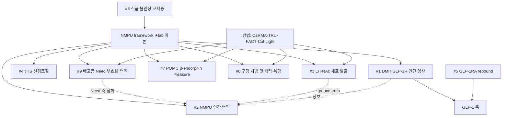

> [!takeaway] 연구 방향 관점의 핵심
> 위키에 축적된 자료에서 도출한 **사용자 lab 연구계획서 6개 과제**를 한눈에 비교하는 hub. 공통 spine은 lab 자체 이론 [[concept-need-motivation-pleasure-utility|NMPU]]이며, 각 과제는 NMPU를 ① 인간으로 번역(NMPU 인간 번역), ② 세포타입으로 분해(LH/NAc 발굴), ③ 특정 축을 표적(tTIS 신경조절·DMH GLP-1R), ④ 환경·약물 맥락으로 확장(식품 불안정·GLP-1RA rebound)한다. 실현가능성·기간·중견 양식 여부로 정렬해 **우선순위 의사결정**을 돕는다.

# 연구계획서 비교 hub

## 한 줄 요약
9개 과제(과학 상세 9 + 중견 양식 6 = 15 페이지)를 축·방법·종·기간·실현가능성·양식으로 비교. 상위 로드맵은 [[overview-future-research-directions]], 후보 풀에서 선택된 것들이다.

## 마스터 비교표

| # | 과제 | 핵심 가설(1줄) | NMPU 축·표적 | 주요 방법 | 종 | 기간 | 실현가능성 | 중견양식 |
|---|---|---|---|---|---|---|---|---|
| 1 | [[proposal-dmh-glp1r-human-imaging\|DMH GLP-1R 인간 영상]] | GLP-1RA가 인간 DMH·ARC 반응으로 cognitive satiation 유발 | Need(cognitive 갱신)·시상하부 | 7T 음식 cue fMRI·GLP-1RA RCT | 인간(+마우스 정합) | 3–5y | ★★★ | ✔ [[proposal-dmh-glp1r-nrf-junggyeon\|중견]] |
| 2 | [[proposal-nmpu-human-translation\|NMPU 인간 번역]] | NMPU 4축이 인간 신경 substrate로 분리 매핑 | 4축 전체·LH/NAc/OFC | 계산모델·7T fMRI·인간 iEEG·NHP | 마우스→NHP→인간 | 5y | ★★★ | ✔ [[proposal-nmpu-nrf-junggyeon\|중견]] |
| 3 | [[proposal-lh-nac-nmpu-neuron-discovery\|LH·NAc NMPU 세포 발굴]] | LH·NAc 분자 ensemble이 NMPU 성분 분리 부호화 | Motivation(LH)·Pleasure/Utility(NAc) | CaRMA·TRU-FACT·Cal-Light | 마우스·NHP | 5y | ★★★ | ✔ [[proposal-lh-nac-nmpu-nrf-junggyeon\|중견·상세]] |
| 4 | [[proposal-ttis-feeding-reward-circuits\|비침습 tTIS 신경조절]] | tTIS가 NAc·시상하부 병적 동기를 비침습 차단 | Pleasure(NAc)·Need(시상하부) | tTIS·montage·NHP·인간 pilot | in silico→NHP→인간 | 5y | ★★(야심) | ✔ [[proposal-ttis-nrf-junggyeon\|중견]] |
| 5 | [[proposal-glp1ra-rebound-microbiota\|GLP-1RA rebound 공동중재]] | 중단 rebound=microbiota·set-point reset; 공동중재로 차단 | 약물·대사·시상하부 | microbiome·메타볼롬·회로·공동중재 | 마우스·NHP/인간 | 5y | ★★ | ✔ [[proposal-glp1ra-rebound-nrf-junggyeon\|중견]] |
| 6 | [[proposal-food-insecurity-cross-species\|식품 불안정 교차종]] | 예측불가 먹이가 ARC·보상 회로 재프로그램(insurance) | 환경 입력·Need/Motivation | 행동·photometry·NHP·인간 코호트 | 쥐→원숭이→사람 | 5y | ★★ | ✔ [[proposal-food-insecurity-nrf-junggyeon\|중견]] |
| 7 | [[proposal-pomc-endorphin-food-pleasure\|POMC β-endorphin 쾌락]] | POMC β-endorphin이 음식 쾌락(liking)·만족을 부호화(satiety와 분리) | **Pleasure**(시상하부 기원)·ARC→PVT/NAc | CaRMA·TRU-FACT·Cal-Light·광유전·naltrexone·NHP | 마우스→NHP | 5y | ★★★ | ✗ |
| 8 | [[proposal-oral-fat-taste-pleasure-desire\|구강 지방 맛 쾌락·욕망]] | 구강 지방 맛(orosensory)이 쾌락·욕망 구동; post-oral 영양(Utility)과 분리 | **Pleasure/Motivation**(구강 proxy) vs **Utility**(post-oral) | sham-feeding·IG bypass·GRAB-DA(insula/aBLA)·CaRMA·Cal-Light·PET/fMRI | 마우스→NHP→인간 | 5y | ★★★ | ✗ |
| 9 | [[proposal-hunger-need-encoding-human-translation\|배고픔 Need 부호화·인간 번역]] | 배고픔=영양소 정체 기반 미래 결핍 예측(Need); Motivation과 분리·인간 biomarker화 | **Need**(내측시상하부)·영양소 정체 | 확장 normative model·AgRP photometry·CaRMA·7T fMRI·ghrelin·인간 LHA LFP·NHP | 마우스→NHP→인간 | 5y | ★★★ | ✗ |

> 실현가능성: ★★★=기존 lab 역량 직접 확장 / ★★=플랫폼·협업·고위험 요소.

## 주제 축별 그룹
- **이론(NMPU) 직접**: #2(4축 인간 번역)·#3(세포 발굴)·#7(POMC β-endorphin Pleasure 기원)·#8(구강 지방 Pleasure/Motivation/Utility 분리)·#9(Need=배고픔 축 심화·인간 번역) — lab 이론을 인간·세포·시상하부 기원·감각 단계·Need 정의로.
- **약물(GLP-1)**: #1(cognitive satiation 영상)·#5(rebound) — lab GLP-1 라인 확장.
- **신경조절(electroceutical)**: #4(tTIS) — 비침습 심부 치료.
- **사회결정요인**: #6(식품 불안정) — 환경→회로.

## 과제 관계도

## 우선순위 메모 (실현가능성 기준)
1. **#1 DMH GLP-1R 인간 영상** — 본인 Science 논문 직접 확장, 인간 fMRI+GLP-1 라인 보유. 최단 실현.
2. **#3 LH·NAc 세포 발굴** — 오늘 ingest한 방법 3종 + LH microendoscopy 강점. 중견·상세 완비.
3. **#2 NMPU 인간 번역** — lab signature, 다만 인간 iEEG 협업 필요.

## 관련 페이지
- [[overview-future-research-directions]] — 상위 로드맵(후보 풀·Tier 1–3).
- [[concept-need-motivation-pleasure-utility]] — 6과제의 공통 spine.
- [[concept-activity-molecular-registration]] — #3의 핵심 방법군.
- [[person-choi-hyung-jin]] — 연구책임자(전 과제).
- 개별 과제: [[proposal-dmh-glp1r-human-imaging]] · [[proposal-nmpu-human-translation]] · [[proposal-lh-nac-nmpu-neuron-discovery]] · [[proposal-ttis-feeding-reward-circuits]] · [[proposal-glp1ra-rebound-microbiota]] · [[proposal-food-insecurity-cross-species]] · [[proposal-pomc-endorphin-food-pleasure]] · [[proposal-oral-fat-taste-pleasure-desire]] · [[proposal-hunger-need-encoding-human-translation]].
