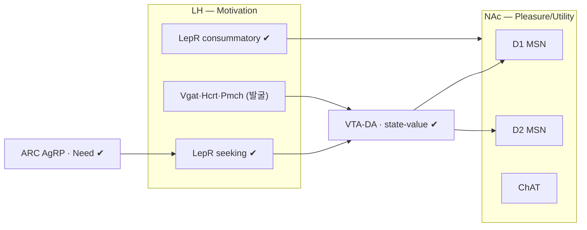

> [!takeaway] 연구 방향 관점의 핵심
> 사용자 lab 이론 [[concept-need-motivation-pleasure-utility|NMPU]](Need·Motivation·Pleasure·Utility)의 두 핵심 노드 **외측시상하부(LH, Motivation)** 와 **측좌핵(NAc, Pleasure/state-value)** 에서, **활성↔분자정체↔투사↔인과**를 한 파이프라인으로 잇는다. 도구 3종을 역할 분담: **[[xu-2020-behavioral-state-coding-by|CaRMA]]**(활성 뉴런에 분자정체 부여)·**[[wang-2026-multimodal-alignments-of-in|TRU-FACT]]**(+MERFISH·projection·통계·freely-behaving)로 **발굴** → **[[hyun-2022-tagging-active-neurons-by|Cal-Light]]**(NMPU epoch 활성 태깅)로 **인과 검증**. 목표: LH·NAc의 어떤 **분자 세포타입이 어떤 NMPU 성분을 담당**하는지 cell-type·projection 해상도로 발굴. [[kim-2024-normative-framework-dissociates-need|LH LepR=Motivation]]·[[jung-2024-dopamine-mediated-formation-of-a|NAc state-value]]를 cell-type 지도로 확장.

# [연구계획서] LH·NAc의 NMPU 식욕 담당 신경 발굴

## 1. 연구 제목
**외측시상하부·측좌핵의 NMPU(Need–Motivation–Pleasure–Utility) 식욕 담당 신경 발굴: 활성–분자정체–투사 정합(CaRMA·TRU-FACT)과 활성 의존 태깅(Cal-Light)의 통합 파이프라인**

## 2. 배경 및 필요성
- **NMPU framework**: 식욕·동기를 4 성분으로 분해([[kim-2024-unified-theoretical-framework-underlying-regulation|BioEssays 2024]]·[[concept-need-motivation-pleasure-utility]]). 마우스 검증: **AgRP=Need, [[lee-2023-lateral-hypothalamic-leptin-receptor|LH LepR=Motivation]]**([[kim-2024-normative-framework-dissociates-need|Sci Adv 2024]]), NAc=Pleasure.
- **두 노드의 세포 다양성 미해결**: LH는 LepR·GABA·Glu·Hcrt(orexin)·Pmch(MCH)·Gal·Nts 등 이질적([[concept-lateral-hypothalamus]]·[[cheon-2025-lateral-hypothalamus-and-eating-cell]]); NAc는 D1/D2 MSN·ChAT·다수 하위형([[concept-nucleus-accumbens]]). **어떤 분자 세포타입이 어떤 NMPU 성분을 담당**하는지, 그리고 그 **투사 표적**은 미규명.
- **방법 성숙**: in vivo 활성을 분자정체·투사에 잇는 도구가 등장([[concept-activity-molecular-registration]]) — 이를 NMPU 분해 과제와 결합하면 "기능별 세포타입 카탈로그"가 가능.
- **필요성**: NMPU 성분별 cell-type·projection 지도는 [[proposal-nmpu-human-translation|인간 번역]]·표적 치료(특정 축 표적 약물·신경조절)의 전제.

## 3. 연구 가설
> **LH와 NAc는 분자적으로 구별되는 신경 ensemble로 식욕의 NMPU 성분(Need·Motivation·Pleasure·Utility)을 분리 부호화하며, CaRMA/TRU-FACT(활성→정체+투사)와 Cal-Light(태깅→인과)의 통합으로 각 성분 담당 세포타입을 발굴·검증할 수 있다.**

## 3-A. NMPU × LH/NAc 세포타입 가설 지도
**✔=기존 확립**, **(발굴)=본 과제 대상**. 단일 labeled-line 아닌 [[xu-2020-behavioral-state-coding-by|grouped-ensemble]] 조합 부호 가정. (상세 표 2·3은 [[proposal-lh-nac-nmpu-nrf-junggyeon#4-A. NMPU × LH/NAc 세포타입 가설 지도 (발굴 매트릭스)|중견연구 양식판]].)

| NMPU 성분 | LH 후보 | NAc 후보 | 근거·상태 |
|---|---|---|---|
| **Need** | LepR 일부(?) | — | ARC AgRP=Need **✔**; LH/NAc=(발굴) |
| **Motivation** | **LepR^seeking ✔**·Vgat·Hcrt | D1 MSN(approach) | LH LepR=Motivation **✔**([[lee-2023-lateral-hypothalamic-leptin-receptor]]); 분자형=(발굴) |
| **Pleasure** | **LepR^consummatory ✔**·Pmch | D1/D2 hedonic | LH consummatory subpop **✔**; 세포형=(발굴) |
| **Utility/state-value** | arbitration(?) | **D1/D2·ChAT** | NAc state-value **✔**([[jung-2024-dopamine-mediated-formation-of-a]]); 세포형=(발굴) |

> **CaRMA·TRU-FACT**=활성→분자정체→투사 발굴(Aim 1·2), **Cal-Light**=인과 검증(Aim 3). 배정은 가설.

## 4. 연구 목표 (Specific Aims)

### Aim 1 — LH: NMPU 성분별 세포타입·투사 발굴 *(CaRMA + TRU-FACT)*
- **과제**: NMPU 성분을 분리하는 섭식 패러다임(공복=Need / 노력·seeking=Motivation / palatable consummatory=Pleasure / 가치-비용=Utility; [[liu-2026-granular-motivational-interaction-and|granular states]] 활용).
- **방법**: GRIN microendoscope Ca²⁺ 영상 중 행동 → **CaRMA**(사후 RNA-FISH로 LepR/Vgat/Vglut2/Hcrt/Pmch/Gal/Nts 정체) + **TRU-FACT**(MERFISH high-plex + retroAAV barcode로 **투사 표적**: VTA·NAc·PVN·뇌간).
- **성공지표**: "Motivation-tuned LH 뉴런 = 어떤 분자형·어디로 투사" 지도. [[kim-2024-normative-framework-dissociates-need|LH LepR=Motivation]]의 세포타입·회로 해상도 확장.

### Aim 2 — NAc: Pleasure/state-value 세포타입·입출력 발굴 *(CaRMA + TRU-FACT)*
- **과제**: 동일 NMPU 패러다임, NAc(medial shell 포함) 영상.
- **방법**: D1/D2/ChAT 및 finer 하위형(MERFISH)에 NMPU tuning 매핑; TRU-FACT로 VTA^DA·vHPC·BLA 입력 및 출력 투사 정합([[jung-2024-dopamine-mediated-formation-of-a|state-value/memory module]] 확장).
- **성공지표**: Pleasure/Utility/state-value를 담당하는 NAc 분자형·회로 지도.

### Aim 3 — 인과 검증 *(Cal-Light tag-then-manipulate)*
- **방법**: 특정 NMPU epoch(예: seeking=Motivation vs consummatory=Pleasure) 활성 LH·NAc 뉴런을 **[[hyun-2022-tagging-active-neurons-by|Cal-Light]]** 로 태깅 → ChrimsonR 재활성/NpHR 침묵으로 식욕 성분 인과 검증. 조건부 KI × cell-type Cre(예: Lepr-Cre·Drd1-Cre)로 분자형 특이 태깅.
- **번역**: [[ha-2024-hypothalamic-neuronal-activation-non-human|NHP 플랫폼]]에서 핵심 세포타입 검증(rodent→primate).
- **성공지표**: 발굴된 세포타입의 식욕 성분 인과 역할 확립.

## 5. 예상 결과 및 해석
- LH·NAc의 **NMPU 성분별 식욕 세포타입 카탈로그**(분자정체 + 투사 + 인과).
- LH LepR=Motivation·NAc=Pleasure의 세포·회로 해상도 정교화 및 신규 세포타입 발굴.
- [[concept-hypomap|atlas]]·[[littleton-2025-from-identity-to-function-unveiling|인간 세포형]]과 cross-reference 가능한 functional-molecular 지도.

## 6. 한계·위험 및 대응
| 위험 | 근거 | 대응 |
|---|---|---|
| 심부(LH·NAc) 영상-사후 정합 난이도 | [[wang-2026-multimodal-alignments-of-in]] | TRU-FACT optomechanical·soma-print(GRIN 지원) |
| NMPU 성분 행동 직교화 | [[liu-2026-granular-motivational-interaction-and]] | granular-state 과제 설계 + 계산 분리 |
| Cal-Light 시점 특이도 | [[hyun-2022-tagging-active-neurons-by]] | soma-targeting·짧은 광창·cell-type Cre |
| 세포타입-기능 다대다 | [[xu-2020-behavioral-state-coding-by]] grouped-ensemble | ensemble·조합 부호 분석(단일 labeled-line 가정 회피) |

## 7. 연구 일정 (5년)
- **Y1–2**: Aim1 LH CaRMA/TRU-FACT.
- **Y2–4**: Aim2 NAc.
- **Y3–5**: Aim3 Cal-Light 인과 + NHP.

## 8. 기대효과 및 의의
- NMPU 4성분의 **세포타입·회로 substrate를 발굴**해 이론을 분자·회로 지도로 전환.
- 특정 성분 표적 치료(약물·[[proposal-ttis-feeding-reward-circuits|tTIS]]·DTx)의 cell-type 근거.
- [[proposal-nmpu-human-translation|NMPU 인간 번역]]의 동물 cell-type ground truth.
- 사용자 lab LH 연구([[lee-2023-lateral-hypothalamic-leptin-receptor]]·[[cheon-2025-lateral-hypothalamus-and-eating-cell]])의 방법론적 도약(영상→정체→투사→인과 통합).

## 관련 페이지
- [[proposal-lh-nac-nmpu-nrf-junggyeon]] — 본 과제의 **중견연구 상세 양식**(배경·선행연구·방법 확장).
- [[overview-future-research-directions]] — 상위 로드맵(NMPU 인간 번역·NHP 회로 항목과 연결).
- [[concept-need-motivation-pleasure-utility]] — 분해 대상 framework.
- [[concept-lateral-hypothalamus]] · [[concept-nucleus-accumbens]] — 두 표적 노드.
- [[xu-2020-behavioral-state-coding-by]] · [[wang-2026-multimodal-alignments-of-in]] · [[hyun-2022-tagging-active-neurons-by]] · [[concept-activity-molecular-registration]] — 핵심 방법.
- [[kim-2024-normative-framework-dissociates-need]] · [[lee-2023-lateral-hypothalamic-leptin-receptor]] · [[cheon-2025-lateral-hypothalamus-and-eating-cell]] · [[jung-2024-dopamine-mediated-formation-of-a]] — 표적 회로 근거.
- [[ha-2024-hypothalamic-neuronal-activation-non-human]] — NHP 번역.
- [[person-choi-hyung-jin]] · [[person-kwon-hyung-bae]] — 연구진·도구 협력.
- [[proposal-nmpu-human-translation]] — 자매 과제(인간 번역).
- [[gazit-shimoni-2025-changes-in-neurotensin-signalling-drive]] — **NAc 쪽 후보 세포타입의 선례**: NAcLat^Nts→VTA를 patch-seq(활성+분자정체)·역행표지(투사)·조건부 KO/과발현(인과)으로 확정한 설계. 본 제안의 CaRMA·TRU-FACT 파이프라인이 목표하는 결과물의 구체적 사례 (Nature 2025).
