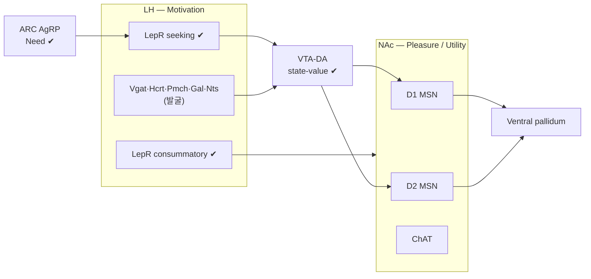

> [!takeaway] 연구 방향 관점의 핵심
> [[proposal-lh-nac-nmpu-neuron-discovery|LH·NAc NMPU 신경 발굴 계획서]]의 **한국연구재단 중견연구 상세 양식** 버전(배경·선행연구·방법 대폭 확장). 사용자 lab의 **NMPU 이론·LH LepR microendoscopy·NHP·인간 fMRI** 선행자산 위에, 활성↔분자정체↔투사↔인과를 잇는 [[xu-2020-behavioral-state-coding-by|CaRMA]]·[[wang-2026-multimodal-alignments-of-in|TRU-FACT]]·[[hyun-2022-tagging-active-neurons-by|Cal-Light]] 3종을 통합해 LH(Motivation)·NAc(Pleasure/state-value)의 **NMPU 성분별 식욕 세포타입 카탈로그**를 발굴·인과 검증한다. 연구비·일정 수치는 양식 예시.

# [중견연구·상세] LH·NAc의 NMPU 식욕 담당 신경 발굴

- **국문 과제명**: 외측시상하부·측좌핵의 NMPU 식욕 담당 신경 발굴 — 활성–분자정체–투사 정합(CaRMA·TRU-FACT)과 활성 의존 태깅(Cal-Light)의 통합 파이프라인
- **영문 과제명**: Discovering NMPU appetite-coding neurons in the lateral hypothalamus and nucleus accumbens by integrating activity–molecular–projection registration (CaRMA, TRU-FACT) with activity-dependent tagging (Cal-Light)
- **사업유형**: 개인기초연구 — **중견연구** (5년, 연 3억원 이내 가정) · **연구책임자**: [[person-choi-hyung-jin|최형진]] (서울대 의대)
- **연구분야**: 신경과학 / 식욕·동기 회로 / 분자-기능 정합 방법론

---

## 1. 연구개발과제의 필요성 (배경)

### 1-1. 식욕·동기의 다요소 분해 — NMPU 패러다임
식욕은 단일 "배고픔"이 아니라 분리 가능한 심리·신경 성분의 합이다. 연구책임자 lab은 이를 **Need(예측된 에너지 결핍) · Motivation(행동 추동) · Pleasure(쾌락) · Utility(가치-비용 통합)** 4 성분으로 분해한 **NMPU framework**를 제안했다([[kim-2024-unified-theoretical-framework-underlying-regulation|Kim et al. 2024, BioEssays]]·[[concept-need-motivation-pleasure-utility]]). 이 분해는 단순 이론이 아니라 **정량 검증**되었다 — normative model fitting + 광유전학으로 **궁상핵(ARC) AgRP=Need**(motivation 아님), **외측시상하부(LH) LepR=Motivation**임을 분리 입증했다([[kim-2024-normative-framework-dissociates-need|Kim et al. 2024, Science Advances]]). 동시대 연구들도 동기를 입자화된 상태열(seeking→approach→investigation→sustained eating→satiation→aversion)로 분해하며([[liu-2026-granular-motivational-interaction-and|Liu & Wang 2026, Neuron]]) 수렴하고 있다.

그러나 NMPU의 두 핵심 노드 — **Motivation의 LH**와 **Pleasure/state-value의 NAc** — 가 **어떤 분자 세포타입으로 각 성분을 부호화하는지**는 미해결이다.

### 1-2. LH·NAc의 세포 다양성과 미해결 문제
- **LH**는 극도로 이질적이다: LepR·GABA(Vgat)·glutamate(Vglut2)·Hcrt(orexin)·Pmch(MCH)·Gal(galanin)·Nts(neurotensin) 등이 섞여 seeking·consummatory·각성·보상·정서를 분담한다([[concept-lateral-hypothalamus]]·[[cheon-2025-lateral-hypothalamus-and-eating-cell|Cheon et al. 2025, EMM]]). LH는 hunger×anxiety×사회성을 중재하는 arbitration hub이기도 하다([[korotkova-2026-balancing-acts-lateral-hypothalamic]]).
- **NAc**는 D1/D2 medium spiny neuron·ChAT 개재뉴런과 다수 하위형으로 구성되며, 인간에서 loss-of-control eating 직전 저주파 biomarker를 보이고([[shivacharan-2022-pilot-study-of-responsive-nucleus]]·[[concept-nucleus-accumbens]]), 최근 VTA 도파민이 **state-value** 신호로서 NAc에 목표 기억(memory module)을 형성함이 밝혀졌다([[jung-2024-dopamine-mediated-formation-of-a|Jung et al. 2024, Nat Neurosci]]).
- **핵심 공백**: (i) 어떤 분자형이 어떤 NMPU 성분에 tuning되는가, (ii) 그 세포의 **투사 표적/입력**은 무엇인가, (iii) 그 세포가 식욕에 **인과적**인가 — 세 질문이 동시에 풀린 적이 없다.

### 1-3. 방법론적 전환점 — 활성·정체·투사·인과의 통합
전통적으로 in vivo 기능 영상은 "무엇을 하는가"만, 단일세포 전사체/공간전사체는 "누구인가"만 알려주어 둘이 분리돼 있었다. 최근 이 간극을 메우는 도구가 성숙했다([[concept-activity-molecular-registration]]):
- **[[xu-2020-behavioral-state-coding-by|CaRMA]]**(Calcium and RNA Multiplexed Activity; Sternson 2020): in vivo 칼슘 영상 뉴런에 사후 다중 RNA-FISH로 분자정체 부여 → PVH가 **grouped-ensemble coding**(labeled-line 아님)을 씀을 발견.
- **[[wang-2026-multimodal-alignments-of-in|TRU-FACT]]**(Schnitzer 2026): optomechanical 정합 + soma-print graph 매칭 + 통계적 신뢰도로 in vivo 영상 ↔ **MERFISH high-plex** ↔ **RNA-barcode retroAAV 투사**를 세포 단위로 정합(10,522 cells·precision 98%), **freely-behaving miniature 2P**까지 지원.
- **[[hyun-2022-tagging-active-neurons-by|Cal-Light]]**(Kwon 2022): Ca²⁺ AND 광 동시검출 → 영구 유전자 발현으로 특정 시점 활성 뉴런을 태깅 → 재활성/침묵(tag-then-manipulate). soma-targeting으로 SNR↑, 조건부 KI × cell-type Cre 가능.

이 3종을 NMPU 분해 과제와 결합하면 처음으로 **"기능(NMPU 성분)–분자정체–투사–인과"를 한 세포에서** 규명할 수 있다.

### 1-4. 필요성·시의성
GLP-1RA 시대에도 hedonic 과식·약물 무반응·rebound은 미충족 수요다. NMPU 성분별 세포타입·회로 지도는 **성분 표적 치료**(특정 축의 약물·[[proposal-ttis-feeding-reward-circuits|비침습 신경조절]]·DTx)와 [[proposal-nmpu-human-translation|인간 번역]]의 전제다. 도구·이론·표적이 동시에 무르익은 지금이 적기다.

## 2. 독창성·창의성 및 차별성
> ① **이론 주도권**: 연구책임자 자체 framework(NMPU, BioEssays 2024)와 그 정량 검증(Science Advances 2024)을 직접 확장. ② **4중 통합**(활성·분자정체·투사·인과)을 단일 파이프라인으로 — 기존은 한두 축만. ③ **발굴→인과의 도구 분업**(CaRMA/TRU-FACT 발굴 → Cal-Light 인과). ④ **grouped-ensemble 가정**(labeled-line 회피, [[xu-2020-behavioral-state-coding-by]]) 하의 조합 부호 분석. ⑤ 마우스→**NHP**([[ha-2024-hypothalamic-neuronal-activation-non-human]])→인간 번역 사슬 보유.

## 3. 연구실 선행연구 결과 (우리 연구실)
본 과제는 연구책임자 lab의 누적 성과 위에 직접 구축된다:

1. **NMPU 이론 정립** — [[kim-2024-unified-theoretical-framework-underlying-regulation|BioEssays 2024]]: 동기 행동을 Need·Motivation·Pleasure·Utility로 분해하는 통합 framework 제안. (본 과제의 개념 backbone.)
2. **AgRP=Need / LH LepR=Motivation 정량 분리** — [[kim-2024-normative-framework-dissociates-need|Science Advances 2024]]: normative model + 광유전으로 ARC AgRP가 motivation이 아닌 **예측 결핍(Need)** 을, LH LepR이 **Motivation**을 부호화함을 입증. (Aim 1의 직접 출발점.)
3. **LH LepR의 seeking vs consummatory 분리** — [[lee-2023-lateral-hypothalamic-leptin-receptor|Nature Communications 2023]]: **microendoscopy로 LH LepR의 2개 하위집단**(food-seeking vs consummatory)을 분리하고, **NPY가 disinhibition으로 LH LepR의 permissive gate** 역할을 함을 규명. LH LepR = LH food-specific GABA의 79%. (Aim 1·3의 회로·기법 기반: 본 lab은 이미 LH microendoscopy를 수행.)
4. **LH 세포·해부·시간동역학 종합** — [[cheon-2025-lateral-hypothalamus-and-eating-cell|EMM 2025]]: LH 세포타입·기능 매핑 리뷰. (Aim 1 세포타입 패널 설계 근거.)
5. **비인간영장류(NHP) LHA 회로 조작** — [[ha-2024-hypothalamic-neuronal-activation-non-human|Neuron 2024]]: macaque LHA GABAergic chemogenetic 활성화가 palatable food 한정 goal-directed 식이↑; GABA-PET·7T MRS·rs-fMRI로 검증. (Aim 3 NHP 번역의 직접 플랫폼.)
6. **DMH GLP-1R cognitive satiation** — [[kim-2024-glp-1-increases-preingestive-satiation|Science 2024]]: 인간 RCT + 마우스 광유전·photometry·microendoscopy·CRACM로 DMH GLP-1R→ARC AgRP 회로 규명. (다회로 in vivo 영상·CRACM 역량 입증.)
7. **행동 phase framework** — [[lee-2019-food-craving-seeking-and|JOMES 2019]]: craving→seeking→consumption phase 분해 및 phase×종별 측정법. (NMPU 분해 행동 패러다임 설계의 lab 원전.)
8. **인간 음식 cue fMRI** — [[bae-2019-glucagon-like-peptide-1-receptor|DMJ 2019]]: lean vs obese GLP-1RA 음식 cue 뇌반응 차별 조절. (인간 번역 연계.)
9. **임상 통합 — hijacked brain·DTx** — [[lee-2025-hijacked-brain-modern-obesity-cue|JOMES 2025]]·[[concept-digital-therapeutics]]. (성과 활용 경로.)

→ 요약: 본 lab은 **NMPU 이론 + LH LepR microendoscopy + 다회로 in vivo 영상/CRACM + NHP + 인간 fMRI**를 모두 보유. 본 과제는 여기에 **활성↔정체↔투사↔인과 통합 방법(3종)** 을 더해 세포타입 해상도로 도약한다.

## 4. 연구개발 내용 및 방법 (연차별·상세)

### 4-A. NMPU × LH/NAc 세포타입 가설 지도 (발굴 매트릭스)
본 과제의 핵심 산출물 형태를 미리 제시한다. **✔=기존 확립**, **(발굴)=본 과제 발굴/검증 대상**. 단일 labeled-line이 아니라 [[xu-2020-behavioral-state-coding-by|grouped-ensemble]] 조합 부호를 가정한다.

**표 1. NMPU 성분 × 표적 세포타입 가설 매트릭스**

| NMPU 성분 | 주 노드 | LH 후보 세포타입 | NAc 후보 세포타입 | 예상 투사/입력 | 근거·상태 |
|---|---|---|---|---|---|
| **Need**(예측 결핍) | ARC | LH LepR 일부(?) | — | ARC AgRP → PVN·LH | ARC AgRP=Need **✔**([[kim-2024-normative-framework-dissociates-need\|Sci Adv]]); LH/NAc 기여=(발굴) |
| **Motivation**(seeking·추동) | LH | **LepR^seeking ✔**, Vgat/GABA, Hcrt | D1 MSN(approach) | LH→VTA; VTA-DA→NAc D1 | LH LepR=Motivation **✔**, seeking subpop **✔**([[lee-2023-lateral-hypothalamic-leptin-receptor\|Nat Commun]]); 분자형=(발굴) |
| **Pleasure**(consummatory·쾌락) | NAc | **LepR^consummatory ✔**, Pmch/MCH, Vgat | D1/D2 hedonic(μ-opioid) | LH↔NAc shell; NAc shell→VP | LH consummatory subpop **✔**; NAc=Pleasure(가설); 세포형=(발굴) |
| **Utility**(가치-비용·state-value) | NAc/OFC | LH arbitration(?) | **D1/D2 value, ChAT** | VTA-DA(state-value)→NAc; vHPC·BLA→NAc | NAc state-value **✔**([[jung-2024-dopamine-mediated-formation-of-a\|NN 2024]]); 세포형 분해=(발굴) |

**표 2. LH 세포타입별 가설(Aim 1 발굴 대상)**

| LH 세포타입 | 가설 NMPU 성분 | phase | 예상 투사 | 상태 |
|---|---|---|---|---|
| **LepR**(GABA; food-GABA의 79%) | Motivation+Pleasure (2 subpop) | seeking/consummatory | VTA·NAc·PVN | **✔**([[lee-2023-lateral-hypothalamic-leptin-receptor]]) |
| Vgat / GABA | Motivation·Pleasure | both | VTA(reward) | (발굴) |
| Vglut2 / Glu | aversion·satiation(?) | satiation | LHb·PVN | (발굴) |
| Hcrt / orexin | Motivation·arousal | seeking | VTA·광범위 | (발굴) |
| Pmch / MCH | consummatory·orexigenic | consummatory | dlHPC([[barbosa-2023-an-orexigenic-subnetwork-within-the]])·광범위 | (발굴) |
| Gal · Nts | reward·feeding | mixed | VTA | (발굴) |

**표 3. NAc 세포타입별 가설(Aim 2 발굴 대상)**

| NAc 세포타입 | 가설 NMPU 성분 | 입력 / 출력 | 상태 |
|---|---|---|---|
| **D1 MSN** | Pleasure·Motivation(approach)·state-value | VTA-DA→ / →VP·VTA | (발굴; Jung 2024 활성 48% Drd1) |
| **D2 MSN** | Utility(cost)·avoidance | →VP(indirect) | (발굴) |
| **ChAT 개재뉴런** | state/salience gating | local | (발굴; Jung 2024 활성도 최고) |

**그림 1. NMPU 흐름 × LH/NAc 회로 × 방법 적용 개략도**

> 방법 적용: **CaRMA·TRU-FACT** = 각 노드의 활성→분자정체→투사 **발굴**(Aim 1·2). **Cal-Light** = NMPU epoch 활성 세포 **인과 검증**(Aim 3). 모든 화살표·세포의 NMPU 배정은 가설이며 본 과제로 확정.

### 공통 — NMPU 분해 행동 패러다임
4 성분을 직교 분리하는 통합 과제를 설계한다(본 lab phase framework [[lee-2019-food-craving-seeking-and]] + granular states [[liu-2026-granular-motivational-interaction-and]] 기반):
- **Need**: 단계적 caloric deficit(절식 시간·열량 차감)로 예측 결핍 조작; ghrelin/leptin 약리 비교.
- **Motivation**: progressive-ratio breakpoint·effort·seeking phase(접근 잠복기·시도 횟수).
- **Pleasure**: palatable consummatory; **lick microstructure**(burst size=hedonic)·hedonic 평정.
- **Utility**: cost-benefit 선택·outcome devaluation·delay discounting.
행동 readout을 NMPU 계산모델([[kim-2024-normative-framework-dissociates-need|normative]] + [[weber-2025-interoceptive-origin-reinforcement-learning|interoceptive RL]])로 fitting해 시점별 성분 가중치를 산출, 신경 활성과 정합한다.

### Aim 1 (1–2년) — LH: NMPU 성분별 세포타입·투사 발굴
- **영상**: GRIN microendoscope 1p/2p GCaMP6 volumetric Ca²⁺(본 lab LH microendoscopy 경험 [[lee-2023-lateral-hypothalamic-leptin-receptor]]); freely-behaving은 TRU-FACT 호환 miniature 2p.
- **분자정체 — CaRMA**: 영상 후 ex vivo↔in vivo 정합 → 반복 다중 RNA-FISH로 **LH 패널**(Lepr·Vgat·Vglut2·Hcrt·Pmch·Gal·Nts·Slc17a6·Gad2 등) 부여. 분자 cluster별 NMPU tuning purity 분석(grouped-ensemble 틀).
- **투사 — TRU-FACT**: MERFISH high-plex(수백 유전자)로 세포형 정밀화 + **RNA-barcode retroAAV**(VTA·NAc·PVN·뇌간 주입)로 영상 뉴런의 **투사 표적** 동정; soma-print 매칭 + per-cell 통계(p·likelihood).
- **산출**: "Motivation-tuned LH 뉴런 = 분자형 × 투사" 지도; [[kim-2024-normative-framework-dissociates-need|LH LepR=Motivation]]의 세포·회로 해상도 확장 및 신규 세포타입 발굴.

### Aim 2 (2–4년) — NAc: Pleasure/state-value 세포타입·입출력 발굴
- **영상**: NAc(medial shell 포함) GRIN Ca²⁺; 동일 NMPU 과제.
- **분자정체·투사**: CaRMA + TRU-FACT로 D1/D2/ChAT 및 MERFISH finer 하위형에 Pleasure/Utility/state-value tuning 매핑; VTA^DA·vHPC·BLA **입력**과 ventral pallidum 등 **출력** 정합([[jung-2024-dopamine-mediated-formation-of-a|memory module/state-value]] 확장).
- **산출**: NAc Pleasure/Utility 담당 분자형·회로 지도, LOC eating biomarker([[shivacharan-2022-pilot-study-of-responsive-nucleus]])의 세포 기원 후보.

### Aim 3 (3–5년) — 인과 검증 + NHP 번역
- **Cal-Light tag-then-manipulate**: 특정 NMPU epoch(seeking=Motivation vs consummatory=Pleasure) 활성 LH·NAc 뉴런을 [[hyun-2022-tagging-active-neurons-by|soma-targeted Cal-Light]]로 태깅(짧은 광창·~30초 간격) → ChrimsonR 재활성/NpHR 침묵으로 식욕 성분 인과 검증. 조건부 ST-Cal-Light KI × **cell-type Cre**(Lepr-Cre·Drd1-Cre·Vgat-Cre 등)로 Aim 1·2에서 발굴된 분자형 특이 태깅.
- **회로 인과**: projection-specific(retro-Cre) Cal-Light로 표적 경로(LH→VTA/NAc, NAc→VP) 인과 분해.
- **NHP 번역**: [[ha-2024-hypothalamic-neuronal-activation-non-human|macaque 플랫폼]]에서 핵심 세포타입/경로를 chemogenetic·영상으로 검증(rodent→primate).
- **분석·통계**: ensemble decoding(세포타입 1개당 1뉴런 디코딩, [[xu-2020-behavioral-state-coding-by]] 방식), 조합 부호 모델, mixed-effects; **암수 모두**(sex as biological variable), 사전 power 분석, parameter recovery로 계산모델 식별성 확보.

## 5. 추진전략 및 위험관리
- **전략**: 발굴(Aim1·2 CaRMA/TRU-FACT)→인과(Aim3 Cal-Light)→번역(NHP)의 단계적 위험 감축. LH 먼저(본 lab 강점)→NAc 확장.
- **위험·대응**:
  - 심부 영상-사후 정합 → TRU-FACT optomechanical·soma-print(GRIN 지원).
  - NMPU 행동 직교화 실패 → granular-state 과제·계산 분리·devaluation 통제.
  - Cal-Light 시점 누출 → soma-targeting·짧은 광창·cell-type Cre 제한.
  - 세포타입-기능 다대다 → grouped-ensemble·조합 부호 분석(labeled-line 가정 회피).
  - retroAAV tropism 편향 → 다중 serotype·역행 대조.

## 6. 연구역량 및 인프라
- **연구책임자([[person-choi-hyung-jin]])**: NMPU 이론·LH LepR microendoscopy·다회로 in vivo 영상/CRACM·NHP·인간 fMRI 전 라인 보유(§3).
- **협력**: 활성 태깅·NAc 보상 회로([[person-kwon-hyung-bae|Kwon]] Cal-Light), 정합 방법(TRU-FACT/CaRMA 계열), 계산신경과학(RL 모델), 인간 침습([[person-halpern-casey|Halpern]]).
- **인프라**: GRIN microendoscope·miniature 2P, MERFISH/공간전사체 코어, NHP 시설, 7T MRI, 전산 클러스터.

## 7. 기대효과 및 활용방안
- **학술**: LH·NAc의 **NMPU 성분별 식욕 세포타입 카탈로그**(분자·투사·인과) — 이론을 분자·회로 지도로 전환.
- **임상**: 성분 표적 치료(약물·[[proposal-ttis-feeding-reward-circuits|tTIS]]·DTx)의 cell-type 근거; LOC eating biomarker 세포 기원.
- **번역**: [[proposal-nmpu-human-translation|NMPU 인간 번역]]의 동물 ground truth; [[concept-hypomap|atlas]] cross-reference.
- **확산**: 식락학 교재 [[overview-sikrakhak-book-project|Ch 13–15]] 연계.

## 8. 연구비 (예시 — 작성 시 조정)
- 규모: 중견연구 가정 **연 ~2억원 × 5년**.
- 항목: 인건비(박사후·대학원생·계산), GRIN/miniscope·2P 영상 장비·소모품, **MERFISH/RNA-FISH 시약**, retroAAV 제작, Cal-Light 바이러스·KI 마우스, NHP 사육·실험, 전산.

## 9. 참고문헌 (wiki 내 근거)
[[kim-2024-unified-theoretical-framework-underlying-regulation]] · [[kim-2024-normative-framework-dissociates-need]] · [[lee-2023-lateral-hypothalamic-leptin-receptor]] · [[cheon-2025-lateral-hypothalamus-and-eating-cell]] · [[ha-2024-hypothalamic-neuronal-activation-non-human]] · [[kim-2024-glp-1-increases-preingestive-satiation]] · [[lee-2019-food-craving-seeking-and]] · [[bae-2019-glucagon-like-peptide-1-receptor]] · [[xu-2020-behavioral-state-coding-by]] · [[wang-2026-multimodal-alignments-of-in]] · [[hyun-2022-tagging-active-neurons-by]] · [[jung-2024-dopamine-mediated-formation-of-a]] · [[liu-2026-granular-motivational-interaction-and]] · [[weber-2025-interoceptive-origin-reinforcement-learning]] · [[shivacharan-2022-pilot-study-of-responsive-nucleus]] · [[korotkova-2026-balancing-acts-lateral-hypothalamic]]

## 관련 페이지
- [[proposal-lh-nac-nmpu-neuron-discovery]] — 동일 과제의 과학 상세(요약) 버전.
- [[overview-future-research-directions]] — 상위 로드맵.
- [[concept-need-motivation-pleasure-utility]] · [[concept-lateral-hypothalamus]] · [[concept-nucleus-accumbens]] · [[concept-activity-molecular-registration]] — 핵심 개념·표적·방법 hub.
- [[proposal-nmpu-human-translation]] · [[proposal-nmpu-nrf-junggyeon]] — 자매 NMPU 과제.
- [[person-choi-hyung-jin]] · [[person-kwon-hyung-bae]] — 연구진·도구 협력.
