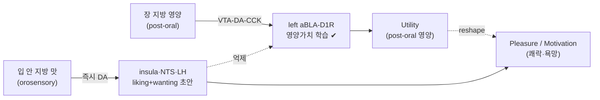

> [!takeaway] 연구 방향 관점의 핵심
> **구강 지방 감지는 쾌락·욕망의 충분한 원인인가, 아니면 영양 확인을 기다리는 "초안"인가?** 위키는 음식 보상을 **proxy reward(구강 맛, 즉각 정동 초안) vs primary reward(post-oral 영양)** 로 분리하고([[concept-primary-reward-signals|Weber 2025]]), 인체에서 **즉시 orosensory DA(insula·해마·ACC)가 "먹고 싶은 욕구(wanting)"와 양의 상관, 지연 post-ingestive DA(putamen)와는 음의 상관**임을 보였다([[thanarajah-2019-food-intake-recruits-orosensory|Thanarajah 2019]]). 지방의 post-oral 영양 회로(GPR40/120/CD36→vagus→VTA-DA-CCK→aBLA)는 규명됐으나([[grove-2025-lateralized-pathway-associating-nutrients|Grove 2025]]), **구강 지방 맛 자체의 쾌락(liking)·욕망(wanting) 인과 기여는 미정박**. 사용자 lab [[concept-need-motivation-pleasure-utility|NMPU]]의 **Pleasure(구강 proxy) vs Motivation(wanting) vs Utility(post-oral)** 분리에 직접 답하고, 식락학 **Ch 20·24** backbone을 제공한다.

# [연구계획서] 입에서 느끼는 지방 맛이 음식 쾌락과 욕망을 구동하는가

## 1. 연구 제목
**구강 지방 화학감지(oral fat chemosensation)가 음식의 쾌락(liking)과 욕망(wanting)을 구동하는가: orosensory 신호와 post-ingestive 영양 신호의 인과 분리와 NMPU Pleasure–Motivation 축으로의 정박**

## 2. 배경 및 필요성

- **보상의 두 신호: proxy vs primary**: [[concept-primary-reward-signals|Weber 2025]]는 음식 보상을 **proxy reward(구강 taste/flavor — 즉각 dopamine·정동 반응을 일으키나 혼자선 sustainable reinforcement 불가, "early affective draft")** 와 **primary reward(post-oral interoceptive 영양)** 로 분리한다. 구강 지방 맛은 전형적 proxy — **쾌락의 즉각 초안**이되, 그 지속 강화는 post-oral 영양 확인에 의존한다는 가설([[concept-flavor-nutrient-conditioning|FNC]]: sucralose는 long-term 학습 유지 못함 = taste ≠ reinforcer).
- **인체 분자 증거 — orosensory DA가 욕망과 직결**: [[thanarajah-2019-food-intake-recruits-orosensory|Thanarajah 2019 *Cell Metab*]]는 연속 PET로 **즉시 orosensory DA**(NTS·전측 [[concept-insula|insula]](1차 미각피질)·SN/VTA·해마·시상하부(LH 추정))와 **지연 post-ingestive DA**(미상핵·창백핵·[[concept-basolateral-amygdala|BLA]])를 분리했고, 결정적으로 **"먹고 싶은 욕구(wanting)"가 즉시 orosensory DA(insula r=0.94·해마 r=0.95·ACC r=0.90)와 양의 상관, 지연 putamen DA와는 음의 상관(r=−0.96)** 임을 보였다 → 구강 감각 단계 DA가 욕망을 키우고 post-ingestive 포만 DA를 억눌러 과식을 부른다는 모델.
- **지방의 post-oral 회로는 규명, 구강 단계는 공백**: [[grove-2025-lateralized-pathway-associating-nutrients|Grove 2025]]는 fat의 **gut sensor(GPR40/120 + CD36)→vagus→VTA-DA-CCK→left aBLA-D1R** 영양가치 학습 회로를 규명하고, **NAc(motivation/cue) vs aBLA(영양가치) double dissociation**을 보였다. 그러나 이는 **post-oral 영양** 회로다. **구강 지방 맛 자체**가 쾌락·욕망을 얼마나, 어떤 회로로 구동하는지는 분리되지 않음.
- **supra-additivity와 비만**: sugar+fat은 **supra-additive** primary reward([[concept-primary-reward-signals]], DiFeliceantonio 2018) → 현대 초가공식품의 핵심 위험. 만약 **구강 지방 맛이 wanting을 선제적으로 증폭**한다면, 이는 [[lee-2025-hijacked-brain-modern-obesity-cue|hijacked brain]]의 cue/addiction type에서 과식의 진입점.
- **NMPU 공백**: [[concept-need-motivation-pleasure-utility|NMPU]]에서 **Pleasure = 구강 proxy reward(taste hedonic)**, **Motivation = wanting**, **Utility = post-oral 영양**으로 매핑되나, "**구강 지방 신호가 Pleasure(liking)인지 Motivation(wanting)인지, 그리고 Utility(영양)와 어떻게 분리·상호작용**하는지"는 회로 수준에서 미정박. 사용자의 질문(구강 지방 맛 → **쾌락과 욕망**)은 정확히 이 분리를 요구.
- **방법 성숙**: oral 전달(lick) vs **IG 직접 주입**으로 구강/post-oral 분리, **sham-feeding(구강만, 영양 차단)**, GRAB-DA photometry(insula/NTS vs aBLA), [[concept-activity-molecular-registration|CaRMA·TRU-FACT]], [[hyun-2022-tagging-active-neurons-by|Cal-Light]], [[lee-2023-lateral-hypothalamic-leptin-receptor|phase-specific 광유전]], [[ha-2024-hypothalamic-neuronal-activation-non-human|NHP]], 인체 PET/7T fMRI([[thanarajah-2019-food-intake-recruits-orosensory|Thanarajah]]·[[huang-2021-the-insulo-opercular-cortex-encodes|Huang 2021]] insula) 모두 준비.
- **필요성**: 구강 지방 신호의 쾌락·욕망 기여를 인과적으로 분리하면 **비-칼로리 지방 대체재(fat mimetic)·식이 설계·GLP-1RA의 구강 vs post-oral 작용점** 판별의 회로 근거가 된다.

## 3. 연구 가설

> **입에서 느끼는 지방 맛(orosensory fat)은 즉각 dopamine 신호(insula·NTS·LH)를 통해 욕망(wanting)을 선제적으로 증폭하고 즉각 쾌락(liking)을 부여하는 proxy reward이나, 그 지속적 강화·선호는 post-oral 영양 신호(GPR40/120/CD36→VTA-DA-CCK→aBLA, Utility)의 확인에 의존한다 — 즉 구강 지방은 NMPU의 Pleasure·Motivation 초안을 쓰고, Utility가 이를 reshape한다.**

부속 가설:
1. **분리**: 구강 지방 단독(sham-feeding/비칼로리 지방)은 즉각 liking·wanting을 유발하나, post-oral 영양 없이는 sustained 선호를 만들지 못한다([[concept-flavor-nutrient-conditioning|FNC]]의 sucralose 논리를 지방에 적용).
2. **회로 분기**: orosensory fat DA(insula·NTS·LH) = liking/wanting 초안 vs post-ingestive fat DA(aBLA) = Utility 학습.
3. **욕망 증폭**: 구강 지방 유발 즉시 DA가 post-ingestive 포만 DA를 억제해 과식을 촉진([[thanarajah-2019-food-intake-recruits-orosensory|Thanarajah 2019]] 모델의 인과 검증).

## 3-A. 핵심 개념 지도 (구강 지방 × NMPU)

**✔=위키 확립**, **(발굴)=본 과제 대상**.

| 신호 단계 | 분자·회로 | 행동 | NMPU 축 | 상태 |
|---|---|---|---|---|
| **구강 지방(orosensory)** | (oral CD36/GPR120?)→즉시 DA(insula·NTS·LH) | liking + wanting 초안 | **Pleasure / Motivation** | wanting 상관 ✔ ([[thanarajah-2019-food-intake-recruits-orosensory|Thanarajah]]); 인과·회로 (발굴) |
| **post-oral 지방(영양)** | gut GPR40/120/CD36→vagus→VTA-DA-CCK→aBLA | 선호 학습(지속) | **Utility** | ✔ ([[grove-2025-lateralized-pathway-associating-nutrients|Grove 2025]]) |

> 본 과제: **구강 단독 신호의 liking/wanting 인과(발굴)** + **Utility의 reshape(발굴)** + 인체 번역.

## 4. 연구 목표 (Specific Aims)

### Aim 1 — 구강 vs post-oral 지방 신호의 행동·DA 분리 *(sham-feeding/IG bypass + GRAB-DA photometry)*
- **과제**: oral 전달(lick) vs **IG 직접 주입**, **sham-feeding(구강 자극만·영양 차단)**, **비칼로리 지방(mineral oil 등) vs 칼로리 지방**으로 구강/post-oral을 직교 분리. liking은 **taste reactivity(consummatory 미세구조)**, wanting은 **progressive ratio·seeking**으로 동시 측정([[concept-appetitive-consummatory-phases]]·[[lee-2019-food-craving-seeking-and|craving→seeking→consumption]]).
- **방법**: GRAB-DA fiber photometry를 **전측 insula·NTS·LH(orosensory)** vs **aBLA(post-ingestive)**에 동시 설치. 구강 지방 sensor 약리(oral GPR120/CD36 차단 vs gut 차단)로 site별 기여 분해.
- **성공지표**: "구강 지방 단독 → 즉시 insula/NTS/LH DA + liking·wanting↑, but sustained 선호는 post-oral 영양 필요"의 인과 분리. [[thanarajah-2019-food-intake-recruits-orosensory|Thanarajah]] wanting↔orosensory DA 상관의 인과 전환.

### Aim 2 — 구강 지방 회로의 세포정체·liking/wanting 인과 *(CaRMA·TRU-FACT + Cal-Light + phase-specific 광유전)*
- **과제**: orosensory fat에 반응하는 세포의 분자정체·투사와, 그 활성이 liking인지 wanting인지.
- **방법**:
  - **[[concept-activity-molecular-registration|CaRMA·TRU-FACT]]**: 구강 지방 반응 뉴런(insula·LH·NTS)에 사후 분자정체 + 투사 표적 부여.
  - **[[hyun-2022-tagging-active-neurons-by|Cal-Light]] tag-then-manipulate**: 구강 지방 consummatory epoch 활성 뉴런 태깅 → 재활성/침묵으로 liking·wanting 인과.
  - **[[lee-2023-lateral-hypothalamic-leptin-receptor|Phase-specific 광유전]]**: visible-unreachable(appetitive=wanting) vs contact(consummatory=liking)에서 분리 자극.
- **성공지표**: 구강 지방 신호의 행동 기능을 **Pleasure(liking) vs Motivation(wanting)** 으로 귀속 + 세포·투사 지도.

### Aim 3 — 인체 번역 + 임상 *(orosensory DA PET / insula fMRI + GLP-1RA)*
- **과제**: 구강 지방 맛의 쾌락·욕망 substrate가 인체에서 보존되는가, 약물로 조절되는가.
- **방법**:
  - **인체 [11C]raclopride PET**([[thanarajah-2019-food-intake-recruits-orosensory|Thanarajah paradigm]])/7T fMRI로 고지방 구강 자극(sham-feeding·spit-out)의 **orosensory DA·[[huang-2021-the-insulo-opercular-cortex-encodes|insula]] 반응**과 wanting 측정.
  - **[[concept-flavor-nutrient-conditioning|FNC]] paradigm**으로 환자의 oral vs post-oral 지방 선호 진단 → [[lee-2025-hijacked-brain-modern-obesity-cue|hijacked brain]] type 분류.
  - **GLP-1RA**(semaglutide)가 구강 지방 Pleasure/wanting을 약화하는지 — 구강(orosensory) vs post-oral(영양) 작용점 분리([[bae-2019-glucagon-like-peptide-1-receptor|Bae 2019]] food cue fMRI 라인).
  - **[[ha-2024-hypothalamic-neuronal-activation-non-human|NHP]]** 회로 보존 검증.
- **성공지표**: 구강 지방 쾌락·욕망의 인체 회로 정박 + 약물 작용점 판별 + 정밀 표현형.

## 5. 예상 결과 및 해석
- 구강 지방 신호가 **즉각 liking·wanting을 구동하나 sustained 강화는 post-oral Utility에 의존**한다는 인과 분리(또는 반증).
- orosensory fat DA(insula·NTS·LH) vs post-ingestive(aBLA)의 **이중 분리** 세포·회로 지도.
- **욕망(즉시 DA)이 포만(post-ingestive DA)을 억제**한다는 [[thanarajah-2019-food-intake-recruits-orosensory|Thanarajah]] 과식 모델의 인과 검증.

## 6. 한계·위험 및 대응
| 위험 | 근거 | 대응 |
|---|---|---|
| **구강 지방 수용체 정체**: 위키는 GPR40/120/CD36를 주로 **gut sensor**로 문서화 | [[grove-2025-lateralized-pathway-associating-nutrients]]·[[concept-flavor-nutrient-conditioning]] | 동일 sensor의 **lingual site 작동**을 가설로 검증; 실패 시 orosensory DA(회로 수준) 분리에 의존(수용체 정체 비의존) |
| 구강/post-oral 완전 분리 난이도 | 자연 섭취는 동시 발생 | sham-feeding·IG bypass·비칼로리 지방·spit-out(인체) |
| liking·wanting 행동 직교화 | [[concept-need-motivation-pleasure-utility|Berridge]]·[[liu-2026-granular-motivational-interaction-and|granular states]] | taste reactivity(liking)+PR/seeking(wanting) 동시 + 계산 분리 |
| 인체 PET 소규모·일반화 | [[thanarajah-2019-food-intake-recruits-orosensory]] 한계(남성 10명) | 7T fMRI 보강·성별/BMI 확장 |
| Cal-Light 시점 특이도 | [[hyun-2022-tagging-active-neurons-by]] | soma-targeting·phase 동기화 |

## 7. 연구 일정 (5년)
- **Y1–2**: Aim 1 — 구강/post-oral 분리 행동 + 다부위 GRAB-DA.
- **Y2–4**: Aim 2 — CaRMA/TRU-FACT 정체 + Cal-Light·광유전 liking/wanting 인과.
- **Y3–5**: Aim 3 — 인체 PET/fMRI + GLP-1RA + NHP.

## 8. 기대효과 및 의의
- [[concept-need-motivation-pleasure-utility|NMPU]]의 **Pleasure(구강 proxy)–Motivation(wanting)–Utility(post-oral)** 분리를 지방 감각에서 실증 — framework 핵심 검증.
- **구강 지방 = 쾌락·욕망의 초안, 영양 = 강화의 확정**이라는 원리 → 비-칼로리 지방 대체재·초가공식품 supra-additivity 대응의 회로 근거.
- **GLP-1RA의 구강 vs post-oral 작용점** 판별 → 약물·[[concept-digital-therapeutics|DTx]] 정밀화.
- 사용자 식락학 교재 **Ch 20(opioid·dopamine liking/wanting)·Ch 24(음식 갈망·중독)·Ch 25(비만 근본 치료)** 의 실험적 backbone([[person-choi-hyung-jin]]·[[overview-sikrakhak-book-project]]).
- **[[proposal-pomc-endorphin-food-pleasure|POMC β-endorphin 쾌락]]** 과제와 **Pleasure 축에서 상보** — 중추(β-endorphin) + 말초/구강(orosensory fat)의 두 쾌락 기원.

## 관련 페이지
- [[thanarajah-2019-food-intake-recruits-orosensory]] — orosensory vs post-ingestive DA·wanting 상관 인체 원전.
- [[grove-2025-lateralized-pathway-associating-nutrients]] — fat post-oral 회로(GPR40/120/CD36→VTA-DA-CCK→aBLA).
- [[concept-primary-reward-signals]] — proxy(구강 taste) vs primary(post-oral) reward 정의.
- [[concept-flavor-nutrient-conditioning]] — taste ≠ reinforcer(sucralose 논리)·fat 평행 경로.
- [[concept-need-motivation-pleasure-utility]] — Pleasure·Motivation·Utility 축·liking/wanting.
- [[concept-liking-wanting]] — 구강 지방 맛이 ‘좋아함’·‘갈망’을 분리 구동하는지의 개념 토대(식락학 Ch 20).
- [[overview-sikrakhak-ch20-opioid-dopamine-liking-wanting]] — 본 제안이 backbone인 사용자 식락학 Ch 20.
- [[concept-insula]] — orosensory(1차 미각) 피질 hub.
- [[huang-2021-the-insulo-opercular-cortex-encodes]] — 인간 insula 음식 cue 선제 부호화.
- [[concept-basolateral-amygdala]] — post-ingestive 영양가치(Utility) hub.
- [[concept-dopamine-reward-system]] — DA의 자원·표적별 분리·sugar+fat supra-additive.
- [[concept-cck]] · [[concept-vagal-afferent-neurons]] · [[concept-enteroendocrine-cells]] — fat sensor·전달 경로.
- [[concept-activity-molecular-registration]] · [[hyun-2022-tagging-active-neurons-by]] — 핵심 방법.
- [[lee-2023-lateral-hypothalamic-leptin-receptor]] · [[concept-appetitive-consummatory-phases]] · [[lee-2019-food-craving-seeking-and]] — phase 분리.
- [[weber-2025-interoceptive-origin-reinforcement-learning]] — proxy/primary RL framework.
- [[bae-2019-glucagon-like-peptide-1-receptor]] · [[park-2025-glucagon-like-peptide-1-and-hypothalamic]] — GLP-1RA 인체 라인.
- [[lee-2025-hijacked-brain-modern-obesity-cue]] — 임상 type 분류.
- [[ha-2024-hypothalamic-neuronal-activation-non-human]] — NHP 번역.
- [[person-choi-hyung-jin]] — 연구책임자·식락학 Ch 20.
- [[proposal-pomc-endorphin-food-pleasure]] — 자매 과제(중추 β-endorphin Pleasure).
- [[overview-research-proposals]] — 연구계획서 비교 hub(본 과제 = #8).
