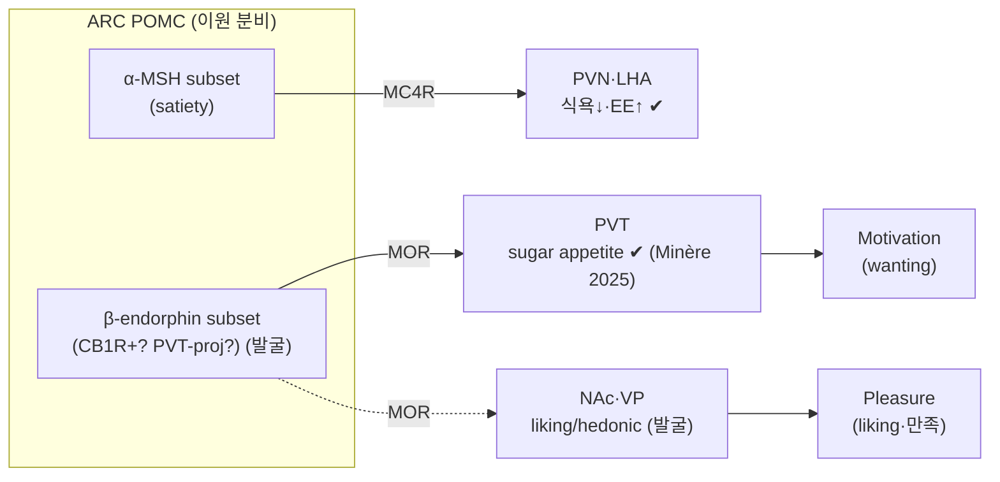

> [!takeaway] 연구 방향 관점의 핵심
> **포만 뉴런이 동시에 쾌락 뉴런인가?** ARC [[concept-pomc-neurons|POMC 뉴런]]은 α-MSH(satiety)뿐 아니라 **β-endorphin(μ-opioid)** 을 분비해 paradoxically 단 음식 식욕을 켠다([[jouque-2025-beyond-satiety-unraveling-the|Jouque 2025]]; Minère 2025 *Science*). 사용자 lab 이론 [[concept-need-motivation-pleasure-utility|NMPU]]에서 **Pleasure(즉각 결과 교사)** 축의 분자 회로 substrate가 아직 시상하부에 정박하지 않았는데, β-endorphin이 그 후보다. 핵심 미해결: β-endorphin이 음식의 **"좋다(liking·쾌락)"** 를 부호화하는가, **"더 원한다(wanting·식욕)"** 를 부호화하는가 — Berridge liking/wanting 및 NMPU의 **Pleasure vs Motivation** 분리에 직접 답한다. 임상 출구는 **naltrexone(μ-opioid 길항, bupropion–naltrexone)** 으로 명확. 사용자 식락학 교재 **Ch 20(opioid·dopamine liking/wanting)** 의 실험적 backbone.

# [연구계획서] POMC β-endorphin이 음식 쾌락·만족을 부호화하는가

## 1. 연구 제목
**시상하부 POMC 뉴런의 β-endorphin 분비가 음식의 쾌락(liking)과 만족을 부호화하는가: α-MSH–β-endorphin 이원 분비의 세포타입·회로·인과 해부와 NMPU Pleasure 축으로의 정박**

## 2. 배경 및 필요성

- **POMC = 단일 satiety 뉴런이라는 통념의 붕괴**: ARC [[concept-pomc-neurons|POMC]]는 전구체를 가수분해해 **α-MSH(식욕↓, [[concept-mc4r|MC4R]] 작용)** 와 **β-endorphin(μ-opioid receptor, MOR 작용)** 을 **동시 생산**한다([[concept-melanocortin-system|melanocortin system]]). [[jouque-2025-beyond-satiety-unraveling-the|Jouque 2025]]는 POMC를 분자·전기생리·해부·신경전달 **4축 heterogeneity mosaic**으로 재정의하며, β-endorphin 분비를 통해 POMC가 **paradoxically 식이·식욕을 촉진**할 수 있음을 정리한다.
- **결정적 인과 증거**: **Minère 2025 *Science***(Jouque 2025·[[concept-pomc-neurons]]·[[concept-need-motivation-pleasure-utility]]에 수록) — POMC→**PVT(paraventricular thalamus)** 광유전 활성 → **β-endorphin → MOR → 단 음식 식욕(sugar appetite) ON**. 동일 ARC POMC 집단이 α-MSH(멈춰라)와 β-endorphin(더 달다/원한다)을 **이원 분비**한다는 직접 증거.
- **수렴 증거**: **CB1R-POMC = cannabinoid hyperphagia**가 α-MSH가 아닌 **β-endorphin 분비**로 매개(Koch 2015 *Nature*); **운동 → POMC 활성 → β-endorphin**(Kang 2021 *Cell Metab*) — β-endorphin이 보상·쾌락 맥락에서 반복 등장.
- **NMPU framework의 공백**: 사용자 lab의 [[concept-need-motivation-pleasure-utility|NMPU]]에서 **Pleasure(즉각 결과 교사; NAc·VP·IC·opioid)** 축은 이미 비만 약물 표적 매핑에서 **"Bupropion–naltrexone = Pleasure(NAc opioid)"** 로 명시되지만, 그 **시상하부 기원**은 미정박. β-endorphin-POMC는 **Need/Motivation 회로(ARC)에서 Pleasure 신호가 발원**한다는, framework를 위협하면서 동시에 확장하는 substrate다. [[concept-need-motivation-pleasure-utility|NMPU]] 페이지 자체가 이를 "**Pleasure가 동일 anorexigenic 뉴런에서 paradoxically 생산 가능**"으로 기록.
- **liking vs wanting 미해결**: Minère 2025은 β-endorphin을 **sugar "appetite"(wanting/Motivation)** 로 보고했으나, μ-opioid는 고전적으로 **hedonic "liking"(Berridge)** 의 핵심 매개자다([[concept-need-motivation-pleasure-utility]]가 인용한 Berridge wanting/liking). 사용자의 질문("β-endorphin이 음식 **쾌락과 만족**을 주관")은 정확히 이 **liking(Pleasure) vs wanting(Motivation)** 의 분리를 요구한다 — 본 과제의 중심 과학 질문.
- **방법 성숙**: in vivo 활성을 분자정체·투사로 잇는 [[concept-activity-molecular-registration|CaRMA·TRU-FACT]]와 활성 의존 태깅 [[hyun-2022-tagging-active-neurons-by|Cal-Light]], [[concept-appetitive-consummatory-phases|appetitive/consummatory phase 분리]] 광유전 패러다임([[lee-2023-lateral-hypothalamic-leptin-receptor|Lee 2023]] 본 lab), [[ha-2024-hypothalamic-neuronal-activation-non-human|NHP 번역 플랫폼]]이 모두 준비됨.
- **필요성**: β-endorphin-POMC가 Pleasure를 부호화한다면, **포만(α-MSH)을 표적하는 setmelanotide**와 **쾌락(β-endorphin)을 표적하는 naltrexone**의 분리·병용 논리가 시상하부 단일 집단 수준에서 성립한다. 사용자 lab의 약물 표적 매핑·DTx·[[lee-2025-hijacked-brain-modern-obesity-cue|hijacked brain]] type 분류에 cell-type 근거 제공.

## 3. 연구 가설

> **ARC POMC 뉴런의 한 subset은 consummatory 단계에서 β-endorphin을 분비해 음식의 쾌락(liking)·만족 신호(NMPU Pleasure)를 부호화하며, 이는 α-MSH 매개 satiety(Motivation/Need 억제)와 분리된 세포타입·투사·시점을 가지고, MOR 길항으로 선택적으로 차단된다.**

부속 가설:
1. **이원 분비의 세포·시점 분리**: α-MSH-우세 POMC(satiety, 식사 anticipation·sustained)와 β-endorphin-우세 POMC(consummatory pleasure)는 분자형(예: CB1R+·PVT-projecting)과 활성 epoch가 다르다.
2. **liking ≠ wanting**: β-endorphin-POMC 활성은 hedonic reaction(liking)과 sugar appetite(wanting) 중 어느 축을 구동하는지 행동·회로로 분리 가능하다.
3. **회로 표적 분기**: POMC^β-endorphin → **PVT/NAc/VP**(Pleasure) vs POMC^α-MSH → **PVN/LHA MC4R**(satiety)가 표적별로 기능 분기한다.

## 3-A. 핵심 개념 지도 (이원 분비 × NMPU)

**✔=위키 확립**, **(발굴)=본 과제 대상**.

| POMC 산물 | 수용체 | 행동 효과 | NMPU 축 | 표적(가설) | 상태 |
|---|---|---|---|---|---|
| **α-MSH** | MC4R/MC3R | 식욕↓·EE↑ | Need/Motivation 억제 | PVN·LHA·NTS | ✔ ([[concept-melanocortin-system]]) |
| **β-endorphin** | MOR(μ-opioid) | sugar appetite↑ | **Pleasure**(liking?) / **Motivation**(wanting?) | **PVT** ✔ / NAc·VP (발굴) | 부분 ✔ (Minère 2025) |

> 본 과제: **B subset의 분자정체·투사(발굴)** + **liking vs wanting 인과 분리** + **MOR 길항 검증**.

## 4. 연구 목표 (Specific Aims)

### Aim 1 — POMC 이원 분비의 세포타입·시점 분해 *(CaRMA + TRU-FACT + photometry)*
- **과제**: [[concept-appetitive-consummatory-phases|appetitive(seeking)]] vs **consummatory(palatable 섭취)** vs satiety를 분리하는 패러다임([[liu-2026-granular-motivational-interaction-and|granular states]]·[[lee-2019-food-craving-seeking-and|craving→seeking→consumption]] 활용)에서 POMC 활성을 추적.
- **방법**: *Pomc*-Cre GRIN microendoscope/fiber photometry로 ARC POMC 활성 → **[[concept-activity-molecular-registration|CaRMA]]**(사후 RNA-FISH로 *Pomc·Cartpt·Cnr1*(CB1R)·*Lepr·Glp1r·Drd2* 정체) + **[[wang-2026-multimodal-alignments-of-in|TRU-FACT]]**(MERFISH high-plex + retroAAV barcode로 **PVT·NAc·VP·PVN 투사 표적**). β-endorphin/MOR 활성은 유전자 부호화 opioid/peptide sensor 및 *Pomc*-derived 펩타이드 면역으로 보강.
- **성공지표**: "**consummatory pleasure epoch에 활성·PVT/NAc로 투사하는 β-endorphin-우세 POMC subset**"의 분자형·투사 지도 — α-MSH-우세(anticipation/sustained satiety) subset과 분리.

### Aim 2 — liking vs wanting 인과 분리 *(phase-specific 광유전 + Cal-Light)*
- **과제**: β-endorphin-POMC 활성이 **hedonic liking**(taste reactivity·consummatory 미세구조)인지 **wanting**(seeking·progressive ratio·sugar appetite)인지 분리.
- **방법**:
  - **Phase-specific 광유전**([[lee-2023-lateral-hypothalamic-leptin-receptor|Lee 2023]] 본 lab paradigm): 음식 visible-unreachable(appetitive only) vs contact(consummatory)에서 POMC→PVT/NAc 자극을 분리 적용.
  - **[[hyun-2022-tagging-active-neurons-by|Cal-Light]] tag-then-manipulate**: consummatory epoch 활성 POMC를 조건부 KI × *Pomc*-Cre(또는 *Cnr1* 교차)로 태깅 → ChrimsonR 재활성/NpHR 침묵으로 liking·만족 인과 검증.
  - **약리 분리**: MOR agonist(DAMGO)/antagonist(naltrexone) 국소 주입으로 표적별(PVT vs NAc/VP) liking/wanting 기여 분해.
- **성공지표**: β-endorphin-POMC의 행동 기능을 **Pleasure(liking) vs Motivation(wanting)** 으로 귀속 — NMPU 축 배정 확정.

### Aim 3 — MOR 길항 임상 번역 + NHP 검증 *(naltrexone 논리 + 영장류)*
- **과제**: β-endorphin-POMC Pleasure 회로가 **naltrexone(bupropion–naltrexone)** 의 작용점인지, 그리고 영장류에서 보존되는지.
- **방법**:
  - MOR 길항(전신·표적 국소)이 palatable food의 hedonic liking·만족·과식을 선택적으로 줄이는지 — α-MSH satiety(setmelanotide 논리)와 **분리 측정**.
  - **[[ha-2024-hypothalamic-neuronal-activation-non-human|NHP 플랫폼]]**(macaque ARC chemogenetic/광유전)에서 β-endorphin-POMC 회로 보존 검증(rodent→primate).
  - [[lee-2025-hijacked-brain-modern-obesity-cue|hijacked brain]] type(특히 food addiction·cue-evoked) 환자의 Pleasure 둔감화/폭주와 회로 매핑(번역 가설).
- **성공지표**: "**포만(α-MSH/setmelanotide) vs 쾌락(β-endorphin/naltrexone)을 시상하부 단일 집단에서 분리 표적**"하는 정밀 약리 논리 확립.

## 5. 예상 결과 및 해석
- ARC POMC 내 **β-endorphin-우세 Pleasure subset**의 분자정체·투사·활성 시점 카탈로그(α-MSH satiety subset과 분리).
- β-endorphin이 **liking(Pleasure)인가 wanting(Motivation)인가**에 대한 인과적 답 — [[concept-need-motivation-pleasure-utility|NMPU]] Pleasure 축의 **시상하부 기원** 정박, 또는 Motivation 축으로의 재배정.
- **포만과 쾌락이 같은 뉴런 집단에서 분기**한다는 원리 — 비만 약리의 "satiety vs hedonic" 분리 표적 근거.

## 6. 한계·위험 및 대응
| 위험 | 근거 | 대응 |
|---|---|---|
| β-endorphin/MOR 활성의 실시간 측정 난이도 | 펩타이드 분비 sensor 성숙도 | 유전자 부호화 opioid sensor + 약리(DAMGO/naltrexone) 인과 보강 |
| α-MSH·β-endorphin 동일 전구체 → 분비 분리 어려움 | POMC 이원 분비([[jouque-2025-beyond-satiety-unraveling-the]]) | 표적별(PVT vs PVN) 투사·수용체(MOR vs MC4R) 수준에서 분리 |
| liking·wanting 행동 직교화 | [[concept-need-motivation-pleasure-utility|Berridge]]·[[liu-2026-granular-motivational-interaction-and|granular states]] | taste reactivity(liking) + PR/seeking(wanting) 동시 측정 + 계산 분리 |
| POMC heterogeneity로 cell-type 특이성 | [[jouque-2025-beyond-satiety-unraveling-the]] 4축 mosaic·[[concept-ghost-pomc-neurons|Ghost POMC]] | *Cnr1*/*Pomc* 교차 Cre + CaRMA 사후 정체 + grouped-ensemble 분석 |
| Cal-Light 시점 특이도 | [[hyun-2022-tagging-active-neurons-by]] | soma-targeting·짧은 광창·phase 동기화 |

## 7. 연구 일정 (5년)
- **Y1–2**: Aim 1 — POMC 활성 영상 + CaRMA/TRU-FACT 이원 분비 subset 발굴.
- **Y2–4**: Aim 2 — phase-specific 광유전 + Cal-Light로 liking/wanting 인과 분리.
- **Y3–5**: Aim 3 — naltrexone 약리 논리 + NHP 번역.

## 8. 기대효과 및 의의
- [[concept-need-motivation-pleasure-utility|NMPU]] **Pleasure 축의 시상하부 분자 기원**을 정박 — framework의 가장 약한 고리(쾌락 회로의 hypothalamic root) 보강.
- **포만 뉴런이 쾌락 뉴런이기도 하다**는 패러다임 — [[concept-pomc-neurons]]·[[concept-melanocortin-system]] 재해석.
- **satiety(α-MSH/setmelanotide) vs hedonic(β-endorphin/naltrexone) 분리 표적** 약리 — [[concept-digital-therapeutics|DTx]]·약물 병용 논리의 cell-type 근거.
- 사용자 식락학 교재 **Ch 20(opioid·dopamine liking/wanting)·Ch 24(음식 갈망·중독)·Ch 25(비만 근본 치료)** 의 실험적 backbone([[person-choi-hyung-jin]]·[[overview-sikrakhak-book-project]]).
- [[proposal-lh-nac-nmpu-neuron-discovery|LH·NAc NMPU 세포 발굴]]·[[proposal-nmpu-human-translation|NMPU 인간 번역]]과 **Pleasure 축에서 상보** — ARC(β-endorphin) → NAc/PVT(Pleasure) 회로 완성.

## 관련 페이지
- [[concept-pomc-neurons]] — 이원 분비(α-MSH·β-endorphin)·heterogeneity 본체.
- [[jouque-2025-beyond-satiety-unraveling-the]] — β-endorphin paradox·Minère 2025 *Science* 수록 원전.
- [[concept-melanocortin-system]] — POMC 산물·MC4R/MOR 분기 backbone.
- [[concept-need-motivation-pleasure-utility]] — Pleasure 축·liking/wanting·약물 표적 매핑.
- [[concept-liking-wanting]] — 본 제안의 핵심 개념(오피오이드 ‘좋아함’ vs 도파민 ‘갈망’ 인과 분리).
- [[concept-hedonic-hotspot]] — β-endorphin/MOR가 작용하는 ‘좋아함’ 증폭 부위.
- [[overview-sikrakhak-ch20-opioid-dopamine-liking-wanting]] — 본 제안이 backbone인 사용자 식락학 Ch 20.
- [[concept-appetitive-consummatory-phases]] — liking(consummatory) vs wanting(appetitive) 행동 분리 framework.
- [[concept-primary-reward-signals]] — proxy(taste/oral) vs primary(post-oral) reward — Pleasure 정의 보조.
- [[concept-nucleus-accumbens]] — Pleasure 축 핵심 표적(opioid hedonic).
- [[concept-activity-molecular-registration]] · [[xu-2020-behavioral-state-coding-by]] · [[wang-2026-multimodal-alignments-of-in]] · [[hyun-2022-tagging-active-neurons-by]] — 핵심 방법(활성→정체→투사→인과).
- [[lee-2023-lateral-hypothalamic-leptin-receptor]] — phase-specific 광유전 본 lab 원전.
- [[liu-2026-granular-motivational-interaction-and]] · [[lee-2019-food-craving-seeking-and]] — 동기 sub-state 행동 분해.
- [[ha-2024-hypothalamic-neuronal-activation-non-human]] — NHP 번역.
- [[lee-2025-hijacked-brain-modern-obesity-cue]] — 임상 type·Pleasure 둔감화/폭주 출구.
- [[concept-ghost-pomc-neurons]] — POMC 정체성 가소성(위험·해석).
- [[person-choi-hyung-jin]] — 연구책임자·식락학 Ch 20.
- [[overview-research-proposals]] — 연구계획서 비교 hub(본 과제 = #7).
- [[overview-future-research-directions]] — 상위 로드맵.
